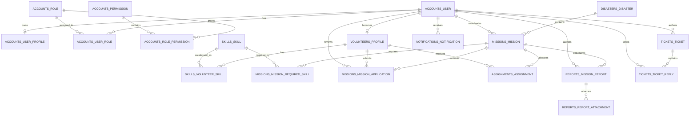
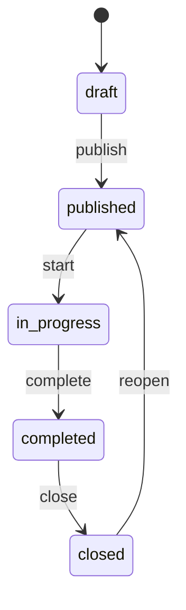
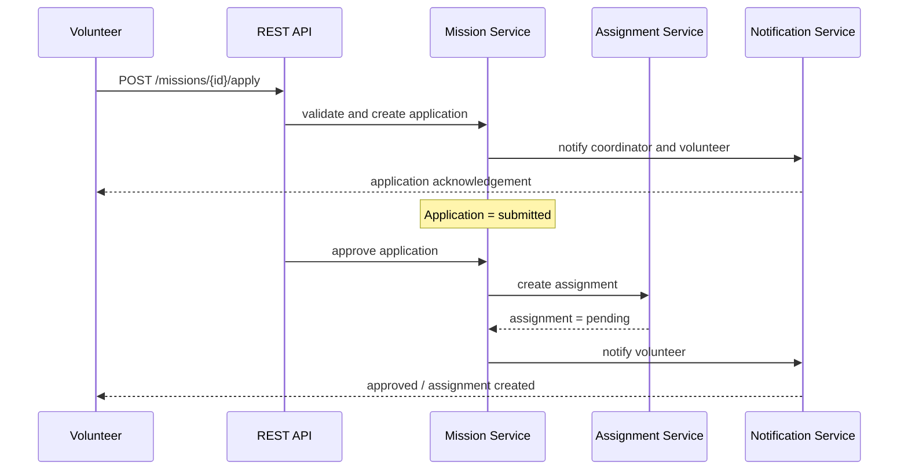
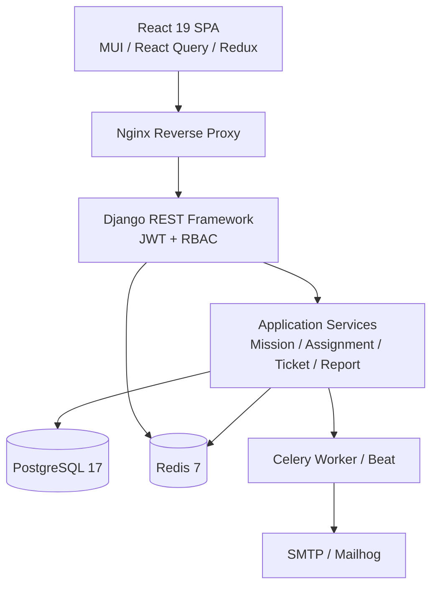
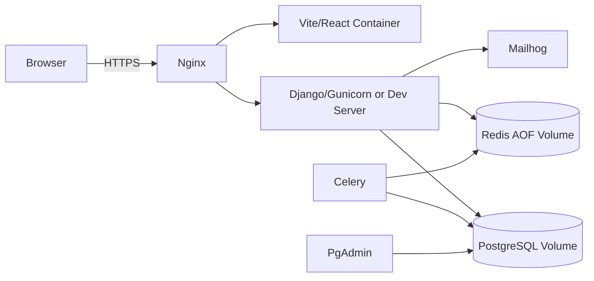

# P21 — Database Schema and Architecture Diagrams

## Volunteer Crisis Management Platform

**Version:** 1.0  
**Date:** 2026-07-17  
**Database:** PostgreSQL 17  
**Implementation source of truth:** Django models and migrations under `backend/src/*/models` and `backend/src/*/migrations`.

> This document is a technical design map. The client delivery SQL is `P22.sql`; its readable text copy is `P23.txt`.

---

## 1. Database Design Principles

1. **UUID primary keys:** all business entities inherit the conceptual base fields `id`, `created_at`, `updated_at`, and `deleted_at`.
2. **Soft deletion:** application default managers exclude records where `deleted_at IS NOT NULL`; administrative/reporting paths may access all records.
3. **Role-based access control:** users receive roles; roles receive permission codenames.
4. **Mission-centric operations:** a `Disaster` has many `Mission` records; a Mission accepts Applications and produces Assignments and Reports.
5. **Auditability:** sensitive operational actions are represented in `audit_logs_audit_log`.
6. **Performance:** status, ownership, time, resource and unread notification indexes support principal operational screens.

---

## 2. Logical ERD



---

## 3. Core Tables

| Domain | Table | Purpose | Key relationship |
|---|---|---|---|
| Identity | `accounts_user` | Email-based system user | Parent for profile, roles, coordinator |
| RBAC | `accounts_role`, `accounts_permission` | Role and permission catalog | Many-to-many through bridge tables |
| Volunteer | `volunteers_profile` | Volunteer operational profile | One-to-one with User |
| Skills | `skills_skill`, `skills_volunteer_skill` | Skill catalog and proficiency | Volunteer-to-skill many-to-many |
| Crisis | `disasters_disaster` | Crisis event / incident | Parent of missions |
| Mission | `missions_mission` | Operational task | Disaster, coordinator, applications |
| Participation | `missions_mission_application` | Volunteer request to participate | Unique per mission/volunteer |
| Assignment | `assignments_assignment` | Approved operational allocation | Unique per mission/volunteer |
| Reports | `reports_mission_report` | Field/mission report | Mission and author |
| Comms | `tickets_ticket`, `tickets_ticket_reply` | Support and staff message thread | User author and replies |
| Notification | `notifications_notification` | In-app / email notification event | User recipient |
| Governance | `audit_logs_audit_log` | Immutable-style audit event log | Resource type/id |

---

## 4. Important Status Domains

| Entity | Values |
|---|---|
| Volunteer | `registered`, `pending_approval`, `active`, `rejected` |
| Mission | `draft`, `published`, `in_progress`, `completed`, `closed` |
| Mission Application | `submitted`, `waitlist`, `approved`, `rejected`, `withdrawn` |
| Assignment | `pending`, `accepted`, `checked_in`, `completed`, `declined` |
| Mission Report | `draft`, `submitted`, `reviewed` |
| Ticket | `open`, `in_progress`, `answered`, `closed` |

---

## 5. Mission Lifecycle State Diagram



## 6. Application and Assignment Flow



---

## 7. Reference Index Strategy

```mermaid
flowchart LR
    A[Operational UI Query] --> B{Query Type}
    B --> C[Coordinator Inbox]
    B --> D[Volunteer Mission Search]
    B --> E[Unread Notifications]
    B --> F[Audit Investigation]
    C --> C1[(status, created_at DESC)]
    C --> C2[(mission coordinator ownership)]
    D --> D1[(status, visibility)]
    D --> D2[(skill bridge indexes)]
    E --> E1[(user_id, created_at DESC) WHERE unread]
    F --> F1[(resource_type, resource_id, created_at DESC)]
```

### Recommended indexes

| Index | Table | Reason |
|---|---|---|
| `missions_coordinator_status_idx` | `missions_mission` | Coordinator dashboard and `mine=true` view |
| `mission_application_inbox_idx` | `missions_mission_application` | Pending/waitlist inbox |
| `notification_user_unread_idx` | `notifications_notification` | Notification badge and list |
| `audit_resource_idx` | `audit_logs_audit_log` | Resource-level forensic review |
| GIN JSONB indexes | Disaster needs / Volunteer availability | Flexible filtered attributes |

---

## 8. System Component Architecture



---

## 9. Deployment Architecture



---

## 10. Client Delivery Files

- `P2.docx` — detailed Persian database and system architecture design report; diagrams inside are English by requirement.
- `P22.sql` — PostgreSQL reference DDL, indexes, views, and acceptance queries.
- `P23.txt` — text copy of `P22.sql` for easy inspection.

