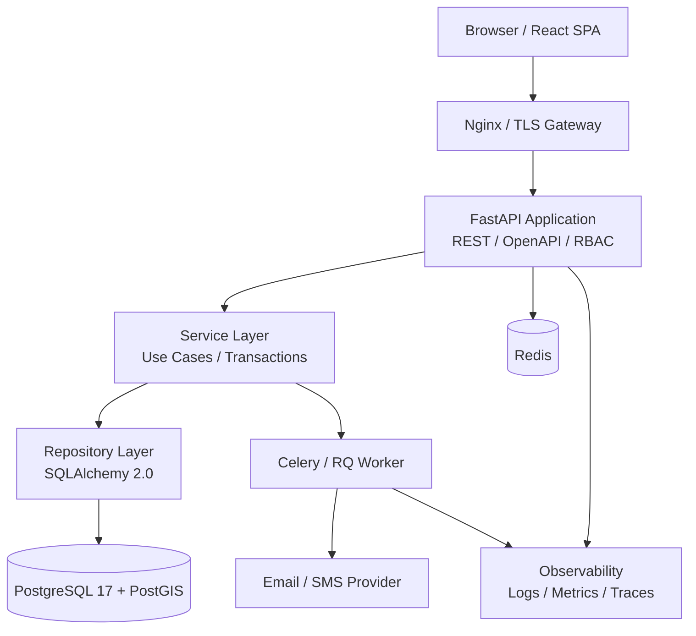
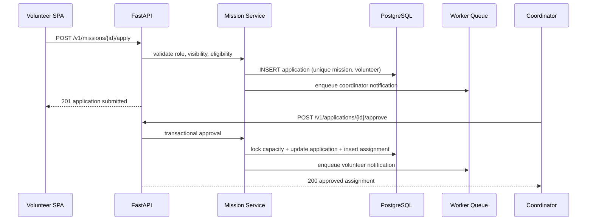
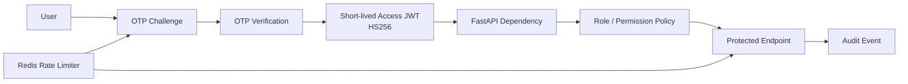
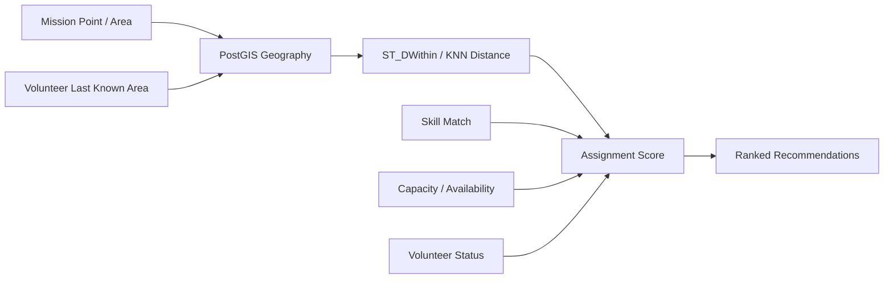
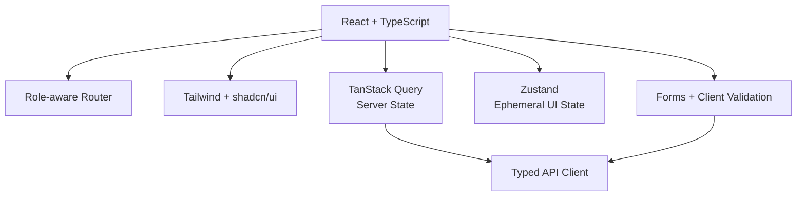
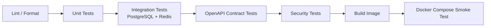

# P31 — Phase 3 Technical Architecture and API Blueprint

## Volunteer Crisis Management Platform

**Version:** 1.0  
**Scope:** Target implementation architecture, API contract, security, spatial assignment, dashboards, testing and development package.

> **Architecture decision note:** the current codebase runs Django REST Framework with React/MUI. This document defines the requested FastAPI + SQLAlchemy + Alembic and React + Tailwind + shadcn/ui target architecture. It must be adopted through a controlled migration or a separately deployed API boundary; it does not claim that the current application has already been converted.

---

## 1. Architecture Goals

- API-first, versioned contracts for web clients and approved integrations.
- Clear module boundaries: identity, volunteer, skill, disaster, mission, assignment, shift, report, notification, audit.
- Transactional correctness for application approval and assignment.
- RBAC with the roles **admin**, **coordinator**, and **volunteer**.
- Secure, observable, testable and repeatable local development.
- Geospatial search and a transparent initial assignment score.

## 2. C4 Container View



## 3. Backend Module Structure

```text
backend/
  app/
    api/v1/                 # FastAPI routers / request-response schemas
    core/                   # config, security, dependencies, errors, rate limits
    domain/                 # entities, enums, business policies
    services/               # use-case orchestration / transaction boundary
    repositories/           # SQLAlchemy persistence adapters
    models/                 # ORM mappings
    schemas/                # Pydantic DTOs
    workers/                # asynchronous notification tasks
    migrations/             # Alembic revisions
    tests/                  # unit, integration, contract, security tests
```

## 4. API Contract Standards

### Base URL and versioning

`/api/v1`. Breaking changes require `/api/v2`; compatible additions remain in the same major version. A response carries `X-Request-ID` and may carry `Deprecation` / `Sunset` headers during retirement.

### Envelope

Successful resource responses use a direct JSON resource or list:

```json
{
  "data": [],
  "meta": { "page": 1, "page_size": 20, "total": 0, "total_pages": 0 },
  "links": { "self": "...", "next": null, "previous": null }
}
```

Failures use RFC 7807-inspired form:

```json
{
  "type": "https://api.panah.example/errors/validation",
  "title": "Validation failed",
  "status": 422,
  "code": "VALIDATION_ERROR",
  "detail": "One or more fields are invalid.",
  "errors": [{ "field": "email", "message": "Invalid email address." }],
  "request_id": "uuid"
}
```

### Pagination, filters and sort

- Offset pagination: `page=1&page_size=20`; default 20, maximum 100.
- Cursor pagination is reserved for append-only feeds such as audit and notifications.
- Repeated filters follow `filter[status]=published`; date range uses `filter[start_at_gte]`.
- Sorting uses `sort=-created_at,title`; only allow-listed columns are accepted.
- Unknown filters and sorts return `422`, never silently ignored.

## 5. Core Endpoint Map

| Module | Primary routes |
|---|---|
| Auth | `POST /auth/otp/request`, `POST /auth/otp/verify`, `POST /auth/token/refresh`, `POST /auth/logout` |
| Volunteers | `GET/POST /volunteers`, `GET/PATCH /volunteers/{id}`, `GET /volunteers/nearby` |
| Skills | `GET/POST /skills`, `PATCH/DELETE /skills/{id}`, `PUT /volunteers/{id}/skills` |
| Missions | `GET/POST /missions`, `GET/PATCH /missions/{id}`, `POST /missions/{id}/publish`, `POST /missions/{id}/apply` |
| Applications | `GET /missions/{id}/applications`, `POST /applications/{id}/approve`, `POST /applications/{id}/reject` |
| Assignments | `GET/POST /assignments`, `PATCH /assignments/{id}/status`, `GET /missions/{id}/capacity` |
| Shifts | `GET/POST /missions/{id}/shifts`, `PATCH /shifts/{id}`, `POST /shifts/{id}/check-in` |
| Reports | `GET/POST /missions/{id}/reports`, `POST /reports/{id}/submit`, `POST /reports/{id}/attachments` |

## 6. Critical API Flows



## 7. Security Architecture



### Security controls

- bcrypt with calibrated work factor for passwords; never log secrets or OTPs.
- Short-lived access JWT, rotating refresh token, `iss`, `aud`, `sub`, `jti`, `exp`, and key rotation plan.
- HS256 only with high-entropy secret held in a secret manager; asymmetric keys are preferred for multi-service verification.
- OTP expiry (e.g. five minutes), attempt cap, replay prevention and service-specific rate limit.
- Server-side RBAC enforcement; the frontend only improves UX and is not a security boundary.
- Pydantic validation, allow-listed sort/filter fields, size-limited uploads and content-type checks.

## 8. Spatial Data and Assignment



**Recommended columns**

- `missions.location_geog geography(Point,4326)` or a geometry/polygon for operational boundary.
- `volunteers.location_geog geography(Point,4326)` with timestamp and consent state.
- `GIST` indexes on both geospatial columns.
- Geographic data must be optional, purpose-limited and retained according to privacy policy.

**Initial explainable score**

`score = 0.45 × skill_match + 0.25 × availability + 0.20 × distance_score + 0.10 × operational_priority`

The service must return score factors to coordinators, not silently automate high-impact decisions.

## 9. Frontend Architecture



### Dashboard responsibilities

| Role | Essential workflows |
|---|---|
| Admin | users, roles, incidents, global mission oversight, audit |
| Coordinator | owned mission queue, applications, assignments, shifts, reports |
| Volunteer | profile, skills, nearby/published missions, application status, assignments, reports |

## 10. Transaction and Migration Rules

- Service methods, not routers, own transaction boundaries.
- Approval locks the mission capacity row or uses a concurrency-safe equivalent before creating an assignment.
- Alembic is the only schema-change mechanism for the target FastAPI service.
- Each migration has upgrade testing, a rollback/forward-fix decision, and backup compatibility review.
- Seed data is idempotent and separated from production secrets.

## 11. Quality and Delivery Pipeline



| Test type | Examples |
|---|---|
| Unit | score calculation, RBAC policy, OTP verifier, state transition |
| Integration | unique application constraint, transaction rollback, PostGIS query |
| Contract | OpenAPI examples and error envelope |
| E2E | volunteer application to coordinator approval |
| Security | rate limit, token expiry, IDOR, role isolation |

## 12. Docker Development Package

```yaml
services:
  api:       # FastAPI + Uvicorn
  worker:    # async jobs
  postgres:  # PostgreSQL 17 + PostGIS extension
  redis:     # cache / broker / rate limit
  frontend:  # React development server
  nginx:     # local gateway
```

Required developer commands: copy `.env.example`, start the compose stack, run Alembic migrations, load idempotent seed data, execute tests and open `/docs` for Swagger UI.

## 13. Migration from Existing Implementation

1. Freeze and test existing Django API contracts.
2. Define OpenAPI target contract and API adapter strategy.
3. Move read-only endpoints first behind a feature flag.
4. Move transactional mission approval only after concurrency and rollback tests.
5. Do not let Django migrations and Alembic alter the same production tables without a single owner and explicit migration governance.

