<p align="center">
  
</p>

<h1 align="center">پناه (Panah)</h1>

<p align="center">
  <strong>سکوی هوشمند امداد، نجات و مدیریت داوطلبان بحران</strong><br/>
  Smart rescue &amp; relief platform for volunteer coordination in emergencies
</p>

<p align="center">
  
  
  
  
  
  
</p>

<p align="center">
  Developed by <strong>Investica Group</strong>
</p>

---

## فهرست مطالب

- [درباره سامانه](#درباره-سامانه)
- [قابلیت‌های اصلی](#قابلیتهای-اصلی)
- [معماری سامانه](#معماری-سامانه)
- [چرخه عمر مأموریت](#چرخه-عمر-مأموریت)
- [نقش‌ها و دسترسی](#نقشها-و-دسترسی)
- [پشته فناوری](#پشته-فناوری)
- [پیش‌نیازها](#پیشنیازها)
- [راه‌اندازی یک‌مرحله‌ای](#راهاندازی-یکمرحلهای)
- [استفاده روزانه](#استفاده-روزانه)
- [آدرس‌ها و سرویس‌ها](#آدرسها-و-سرویسها)
- [اعتبارنامه‌های توسعه](#اعتبارنامههای-توسعه)
- [ساختار مخزن](#ساختار-مخزن)
- [عملیات و بکاپ](#عملیات-و-بکاپ)
- [استقرار تولید](#استقرار-تولید)
- [عیب‌یابی](#عیبیابی)
- [مستندات](#مستندات)
- [امنیت مخزن](#امنیت-مخزن)
- [مجوز](#مجوز)

---

## درباره سامانه

**پناه** سامانه وب یکپارچه برای هماهنگی نیروهای داوطلب در شرایط بحران است:

- **ستاد عملیات** (مدیر / هماهنگ‌کننده): ثبت بحران، تعریف و انتشار مأموریت، داوری درخواست‌ها، تخصیص نیرو، وظایف و گزارش
- **داوطلب**: پروفایل و مهارت، درخواست همکاری، پذیرش تخصیص، ثبت حضور، گزارش وضعیت وظیفه

از نظر معماری نرم‌افزار، پناه یک **Modular Monolith** است: یک API یگانه Django روی `/api/v1` که به یک SPA فارسی (RTL) خدمت می‌دهد و با PostgreSQL، Redis و Celery پشتیبانی می‌شود.

<p align="center">
  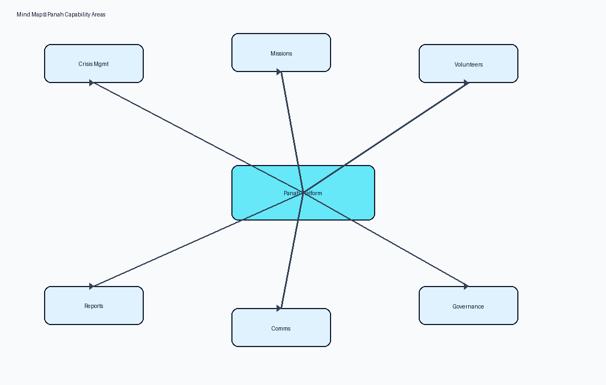
</p>

---

## قابلیت‌های اصلی

| حوزه | شرح |
|------|-----|
| احراز هویت | ثبت‌نام، ورود JWT، تازه‌سازی توکن، پروفایل |
| RBAC | نقش و مجوز پایگاه‌داده‌محور (`admin` / `coordinator` / `volunteer`) |
| داوطلبان | پروفایل، مهارت‌ها، تأیید حساب |
| بحران و مأموریت | ثبت رویداد، انتشار، کنترل مرئی‌بودن برای داوطلبان |
| درخواست و تخصیص | کارتابل درخواست، پذیرش/رد، ثبت حضور |
| وظایف تخصیص | چک‌لیست وظیفه روی تخصیص (مدیریت هماهنگ‌کننده، گزارش داوطلب) |
| گزارش و داشبورد | گزارش مأموریت، خلاصه مأموریت پایان‌یافته، شاخص نقش‌محور |
| پشتیبانی | تیکت، اعلان درون‌برنامه‌ای و ایمیل |
| حسابرسی و Ops | Audit log، بکاپ خودکار DB/Media، پنل عملیات |

---

## معماری سامانه

### ۱) زمینه سامانه (C4 Context)

<p align="center">
  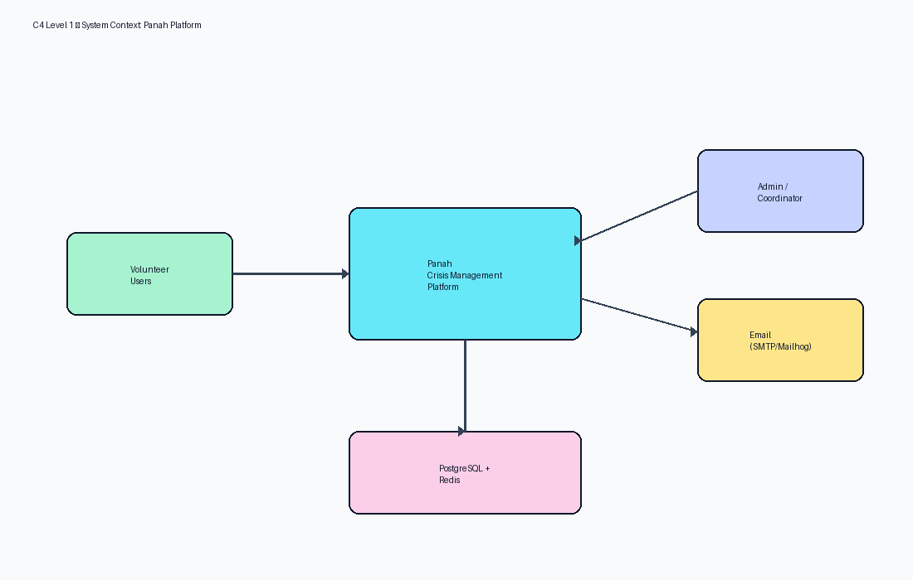
</p>

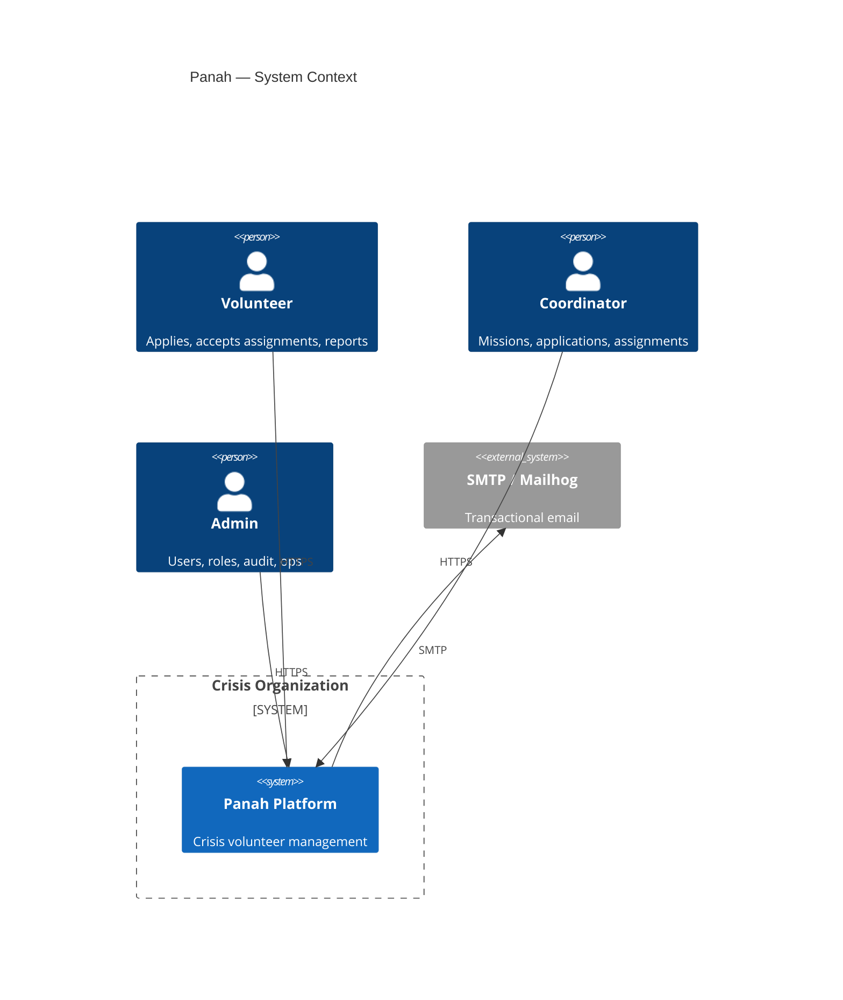

### ۲) کانتینرها (C4 Container)

<p align="center">
  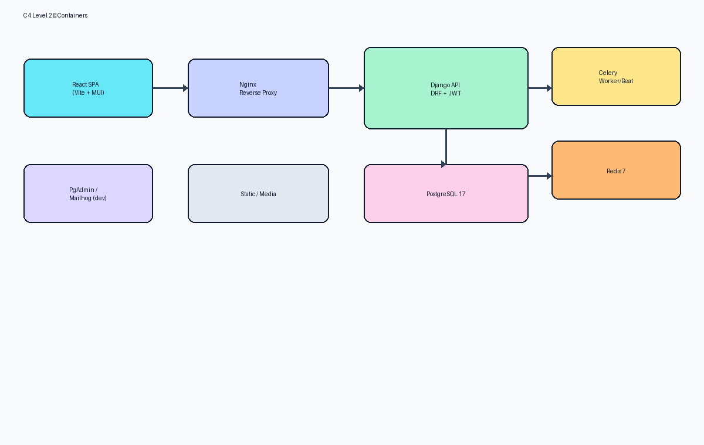
</p>

| کانتینر | فناوری | مسئولیت |
|---------|--------|----------|
| Frontend | React 19 · Vite · MUI · RTL | رابط کاربری تک‌صفحه‌ای فارسی |
| Nginx | Alpine | TLS، reverse proxy، static/media |
| Backend API | Django 5.2 · DRF · JWT · RBAC | قواعد کاری و قرارداد REST |
| Celery Worker / Beat | Celery | کارهای async و زمان‌بندی‌شده |
| PostgreSQL 17 | RDBMS | داده تراکنشی |
| Redis 7 | Cache / Broker | صف، نهانگاه، JWT blacklist |
| PgAdmin / Mailhog | Dev only | مدیریت DB و inbox ایمیل توسعه |

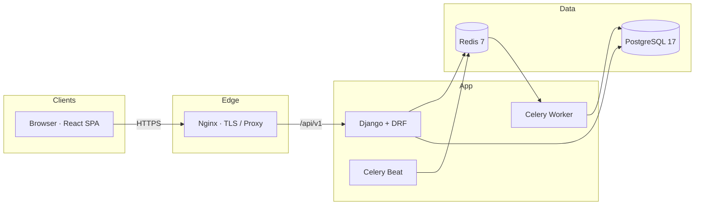

### ۳) استقرار Docker

<p align="center">
  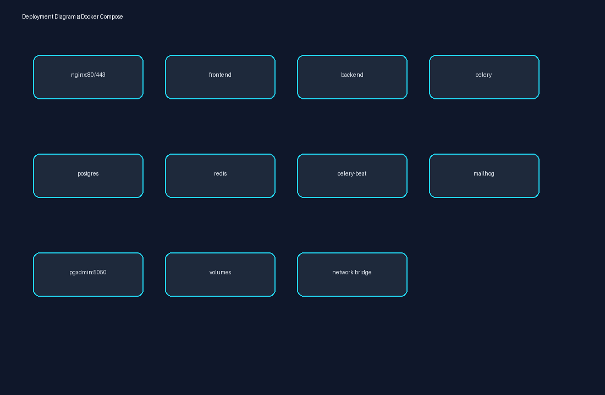
</p>

| Container | نقش |
|-----------|-----|
| `volunteer-management-nginx` | Reverse proxy |
| `volunteer-management-frontend` | React (Vite) |
| `volunteer-management-backend` | Django REST API |
| `volunteer-management-celery` / `-beat` | Async + scheduled jobs |
| `volunteer-management-postgres` | PostgreSQL 17 |
| `volunteer-management-redis` | Cache / broker / JWT blacklist |
| `volunteer-management-pgadmin` | DB UI (توسعه) |
| `volunteer-management-mailhog` | Dev SMTP inbox |

### ۴) لایه‌های Backend (Clean / Layered)

<p align="center">
  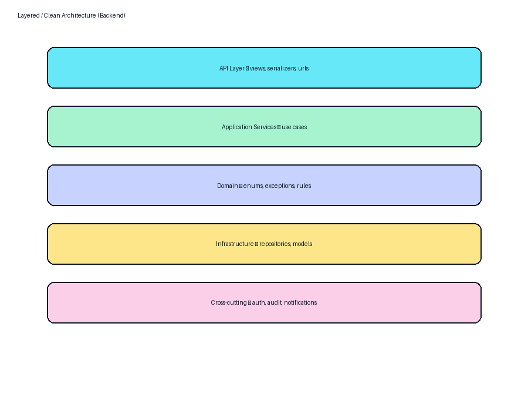
</p>

```text
API Layer            → views, serializers, urls
Application Services → use cases / domain services
Domain Layer         → enums, exceptions, rules
Infrastructure       → models, repositories
Cross-cutting        → auth, audit, notifications
```

### ۵) جریان احراز هویت (JWT)

<p align="center">
  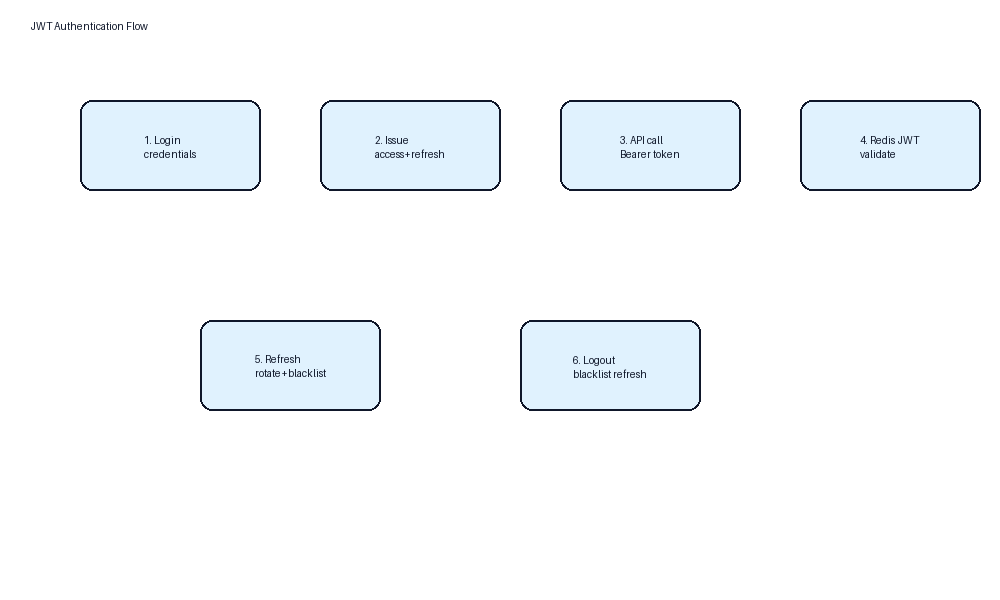
</p>

### ۶) ماژول‌های دامنه

```text
backend/src/
├── accounts / authentication   # کاربران، نقش، JWT
├── volunteers / skills         # پروفایل و مهارت داوطلب
├── disasters / missions        # بحران و مأموریت
├── assignments                 # تخصیص + وظایف (AssignmentTask)
├── reports / dashboard         # گزارش و شاخص
├── notifications / tickets     # اعلان و پشتیبانی
├── audit_logs                  # رد حسابرسی
└── ops                         # بکاپ و عملیات
```

<p align="center">
  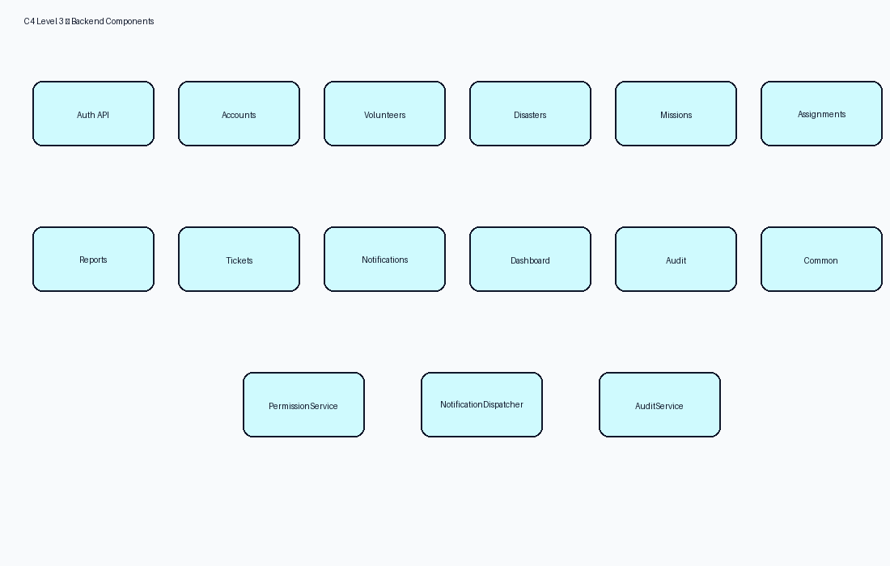
</p>

---

## چرخه عمر مأموریت

<p align="center">
  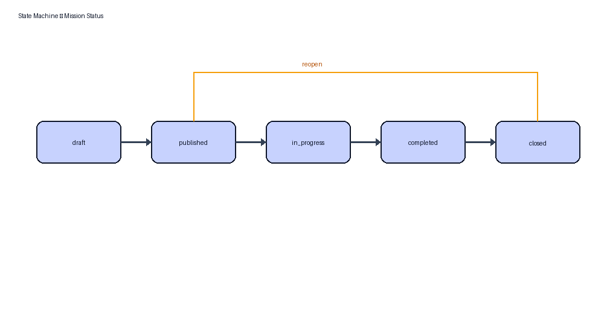
</p>

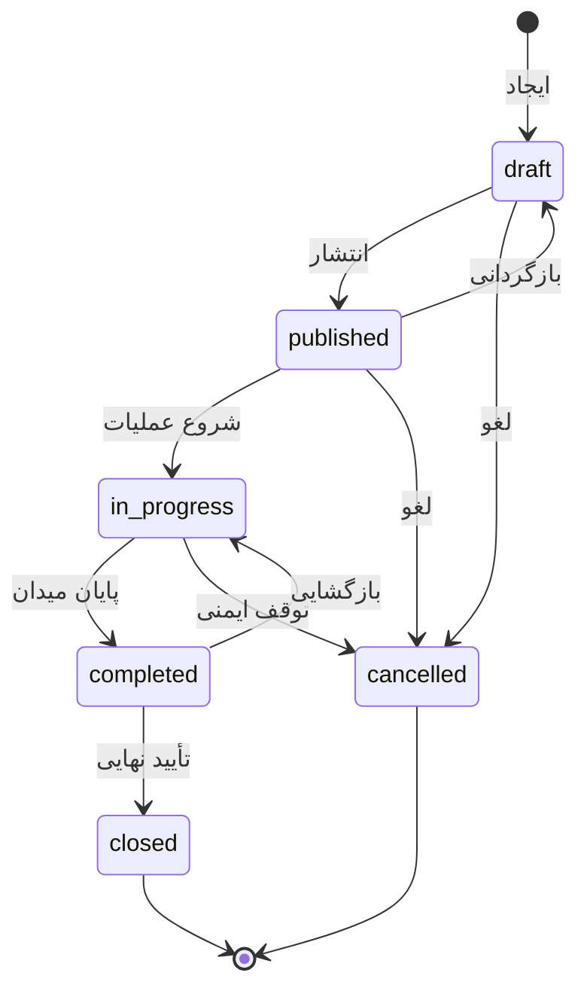

جریان عملیاتی و توالی درخواست:

<p align="center">
  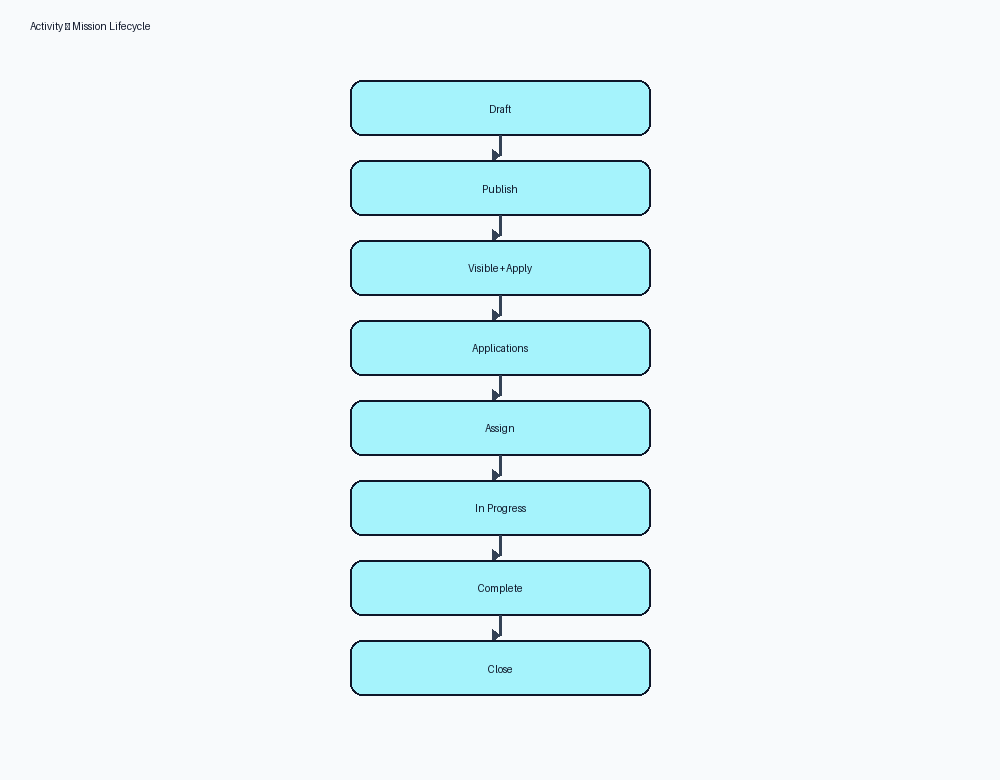
</p>

<p align="center">
  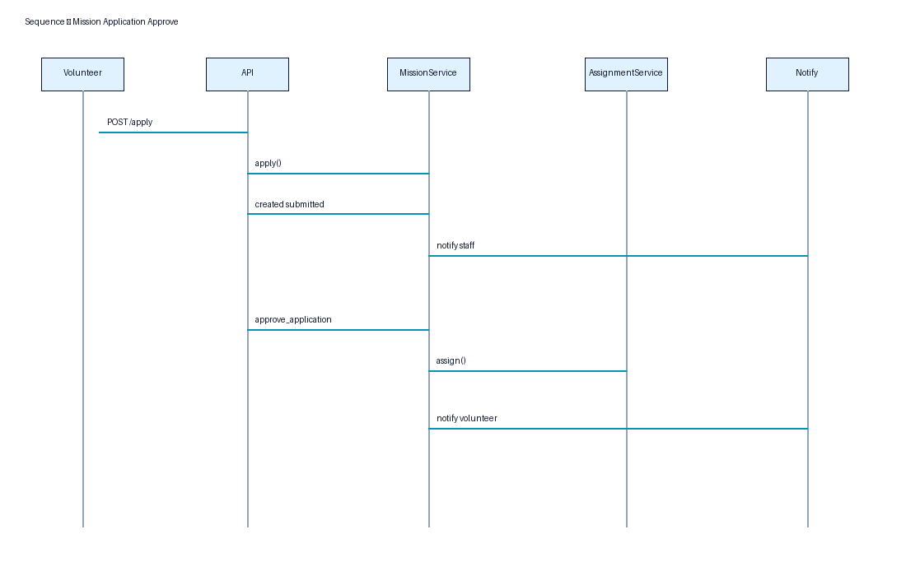
</p>

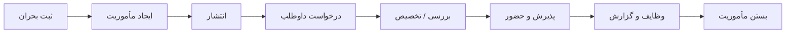

---

## نقش‌ها و دسترسی

<p align="center">
  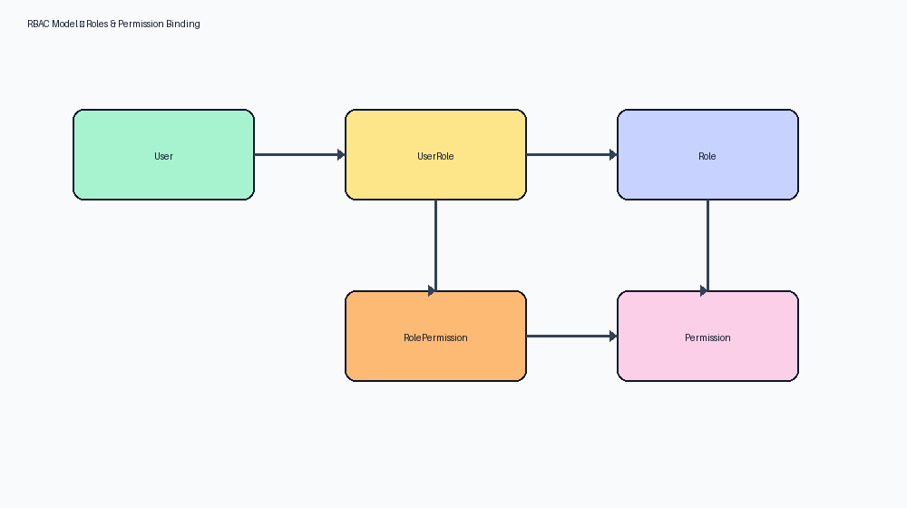
</p>

| نقش | Slug | دامنه |
|-----|------|--------|
| مدیر سامانه | `admin` | کاربران، نقش‌ها، حسابرسی، Ops، دسترسی کامل |
| هماهنگ‌کننده | `coordinator` | بحران، مأموریت، درخواست، تخصیص، وظایف تخصیص |
| داوطلب | `volunteer` | پروفایل، درخواست، پذیرش تخصیص، گزارش وضعیت وظیفه |

ماتریس دسترسی کامل: [VDOC/md/02-system-overview.md](VDOC/md/02-system-overview.md)

---

## پشته فناوری

| لایه | فناوری |
|------|--------|
| Backend | Python 3.13 · Django 5.2 · DRF · SimpleJWT · Celery · drf-spectacular |
| Frontend | React 19 · TypeScript · Vite · MUI · Redux Toolkit · TanStack Query |
| Database | PostgreSQL 17 |
| Cache / Queue | Redis 7 |
| Proxy | Nginx |
| Runtime | Docker Compose |
| API Docs | OpenAPI / Swagger — `/api/docs/` |

| Stack | قفل وابستگی |
|-------|-------------|
| Frontend | `frontend/package-lock.json` (`npm ci`) |
| Backend | `backend/requirements.lock` |

---

## پیش‌نیازها

| مورد | نسخه |
|------|------|
| Docker Desktop (یا Engine + Compose V2) | آخرین پایدار |
| سیستم‌عامل | Windows 10/11 · Ubuntu 24.04 LTS · macOS |

نصب محلی Python / Node / PostgreSQL لازم نیست.

---

## راه‌اندازی یک‌مرحله‌ای

> روی کلون تازه، فقط `docker compose up` کافی نیست — ابتدا `.env` باید ساخته شود. از `SETUP.*` استفاده کنید.

### Windows

1. Docker Desktop را نصب و اجرا کنید.
2. مخزن را کلون کنید.
3. **`SETUP.bat`** را اجرا کنید (یا `.\SETUP.ps1`).

`SETUP` این کارها را انجام می‌دهد:

1. ساخت `.env` از `.env.example` (در صورت نبود)
2. ساخت پوشه‌های `logs/`، `media/`، `static/`، `database/backups/`
3. انتخاب خودکار پورت آزاد اگر `80`/`443` اشغال باشد
4. `docker compose build` و `up -d`
5. انتظار سلامت بک‌اند، سپس `seed_data` + `seed_demo`

### Linux / macOS

```bash
chmod +x SETUP.sh Start.sh Stop.sh
./SETUP.sh
```

### مسیر دستی معادل

```bash
cp .env.example .env
docker compose up -d --build
docker compose exec -T volunteer-management-backend python manage.py seed_data
docker compose exec -T volunteer-management-backend python manage.py seed_demo
```

---

## استفاده روزانه

| عمل | Windows | Linux / macOS |
|-----|---------|---------------|
| Start | `Start.bat` | `./Start.sh` |
| Stop | `Stop.bat` | `./Stop.sh` |

حجم‌های داده با Stop حفظ می‌شوند. پاک‌سازی کامل:

```bash
docker compose down -v
# سپس دوباره SETUP
```

### دستورات پرکاربرد

```bash
docker compose ps
docker compose logs -f volunteer-management-backend
docker compose exec volunteer-management-backend python manage.py migrate
docker compose exec volunteer-management-backend python manage.py seed_data
docker compose exec volunteer-management-backend python manage.py seed_demo
docker compose up -d --build
```

ادمین سفارشی هنگام seed:

```bash
docker compose exec volunteer-management-backend python manage.py seed_data \
  --admin-email you@example.com \
  --admin-password 'YourSecurePass123!'
```

---

## آدرس‌ها و سرویس‌ها

پورت‌ها از `.env` خوانده می‌شوند (`HTTP_PORT`، `PGADMIN_PORT`، `MAILHOG_WEB_PORT`). پیش‌فرض‌ها:

| سرویس | آدرس پیش‌فرض |
|--------|---------------|
| اپلیکیشن (Frontend via Nginx) | http://localhost |
| ورود | http://localhost/login |
| API v1 | http://localhost/api/v1/ |
| Health | http://localhost/api/v1/health/ |
| Swagger UI | http://localhost/api/docs/ |
| OpenAPI schema | http://localhost/api/schema/ |
| Django Admin | http://localhost/django-admin/ |
| PgAdmin | http://localhost:5050 |
| Mailhog | http://localhost:8025 |

اگر SETUP پورت را عوض کرده باشد (مثلاً `HTTP_PORT=8080`)، از همان پورت استفاده کنید؛ اسکریپت در پایان URL نهایی را چاپ می‌کند.

---

## اعتبارنامه‌های توسعه

> **فقط محیط محلی / دمو.** قبل از اشتراک‌گذاری یا استقرار، مقادیر `.env` را تغییر دهید.

### ورود وب (Admin)

| فیلد | مقدار (از `.env.example`) |
|------|---------------------------|
| Email | `Investicaco@gmail.com` (`ADMIN_EMAIL`) |
| Password | `ADMIN` (`ADMIN_PASSWORD`) |

### PgAdmin

| Email | Password |
|-------|----------|
| `admin@example.com` | `admin` |

### PostgreSQL (شبکه Docker)

| Host | Port | DB / User / Password |
|------|------|----------------------|
| `volunteer-management-postgres` | `5432` (به‌صورت پیش‌فرض روی host منتشر نمی‌شود) | `volunteer_management` / `volunteer_user` / `volunteer_pass` |

---

## ساختار مخزن

```text
├── SETUP.bat / Start.bat / Stop.bat
├── SETUP.sh  / Start.sh  / Stop.sh
├── docker-compose.yml
├── docker-compose.prod.yml
├── .env.example
├── backend/                 # Django API
├── frontend/                # React + MUI
├── infrastructure/          # Nginx, Postgres init, scripts
├── documentation/           # SDD, ADR, runbooks
├── DOCS/                    # بسته مستندات + دیاگرام‌های معماری
├── VDOC/                    # SRS و تصاویر تکمیلی
├── environment/             # قالب‌های env تولید
└── database/backups/        # خروجی بکاپ (محتوا gitignored)
```

نقشه ناوبری UI:

<p align="center">
  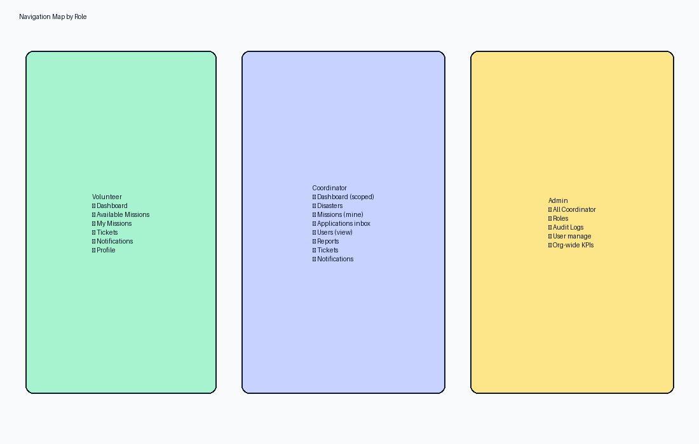
</p>

---

## عملیات و بکاپ

- بکاپ شبانه DB (`pg_dump`) + آرشیو `media/` توسط **Celery Beat** (۰۲:۰۰ Asia/Tehran)
- نگه‌داری پیش‌فرض: ۳۰ روز
- مسیر آرتیفکت: `./database/backups/`
- UI: **بکاپ و عملیات** (`/admin/ops`)
- API: `GET /api/v1/ops/backups/status/`
- تریگر دستی:

```bash
docker compose exec volunteer-management-backend python manage.py backup_now
```

جزئیات بازیابی: [documentation/runbooks/deployment.md](documentation/runbooks/deployment.md)

---

## استقرار تولید

```bash
cp environment/.env.production.example .env
# SECRET_KEY قوی، رمز DB، ADMIN_*، ایمیل سازمانی
docker compose -f docker-compose.yml -f docker-compose.prod.yml up -d --build
```

Runbook کامل: [documentation/runbooks/deployment.md](documentation/runbooks/deployment.md)

---

## عیب‌یابی

| مشکل | راه‌حل |
|------|--------|
| Docker اجرا نیست | Docker Desktop را روشن کنید و SETUP را دوباره بزنید |
| `.env` نیست | `SETUP` را اجرا کنید |
| پورت ۸۰/۴۴۳ اشغال یا forbidden | SETUP پورت را عوض می‌کند؛ یا دستی `HTTP_PORT=8080` |
| Backend unhealthy | `docker logs volunteer-management-backend` |
| Frontend خالی | حدود ۳۰ ثانیه صبر؛ `docker logs volunteer-management-frontend` |
| ریست کامل | `docker compose down -v` سپس `SETUP` |

---

## مستندات

| سند | مسیر |
|-----|------|
| دیاگرام‌های معماری | [DOCS/Diagrams/](DOCS/Diagrams/) |
| بسته مستندات پروژه | [DOCS/](DOCS/) |
| SRS / مشخصات | [VDOC/md/](VDOC/md/) |
| Software Design Document | [documentation/architecture/SDD.md](documentation/architecture/SDD.md) |
| API Contracts | [documentation/architecture/api-contracts.md](documentation/architecture/api-contracts.md) |
| Deployment Runbook | [documentation/runbooks/deployment.md](documentation/runbooks/deployment.md) |
| طراحی داده (P21) | [P21.md](P21.md) |
| معماری فاز ۳ (P31) | [P31.md](P31.md) |

مدل داده منطقی:

<p align="center">
  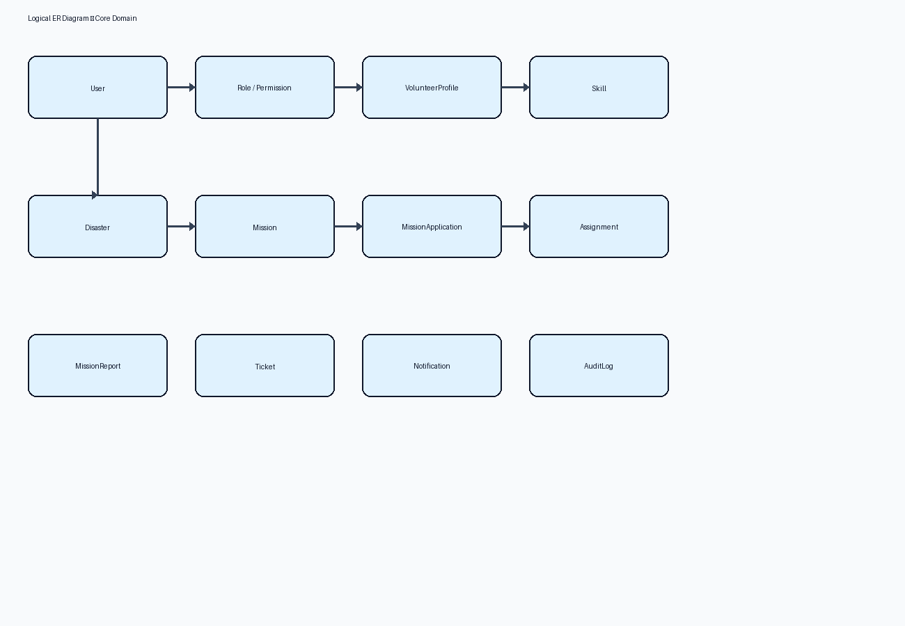
</p>

---

## امنیت مخزن

| بررسی | وضعیت |
|-------|--------|
| کلید/توکن تولید در سورس | **خیر** |
| Secret واقعی در git | **خیر** — `.env` در `.gitignore` |
| وابستگی قابل بازتولید | **بله** — lockfileها |
| راه‌اندازی یک‌فرمان | **بله** — `SETUP.*` |

هرگز `SECRET_KEY`، رمز DB تولید، یا کلید API شخص ثالث را commit نکنید. برای تولید از `docker-compose.prod.yml` و مقادیر قوی در `.env` استفاده کنید.

---

## مجوز

**Proprietary — Panah Platform**

Developed by **Investica Group**
