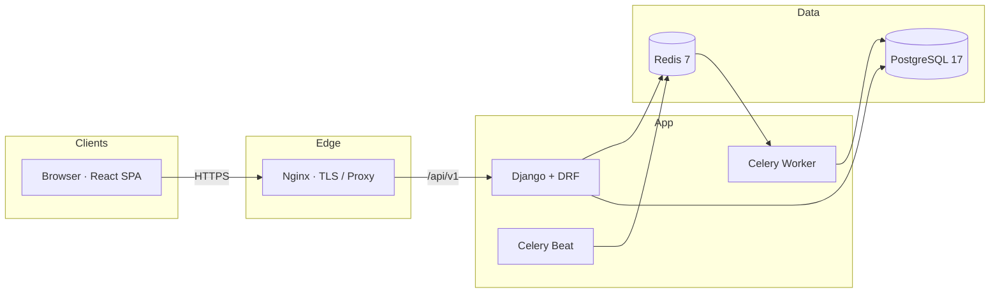
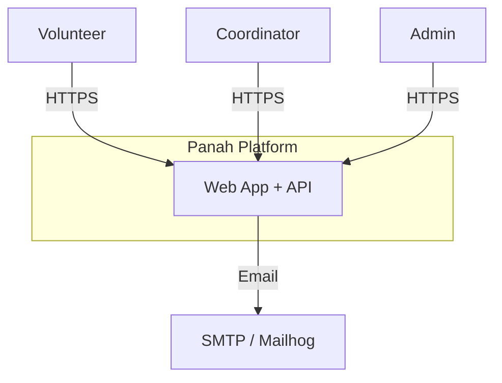
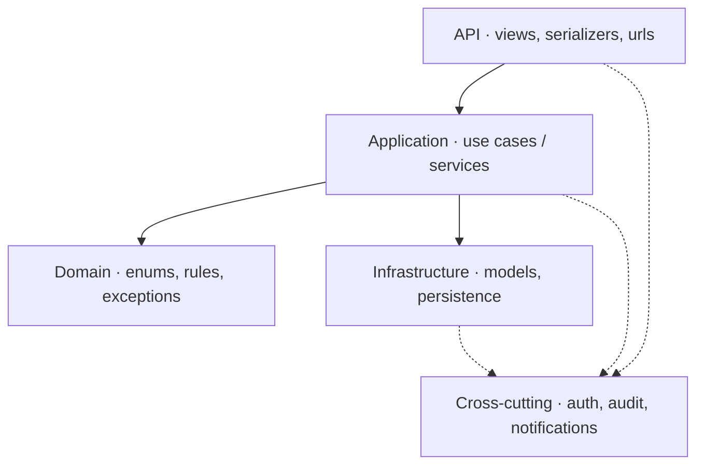
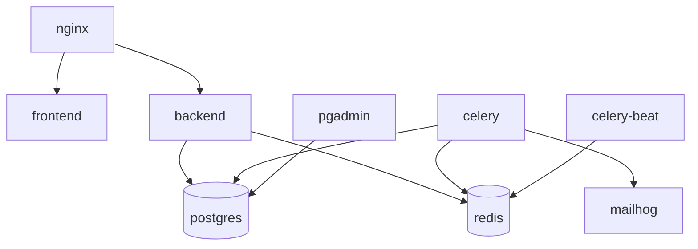
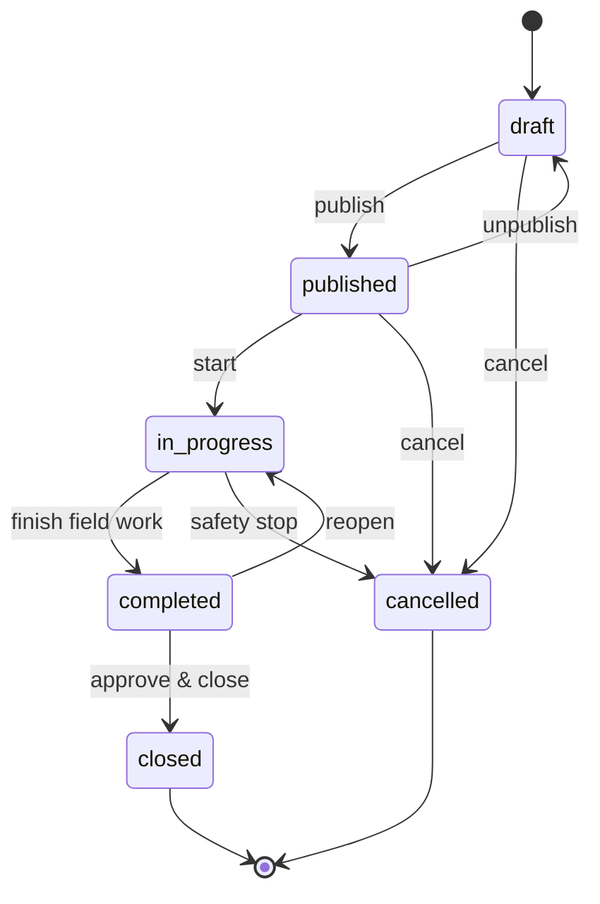
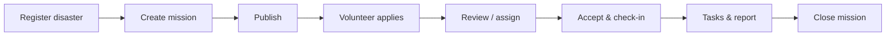
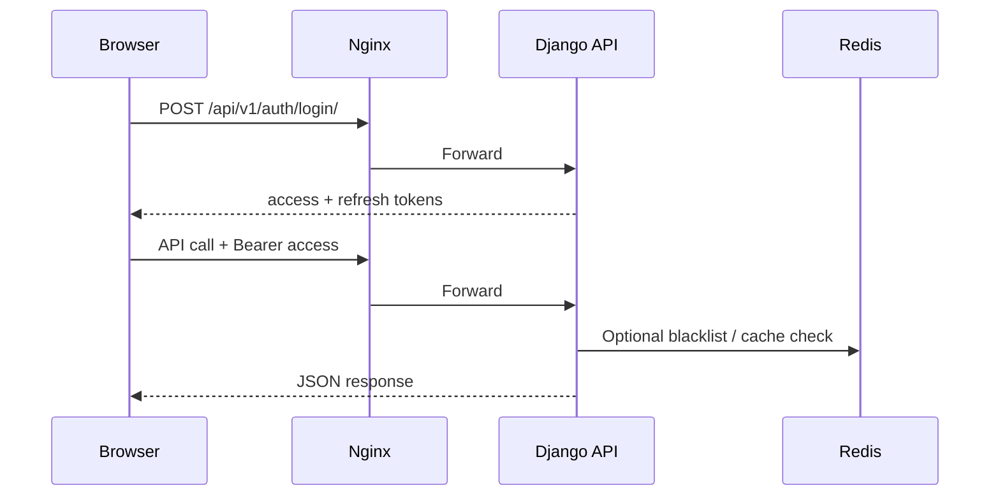

<p align="center">
  
</p>

<p align="center">
  <strong>Crisis volunteer management platform</strong><br/>
  Coordinate volunteers, missions, and field operations in emergencies.
</p>

<p align="center">
  
  
  
  
  
</p>

<p align="center">
  Developed by<br/>
  
</p>

---

## Overview

Panah is a modular monolith for crisis response coordination:

- **Staff** (admin / coordinator) create disasters and missions, review applications, assign volunteers, define tasks, and close reports.
- **Volunteers** manage profiles and skills, apply to published missions, accept assignments, check in, and report task progress.

The stack is a Persian RTL React SPA talking to a Django REST API at `/api/v1`, backed by PostgreSQL, Redis, and Celery, fronted by Nginx.

---

## Features

| Area | Description |
|------|-------------|
| Auth | Registration, JWT login/refresh, user profiles |
| RBAC | Database-driven roles and permissions |
| Volunteers | Profiles, skills, account approval |
| Missions | Disaster events, publish/visibility controls |
| Assignments | Applications, accept/reject, check-in |
| Tasks | Per-assignment checklists (coordinator manages, volunteer reports) |
| Reporting | Mission reports, finished-mission summaries, role dashboards |
| Ops | Audit logs, automated DB/media backups, support tickets |

---

## Architecture

### Runtime topology



### System context



### Backend layers



### Domain modules

```text
backend/src/
├── accounts / authentication
├── volunteers / skills
├── disasters / missions
├── assignments          # includes AssignmentTask
├── reports / dashboard
├── notifications / tickets
├── audit_logs
└── ops                  # backups & operations
```

### Docker services



---

## Mission lifecycle



### Operational flow



### Auth flow (JWT)



---

## Roles

| Role | Slug | Scope |
|------|------|--------|
| Admin | `admin` | Users, roles, audit, ops, full access |
| Coordinator | `coordinator` | Disasters, missions, applications, assignments, tasks |
| Volunteer | `volunteer` | Profile, applications, assignment acceptance, task status |

---

## Tech stack

| Layer | Technology |
|------|------------|
| Backend | Python 3.13, Django 5.2, DRF, SimpleJWT, Celery |
| Frontend | React 19, TypeScript, Vite, MUI, TanStack Query |
| Data | PostgreSQL 17, Redis 7 |
| Edge | Nginx |
| Runtime | Docker Compose |
| API docs | OpenAPI / Swagger at `/api/docs/` |

Dependency locks: `frontend/package-lock.json`, `backend/requirements.lock`.

---

## Quick start

**Requirements:** Docker Desktop (or Engine + Compose V2) on Windows, macOS, or Ubuntu.

> A fresh clone needs `.env` before containers start. Prefer the setup scripts below.

### Windows

1. Start Docker Desktop.
2. Clone this repository.
3. Run `SETUP.bat` (or `.\SETUP.ps1`).

### Linux / macOS

```bash
chmod +x SETUP.sh Start.sh Stop.sh
./SETUP.sh
```

Setup will create `.env` from `.env.example`, prepare local folders, remap busy ports if needed, build and start the stack, then seed demo data.

### Manual equivalent

```bash
cp .env.example .env
docker compose up -d --build
docker compose exec -T volunteer-management-backend python manage.py seed_data
docker compose exec -T volunteer-management-backend python manage.py seed_demo
```

### Day-to-day

| Action | Windows | Linux / macOS |
|--------|---------|---------------|
| Start | `Start.bat` | `./Start.sh` |
| Stop | `Stop.bat` | `./Stop.sh` |

```bash
docker compose ps
docker compose logs -f volunteer-management-backend
docker compose exec volunteer-management-backend python manage.py migrate
docker compose down -v   # full reset, then run SETUP again
```

---

## Endpoints

Ports come from `.env` (`HTTP_PORT`, `PGADMIN_PORT`, `MAILHOG_WEB_PORT`). Defaults:

| Service | URL |
|---------|-----|
| App | http://localhost |
| Login | http://localhost/login |
| API v1 | http://localhost/api/v1/ |
| Health | http://localhost/api/v1/health/ |
| Swagger | http://localhost/api/docs/ |
| Django Admin | http://localhost/django-admin/ |
| PgAdmin | http://localhost:5050 |
| Mailhog | http://localhost:8025 |

If setup remapped ports (e.g. `HTTP_PORT=8080`), use that host port instead.

---

## Development credentials

Local/demo only — change `.env` before sharing or deploying.

| Account | Email | Password |
|---------|-------|----------|
| App admin | `Investicaco@gmail.com` (`ADMIN_EMAIL`) | `ADMIN` (`ADMIN_PASSWORD`) |
| PgAdmin | `admin@example.com` | `admin` |

PostgreSQL (Docker network): host `volunteer-management-postgres`, database/user/password `volunteer_management` / `volunteer_user` / `volunteer_pass`.

---

## Repository layout

```text
├── SETUP.* / Start.* / Stop.*
├── docker-compose.yml
├── docker-compose.prod.yml
├── .env.example
├── backend/
├── frontend/
├── infrastructure/
├── documentation/          # SDD, ADRs, runbooks
├── DOCS/ / VDOC/           # detailed project documentation
└── environment/            # production env templates
```

---

## Backups & production

Nightly DB + media backups run via Celery Beat (02:00 Asia/Tehran). Artifacts land in `./database/backups/`. Trigger manually:

```bash
docker compose exec volunteer-management-backend python manage.py backup_now
```

Production:

```bash
cp environment/.env.production.example .env
# set strong SECRET_KEY, DB password, ADMIN_*, SMTP
docker compose -f docker-compose.yml -f docker-compose.prod.yml up -d --build
```

See [documentation/runbooks/deployment.md](documentation/runbooks/deployment.md).

---

## Troubleshooting

| Issue | Fix |
|-------|-----|
| Docker not running | Start Docker Desktop, re-run setup |
| Missing `.env` | Run `SETUP` |
| Port 80/443 busy | Setup remaps ports, or set `HTTP_PORT=8080` |
| Backend unhealthy | `docker logs volunteer-management-backend` |
| Blank frontend | Wait ~30s; check frontend logs |
| Full reset | `docker compose down -v` then `SETUP` |

---

## Documentation

| Document | Path |
|----------|------|
| Deployment runbook | [documentation/runbooks/deployment.md](documentation/runbooks/deployment.md) |
| Software design | [documentation/architecture/SDD.md](documentation/architecture/SDD.md) |
| API contracts | [documentation/architecture/api-contracts.md](documentation/architecture/api-contracts.md) |
| SRS | [VDOC/md/](VDOC/md/) |
| Architecture diagrams pack | [DOCS/Diagrams/](DOCS/Diagrams/) |

---

## Security

- `.env` is gitignored; never commit real secrets.
- Locks keep installs reproducible (`package-lock.json`, `requirements.lock`).
- Production must use strong credentials and `docker-compose.prod.yml`.

---

## License

**Proprietary — Panah Platform**  
© Investica Group
