# فصل ۳ — فرآیندهای کسب‌وکار

> این فصل فرآیندهای کسب‌وکار سامانه **پناه** را با شناسه‌های `BP-001` به بالا مستند می‌کند. برای هر فرآیند، هدف، مالک، محرک، پیش‌شرط، گام‌ها، خروجی، قواعد کسب‌وکار و شاخص‌های عملکرد ارائه شده است. روش‌شناسی بر پایه **BABOK v3** (تحلیل فرآیند، مدل‌سازی جریان و تحلیل شکاف) و نمادگذاری مفهومی BPMN است.

---

## ۳.۱. معماری فرآیندی سامانه

### ۳.۱.۱. نقشه سطح بالای فرآیندها

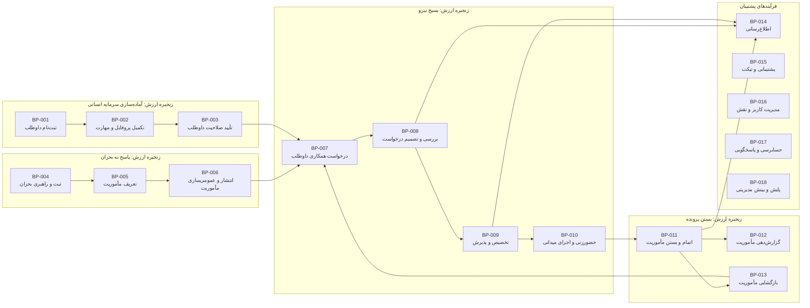

### ۳.۱.۲. فهرست فرآیندها

| شناسه | نام فرآیند | مالک فرآیند | دسته | بسامد | بحرانی بودن |
|---|---|---|---|---|---|
| `BP-001` | ثبت‌نام داوطلب | داوطلب | هسته | زیاد | بالا |
| `BP-002` | تکمیل پروفایل و مهارت‌ها | داوطلب | هسته | زیاد | متوسط |
| `BP-003` | تأیید صلاحیت داوطلب | هماهنگ‌کننده | هسته | متوسط | متوسط |
| `BP-004` | ثبت و راهبری بحران | هماهنگ‌کننده | هسته | کم | بسیار بالا |
| `BP-005` | تعریف مأموریت | هماهنگ‌کننده | هسته | متوسط | بسیار بالا |
| `BP-006` | انتشار و عمومی‌سازی مأموریت | هماهنگ‌کننده | هسته | متوسط | بسیار بالا |
| `BP-007` | ارسال درخواست همکاری | داوطلب | هسته | زیاد | بالا |
| `BP-008` | بررسی و تصمیم‌گیری درخواست | هماهنگ‌کننده | هسته | زیاد | بسیار بالا |
| `BP-009` | تخصیص و پذیرش تخصیص | هماهنگ‌کننده و داوطلب | هسته | زیاد | بسیار بالا |
| `BP-010` | حضورزنی و اجرای میدانی | هماهنگ‌کننده | هسته | زیاد | بالا |
| `BP-011` | اتمام و بستن مأموریت | هماهنگ‌کننده | هسته | متوسط | بالا |
| `BP-012` | گزارش‌دهی مأموریت | هماهنگ‌کننده | هسته | متوسط | بالا |
| `BP-013` | بازگشایی مأموریت | هماهنگ‌کننده | هسته | کم | متوسط |
| `BP-014` | اطلاع‌رسانی رویدادها | سامانه | پشتیبان | بسیار زیاد | متوسط |
| `BP-015` | پشتیبانی و مکاتبه تیکتی | کاربر و ستاد | پشتیبان | متوسط | متوسط |
| `BP-016` | مدیریت کاربران، نقش و مجوز | مدیر سامانه | پشتیبان | کم | بالا |
| `BP-017` | حسابرسی و پاسخگویی | مدیر سامانه | پشتیبان | پیوسته | بالا |
| `BP-018` | پایش عملیات و بینش مدیریتی | مدیر و هماهنگ‌کننده | پشتیبان | زیاد | متوسط |
| `BP-019` | مدیریت کاتالوگ مهارت | هماهنگ‌کننده | پشتیبان | کم | پایین |
| `BP-020` | مدیریت نشست و امنیت دسترسی | سامانه | پشتیبان | پیوسته | بسیار بالا |

---

## ۳.۲. `BP-001` — ثبت‌نام داوطلب

| قلم | مقدار |
|---|---|
| شناسه فرآیند | `BP-001` |
| نام فرآیند | ثبت‌نام داوطلب در سامانه |
| مالک فرآیند | داوطلب (خودخدمت) |
| بازیگران | بازدیدکننده ناشناس، سامانه |
| محرک | تمایل شخص به مشارکت داوطلبانه در عملیات امداد |
| پیش‌شرط | دسترسی به صفحه `/register`؛ نداشتن حساب پیشین با همان رایانامه یا کد ملی |
| پس‌شرط موفق | حساب کاربری با نقش `volunteer`، پروفایل داوطلبی در وضعیت `active`، مهارت‌های انتخابی ثبت‌شده |
| پس‌شرط ناموفق | هیچ رکوردی ایجاد نمی‌شود؛ خطای اعتبارسنجی نمایش داده می‌شود |
| بسامد | زیاد، با اوج در روزهای نخست بحران |
| نقاط پایانی درگیر | `GET /api/v1/skills/public/`، `POST /api/v1/volunteers/register/` |

### ۳.۲.۱. جریان فرآیند

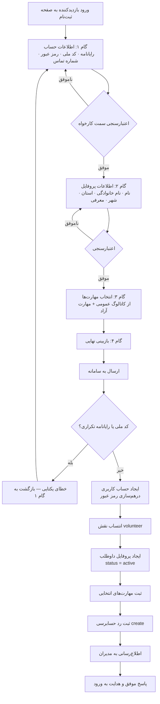

### ۳.۲.۲. گام‌های تفصیلی

| گام | کنشگر | فعالیت | داده ورودی | خروجی | قاعده |
|---|---|---|---|---|---|
| ۱ | بازدیدکننده | ورود به مسیر `/register` | — | نمایش گام نخست جادوگر | مسیر عمومی است |
| ۲ | سامانه | واکشی کاتالوگ مهارت عمومی | — | فهرست مهارت دسته‌بندی‌شده | نقطه پایانی `skills/public/` بدون احراز هویت |
| ۳ | بازدیدکننده | تکمیل اطلاعات حساب | رایانامه، کد ملی، رمز عبور، تکرار رمز، شماره تماس | داده معتبر گام ۱ | رمز عبور حداقل ۸ نویسه؛ تکرار رمز باید مطابق باشد |
| ۴ | بازدیدکننده | تکمیل اطلاعات پروفایل | نام، نام خانوادگی، استان، شهر، معرفی | داده معتبر گام ۲ | استان و شهر از فهرست آبشاری تقسیمات کشوری |
| ۵ | بازدیدکننده | انتخاب مهارت‌ها | شناسه مهارت‌ها، مهارت‌های آزاد | مجموعه مهارت | مهارت آزاد در `custom_skills` نگهداری می‌شود |
| ۶ | بازدیدکننده | بازبینی و تأیید نهایی | — | تأیید | نمایش خلاصه همه گام‌ها |
| ۷ | سامانه | اعتبارسنجی سمت کارساز و بررسی یکتایی | کل بار درخواست | پذیرش یا خطا | یکتایی رایانامه و کد ملی در سطح پایگاه داده |
| ۸ | سامانه | ایجاد حساب، انتساب نقش، ایجاد پروفایل و مهارت‌ها در یک تراکنش | — | رکوردهای پایا | تراکنش اتمی؛ شکست در هر بخش موجب بازگردانی کامل |
| ۹ | سامانه | ثبت رد حسابرسی و ارسال اطلاع‌رسانی به مدیران | — | رد حسابرسی، اطلاع‌رسانی | کنش `create` روی منبع داوطلب |
| ۱۰ | سامانه | پاسخ موفق و راهنمایی کاربر به ورود | — | پیام موفقیت | — |

### ۳.۲.۳. جریان‌های بدیل و استثنا

| شناسه | سناریو | رفتار سامانه |
|---|---|---|
| `BP-001-ALT-01` | کد ملی از پیش ثبت شده است | خطای یکتایی با پیام فارسی روشن؛ راهنمایی به صفحه ورود |
| `BP-001-ALT-02` | رایانامه از پیش ثبت شده است | خطای یکتایی؛ راهنمایی به بازیابی دسترسی از مسیر ستاد |
| `BP-001-ALT-03` | رمز عبور و تکرار آن ناهمسان است | خطای اعتبارسنجی سمت کارخواه پیش از ارسال |
| `BP-001-ALT-04` | داده تقسیمات کشوری از منبع بیرونی بارگذاری نمی‌شود | امکان ورود دستی استان و شهر؛ فرآیند متوقف نمی‌شود |
| `BP-001-ALT-05` | کاربر جادوگر را در میانه رها می‌کند | هیچ داده‌ای پایا نمی‌شود؛ فرآیند از ابتدا آغاز می‌شود |
| `BP-001-ALT-06` | خطای شبکه در لحظه ارسال | نمایش خطای شبکه و امکان تلاش دوباره بدون بازتایپ داده |

### ۳.۲.۴. قواعد کسب‌وکار

| شناسه | قاعده |
|---|---|
| `BR-001` | کد ملی، شناسه یکتای داوطلب در سامانه است و ثبت تکراری آن مجاز نیست. |
| `BR-002` | نشانی رایانامه، نام کاربری سامانه است و باید یکتا باشد. |
| `BR-003` | رمز عبور حداقل ۸ نویسه دارد و تنها به‌صورت درهم‌سازی‌شده ذخیره می‌شود. |
| `BR-004` | پروفایل داوطلب در جریان جاری MVP بی‌درنگ در وضعیت `active` ایجاد می‌شود تا کاربر بتواند بدون انتظار وارد شود. |
| `BR-005` | ثبت‌نام یک تراکنش اتمی است: یا همه رکوردها (کاربر، نقش، پروفایل، مهارت) ایجاد می‌شوند یا هیچ‌کدام. |
| `BR-006` | ثبت‌نام موفق داوطلب به مدیران سامانه اطلاع داده می‌شود. |

### ۳.۲.۵. شاخص‌های عملکرد فرآیند

| شاخص | تعریف | هدف |
|---|---|---|
| نرخ تکمیل ثبت‌نام | نسبت ثبت‌نام‌های تکمیل‌شده به شروع‌شده | بیش از ۷۰٪ |
| مدت میانه تکمیل | زمان از ورود به گام ۱ تا پاسخ موفق | کمتر از ۵ دقیقه |
| نرخ خطای یکتایی | نسبت تلاش‌های ردشده به‌سبب داده تکراری | کمتر از ۱۰٪ |
| میانگین تعداد مهارت انتخابی | تعداد مهارت ثبت‌شده در هر ثبت‌نام | بیش از ۲ |

---

## ۳.۳. `BP-002` — تکمیل پروفایل و مهارت‌ها

| قلم | مقدار |
|---|---|
| شناسه فرآیند | `BP-002` |
| مالک فرآیند | داوطلب |
| بازیگران | داوطلب، سامانه |
| محرک | ورود نخست کاربر با پروفایل ناقص، یا تمایل به به‌روزرسانی اطلاعات |
| پیش‌شرط | کاربر احراز هویت شده است |
| پس‌شرط موفق | داده پروفایل به‌روز شده و درصد تکمیل پروفایل افزایش یافته است |
| نقاط پایانی درگیر | `GET /api/v1/auth/me/`، `PATCH /api/v1/auth/me/`، `POST /api/v1/auth/me/avatar/` |

### ۳.۳.۱. جریان فرآیند

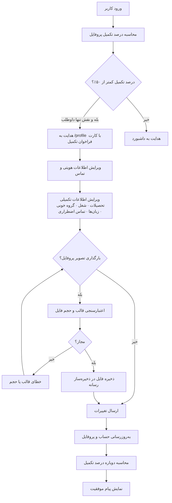

### ۳.۳.۲. اقلام داده پروفایل

| گروه | اقلام |
|---|---|
| هویتی | نام، نام خانوادگی، رایانامه (فقط خواندنی پس از ثبت)، شماره تماس، تاریخ تولد |
| مکانی | استان، شهر، نشانی |
| حرفه‌ای | تحصیلات، شغل، سابقه کار (سال)، علاقه‌مندی‌ها، زبان‌ها |
| سلامت و ایمنی | گروه خونی، شرایط پزشکی، معلولیت |
| تماس اضطراری | نام و شماره تماس فرد مرتبط |
| مهارتی | مهارت‌های کاتالوگ با سطح تخصص، مهارت‌های آزاد |
| دسترسی | زمان‌های در دسترس بودن (ساختار JSON) |
| رسانه | تصویر پروفایل |

### ۳.۳.۳. قواعد کسب‌وکار

| شناسه | قاعده |
|---|---|
| `BR-007` | کاربر تنها می‌تواند پروفایل خود را ویرایش کند. |
| `BR-008` | نشانی رایانامه پس از ثبت‌نام از مسیر پروفایل قابل تغییر نیست. |
| `BR-009` | تصویر پروفایل تنها با قالب‌های تصویری مجاز و حجم حداکثر ۳ مگابایت پذیرفته می‌شود. |
| `BR-010` | آستانه تکمیل پروفایل برای کاربرانی که تنها نقش داوطلب دارند ۵۰٪ است؛ پایین‌تر از آن کاربر به تکمیل پروفایل هدایت می‌شود. |
| `BR-011` | اطلاعات سلامت و پزشکی داده حساس تلقی می‌شود و تنها برای خود کاربر و نقش‌های دارای مجوز مشاهده داوطلب نمایان است. |

---

## ۳.۴. `BP-003` — تأیید صلاحیت داوطلب

| قلم | مقدار |
|---|---|
| شناسه فرآیند | `BP-003` |
| مالک فرآیند | هماهنگ‌کننده |
| بازیگران | هماهنگ‌کننده، مدیر، داوطلب |
| محرک | نیاز به بازبینی داوطلبان در وضعیت `registered` یا `pending_approval` |
| پیش‌شرط | مجوز `volunteers.approve` |
| پس‌شرط موفق | وضعیت داوطلب به `active` یا `rejected` تغییر می‌کند و اطلاع‌رسانی ارسال می‌شود |
| نقاط پایانی درگیر | `GET /api/v1/volunteers/`، `GET /api/v1/volunteers/{id}/`، `POST /api/v1/volunteers/{id}/approve/`، `POST /api/v1/volunteers/{id}/reject/` |

### ۳.۴.۱. جریان فرآیند

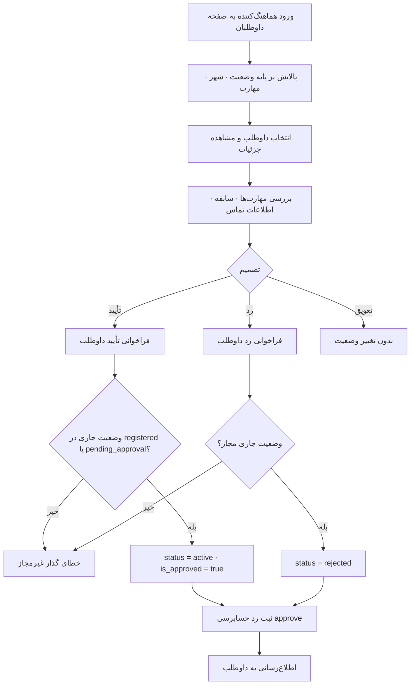

### ۳.۴.۲. قواعد کسب‌وکار

| شناسه | قاعده |
|---|---|
| `BR-012` | تأیید و رد داوطلب تنها از وضعیت‌های `registered` یا `pending_approval` مجاز است. |
| `BR-013` | ارزیابی صلاحیت میدانی و سلامت جسمانی داوطلب فرآیندی بیرون از سامانه است؛ سامانه تنها نتیجه تصمیم را ثبت می‌کند. |
| `BR-014` | تأیید داوطلب همراه با فعال‌سازی پرچم تأییدشدگی حساب کاربری است. |
| `BR-015` | هر تصمیم تأیید یا رد باید در رد حسابرسی ثبت شود. |

---

## ۳.۵. `BP-004` — ثبت و راهبری بحران

| قلم | مقدار |
|---|---|
| شناسه فرآیند | `BP-004` |
| مالک فرآیند | هماهنگ‌کننده |
| بازیگران | هماهنگ‌کننده، مدیر، سامانه |
| محرک | وقوع رویداد بحرانی و اعلام آن به ستاد |
| پیش‌شرط | مجوز `disasters.create` برای ایجاد و `disasters.update` برای ویرایش |
| پس‌شرط موفق | رکورد بحران با نوع، شدت، موقعیت، نیازها و وضعیت `active` ایجاد می‌شود |
| نقاط پایانی درگیر | `GET|POST /api/v1/disasters/`، `GET|PATCH|DELETE /api/v1/disasters/{id}/` |

### ۳.۵.۱. جریان فرآیند

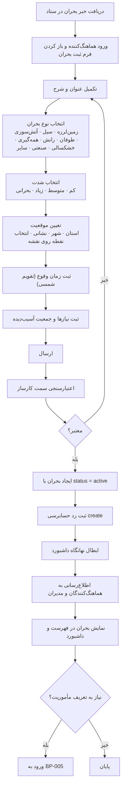

### ۳.۵.۲. اقلام داده بحران

| قلم | نوع | الزامی | توضیح |
|---|---|---|---|
| عنوان | متن (تا ۲۵۵ نویسه) | بله | نمایه‌دار برای جست‌وجو |
| شرح | متن بلند | خیر | توصیف تفصیلی وضعیت |
| نوع بحران | مقدار برشمرده | بله (با پیش‌فرض `other`) | نمایه‌دار برای پالایش |
| شدت | مقدار برشمرده | بله (با پیش‌فرض `medium`) | نمایه‌دار |
| استان / شهر / نشانی | متن | خیر | مبنای پالایش مکانی |
| زمان وقوع | مهر زمانی | خیر | نمایه‌دار برای مرتب‌سازی |
| نیازها | فهرست JSON | خیر | فهرست نیازهای فوری |
| جمعیت آسیب‌دیده | عدد صحیح مثبت | خیر | برآورد دامنه آسیب |
| وضعیت | مقدار برشمرده | بله (با پیش‌فرض `active`) | `active`، `inactive`، `resolved`، `archived` |
| ابرداده | شیء JSON | خیر | داده‌های افزوده مانند مختصات جغرافیایی |

### ۳.۵.۳. قواعد کسب‌وکار

| شناسه | قاعده |
|---|---|
| `BR-016` | بحران تازه‌ساخته‌شده در وضعیت `active` قرار می‌گیرد. |
| `BR-017` | بحران فاقد ماشین حالت اجباری است؛ تغییر وضعیت آن از مسیر به‌روزرسانی و به تشخیص هماهنگ‌کننده انجام می‌شود. |
| `BR-018` | حذف بحران به‌صورت حذف نرم انجام می‌شود و رکورد از پرس‌وجوهای پیش‌فرض کنار می‌رود. |
| `BR-019` | مختصات جغرافیایی در MVP تنها به‌صورت داده توصیفی در ابرداده نگهداری می‌شود و پرس‌وجوی مکانی روی آن اجرا نمی‌شود. |
| `BR-020` | هر بحران می‌تواند صفر یا چند مأموریت داشته باشد؛ هر مأموریت الزاماً به یک بحران تعلق دارد. |
| `BR-021` | ایجاد یا تغییر بحران، نهانگاه داشبورد را باطل می‌کند تا شاخص‌ها بی‌درنگ به‌روز شوند. |

---

## ۳.۶. `BP-005` — تعریف مأموریت

| قلم | مقدار |
|---|---|
| شناسه فرآیند | `BP-005` |
| مالک فرآیند | هماهنگ‌کننده |
| محرک | نیاز عملیاتی مشخص در چارچوب یک بحران فعال |
| پیش‌شرط | وجود بحران؛ مجوز `missions.create` |
| پس‌شرط موفق | مأموریت در وضعیت `draft` با پرچم‌های مرئی‌بودن خاموش ایجاد می‌شود |
| نقاط پایانی درگیر | `POST /api/v1/missions/`، `PATCH /api/v1/missions/{id}/` |

### ۳.۶.۱. جریان فرآیند

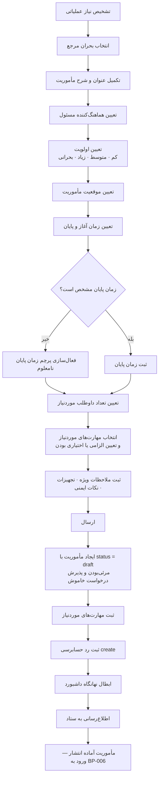

### ۳.۶.۲. اقلام داده مأموریت

| قلم | نوع | الزامی | توضیح |
|---|---|---|---|
| بحران مرجع | ارجاع | بله | مأموریت بی‌بحران ایجاد نمی‌شود |
| عنوان | متن (تا ۲۵۵ نویسه) | بله | نمایه‌دار |
| شرح | متن بلند | خیر | — |
| هماهنگ‌کننده | ارجاع به کاربر | بله | با سیاست حفاظت از حذف |
| وضعیت | مقدار برشمرده | خودکار | همیشه `draft` در ایجاد |
| اولویت | مقدار برشمرده | بله (پیش‌فرض `medium`) | نمایه‌دار |
| استان / شهر / نشانی | متن | خیر | — |
| زمان آغاز / پایان | مهر زمانی | خیر | — |
| پرچم زمان پایان نامعلوم | بولی | خیر (پیش‌فرض خاموش) | برای عملیات با پایان نامشخص |
| تعداد داوطلب موردنیاز | عدد صحیح مثبت | بله (پیش‌فرض ۱) | مبنای سنجش پرشدگی سهمیه |
| ملاحظات ویژه | متن بلند | خیر | — |
| تجهیزات موردنیاز | متن بلند | خیر | — |
| نکات ایمنی | متن بلند | خیر | — |
| پرچم مرئی‌بودن برای داوطلبان | بولی | خودکار (خاموش) | کنترل عمومی‌سازی |
| پرچم پذیرش درخواست | بولی | خودکار (خاموش) | کنترل بازبودن فراخوان |
| ابرداده | شیء JSON | خیر | — |
| مهارت‌های موردنیاز | مجموعه ارجاع + پرچم الزامی | خیر | یکتا بر جفت مأموریت-مهارت |

### ۳.۶.۳. قواعد کسب‌وکار

| شناسه | قاعده |
|---|---|
| `BR-022` | مأموریت الزاماً در وضعیت `draft` و با دو پرچم مرئی‌بودن و پذیرش درخواست خاموش ایجاد می‌شود. |
| `BR-023` | فیلد وضعیت در فرآیند ایجاد و به‌روزرسانی عمومی قابل تعیین نیست؛ تغییر وضعیت تنها از نقاط پایانی گذار ممکن است. |
| `BR-024` | هر مأموریت دقیقاً یک هماهنگ‌کننده مسئول دارد. |
| `BR-025` | ویرایش مأموریت در وضعیت `closed` مسدود است. |
| `BR-026` | مهارت موردنیاز می‌تواند «الزامی» یا «مطلوب» علامت بخورد؛ سامانه در MVP این نشانه را برای پالایش و راهنمایی به کار می‌برد و آن را به‌عنوان قید سخت پذیرش اعمال نمی‌کند. |
| `BR-027` | تعداد داوطلب موردنیاز، مبنای سنجش پرشدگی و پیشنهاد صف انتظار است. |

---

## ۳.۷. `BP-006` — انتشار و عمومی‌سازی مأموریت

| قلم | مقدار |
|---|---|
| شناسه فرآیند | `BP-006` |
| مالک فرآیند | هماهنگ‌کننده |
| محرک | آماده شدن مأموریت پیش‌نویس برای فراخوان داوطلب |
| پیش‌شرط | مأموریت در وضعیت `draft`؛ مجوز `missions.create` |
| پس‌شرط موفق | مأموریت در وضعیت `published` و در صورت فعال‌سازی پرچم‌ها، برای داوطلبان مرئی و درخواست‌پذیر است |
| نقاط پایانی درگیر | `POST /api/v1/missions/{id}/publish/`، `PATCH /api/v1/missions/{id}/visibility/` |

### ۳.۷.۱. جریان فرآیند

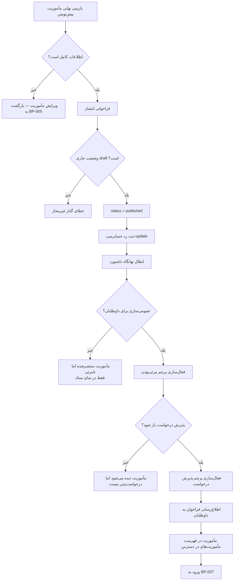

### ۳.۷.۲. جدول ترکیب پرچم‌ها و رفتار سامانه

| وضعیت مأموریت | مرئی برای داوطلبان | پذیرش درخواست | رفتار مشاهده‌شده |
|---|---|---|---|
| `draft` | هر مقدار | هر مقدار | تنها در نمای ستاد؛ داوطلب آن را نمی‌بیند |
| `published` | خاموش | خاموش | فقط در نمای ستاد؛ آماده عمومی‌سازی |
| `published` | روشن | خاموش | داوطلب مأموریت را می‌بیند اما نمی‌تواند درخواست دهد |
| `published` | روشن | روشن | داوطلب می‌بیند و می‌تواند درخواست بفرستد |
| `in_progress` | هر مقدار | هر مقدار | درخواست تازه پذیرفته نمی‌شود |
| `completed` | هر مقدار | هر مقدار | درخواست تازه پذیرفته نمی‌شود |
| `closed` | هر مقدار | هر مقدار | ویرایش و تغییر مرئی‌بودن مسدود است |

### ۳.۷.۳. قواعد کسب‌وکار

| شناسه | قاعده |
|---|---|
| `BR-028` | انتشار تنها از وضعیت `draft` مجاز است. |
| `BR-029` | مرئی‌بودن و پذیرش درخواست دو پرچم مستقل هستند و مستقل از وضعیت مأموریت کنترل می‌شوند. |
| `BR-030` | امکان ارسال درخواست تنها با هم‌زمانی سه شرط برقرار است: وضعیت `published`، پرچم مرئی‌بودن روشن، پرچم پذیرش درخواست روشن. |
| `BR-031` | تغییر مرئی‌بودن مأموریت بسته مجاز نیست. |

---

## ۳.۸. `BP-007` — ارسال درخواست همکاری

| قلم | مقدار |
|---|---|
| شناسه فرآیند | `BP-007` |
| مالک فرآیند | داوطلب |
| محرک | مشاهده مأموریت مناسب در فهرست مأموریت‌های در دسترس |
| پیش‌شرط | داوطلب احراز هویت شده با مجوز `missions.apply`؛ مأموریت درخواست‌پذیر |
| پس‌شرط موفق | درخواست در وضعیت `submitted` ثبت و به ستاد اطلاع داده می‌شود |
| نقاط پایانی درگیر | `GET /api/v1/missions/`، `GET /api/v1/missions/{id}/`، `POST /api/v1/missions/{id}/apply/` |

### ۳.۸.۱. جریان فرآیند

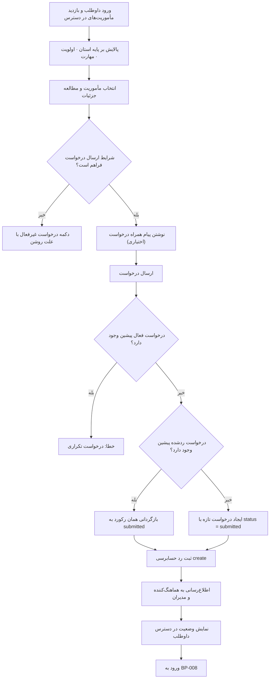

### ۳.۸.۲. شرایط مسدودکننده ارسال درخواست

| شناسه | شرط مسدودکننده | پیام کاربر |
|---|---|---|
| `BLK-01` | مأموریت در وضعیت `published` نیست | مأموریت در حال حاضر پذیرای درخواست نیست |
| `BLK-02` | پرچم مرئی‌بودن خاموش است | مأموریت برای داوطلبان منتشر نشده است |
| `BLK-03` | پرچم پذیرش درخواست خاموش است | فراخوان این مأموریت بسته است |
| `BLK-04` | داوطلب درخواست فعال (`submitted`/`waitlist`/`approved`) دارد | شما پیش‌تر برای این مأموریت درخواست فرستاده‌اید |
| `BLK-05` | کاربر پروفایل داوطلبی ندارد | برای ارسال درخواست باید پروفایل داوطلبی داشته باشید |
| `BLK-06` | کاربر مجوز `missions.apply` ندارد | شما اختیار ارسال درخواست ندارید |

### ۳.۸.۳. قواعد کسب‌وکار

| شناسه | قاعده |
|---|---|
| `BR-032` | هر داوطلب برای هر مأموریت تنها یک درخواست فعال دارد. |
| `BR-033` | درخواست ردشده مانع ارسال دوباره نیست؛ در این حالت همان رکورد به وضعیت `submitted` بازمی‌گردد. |
| `BR-034` | پیام همراه درخواست اختیاری است و برای بررسی‌کننده نمایان می‌شود. |
| `BR-035` | ارسال درخواست بی‌درنگ به هماهنگ‌کننده مأموریت و مدیران اطلاع داده می‌شود. |
| `BR-036` | داوطلب فقط درخواست‌های خود را مشاهده می‌کند. |

---

## ۳.۹. `BP-008` — بررسی و تصمیم‌گیری درخواست

| قلم | مقدار |
|---|---|
| شناسه فرآیند | `BP-008` |
| مالک فرآیند | هماهنگ‌کننده |
| محرک | ورود درخواست تازه به صندوق درخواست‌ها |
| پیش‌شرط | مجوز `missions.create`؛ درخواست در وضعیت `submitted` یا `waitlist` |
| پس‌شرط موفق | درخواست به یکی از وضعیت‌های `approved`، `rejected` یا `waitlist` می‌رسد؛ در حالت پذیرش، تخصیص ایجاد می‌شود |
| نقاط پایانی درگیر | `GET /api/v1/missions/applications/inbox/`، `GET /api/v1/missions/{id}/applications/`، `POST .../approve/`، `POST .../reject/`، `POST .../waitlist/` |

### ۳.۹.۱. جریان فرآیند

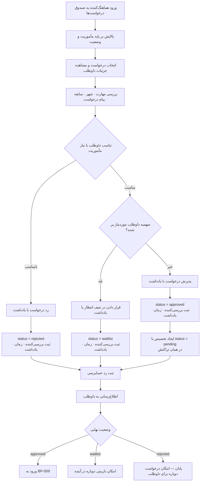

### ۳.۹.۲. معیارهای تصمیم‌گیری (راهنمای عملیاتی)

| معیار | وزن پیشنهادی | منبع داده |
|---|---|---|
| هم‌پوشانی مهارت داوطلب با مهارت‌های موردنیاز مأموریت | بالا | `VolunteerSkill` و `MissionRequiredSkill` |
| سطح تخصص داوطلب در مهارت‌های الزامی | بالا | فیلد سطح تخصص |
| نزدیکی مکانی (تطابق استان و شهر) | متوسط | استان و شهر داوطلب و مأموریت |
| وضعیت فعال بودن داوطلب | قید سخت | وضعیت پروفایل داوطلب |
| بار جاری داوطلب در سایر مأموریت‌ها | متوسط | تخصیص‌های فعال داوطلب |
| کیفیت پیام همراه درخواست | پایین | متن پیام |
| باقی‌مانده سهمیه مأموریت | قید نرم | تعداد داوطلب موردنیاز در برابر تخصیص‌های فعال |

> **توجه:** در MVP این ارزیابی به‌صورت **دستی و بر عهده انسان** است؛ سامانه داده لازم را در یک نما گرد می‌آورد اما امتیازدهی خودکار انجام نمی‌دهد. موتور امتیازدهی خودکار در فاز سوم پیش‌بینی شده است.

### ۳.۹.۳. قواعد کسب‌وکار

| شناسه | قاعده |
|---|---|
| `BR-037` | پذیرش و رد درخواست تنها از وضعیت‌های `submitted` و `waitlist` مجاز است. |
| `BR-038` | قرار دادن در صف انتظار تنها از وضعیت `submitted` مجاز است. |
| `BR-039` | پذیرش درخواست به‌صورت اتمی و در همان تراکنش، یک تخصیص با وضعیت `pending` ایجاد می‌کند. |
| `BR-040` | هر تصمیم باید شناسه بررسی‌کننده، زمان بررسی و یادداشت بررسی را ثبت کند. |
| `BR-041` | داوطلب باید از نتیجه هر تصمیم از طریق اطلاع‌رسانی آگاه شود. |
| `BR-042` | صندوق ورودی درخواست‌ها فقط برای دارندگان مجوز `missions.create` قابل دسترسی است. |

### ۳.۹.۴. شاخص‌های عملکرد فرآیند

| شاخص | هدف |
|---|---|
| زمان میانه پاسخ به درخواست | کمتر از ۲۴ ساعت |
| نسبت درخواست‌های بی‌پاسخ بیش از ۴۸ ساعت | کمتر از ۵٪ |
| نرخ پذیرش | ۴۰٪ تا ۷۰٪ (نشانه سلامت جریان فراخوان) |
| نسبت درخواست‌های صف انتظار که سرانجام تصمیم قطعی گرفته‌اند | بیش از ۹۰٪ |

---

## ۳.۱۰. `BP-009` — تخصیص و پذیرش تخصیص

| قلم | مقدار |
|---|---|
| شناسه فرآیند | `BP-009` |
| مالک فرآیند | هماهنگ‌کننده (ایجاد) و داوطلب (پاسخ) |
| محرک | پذیرش درخواست همکاری، یا تخصیص مستقیم توسط ستاد |
| پیش‌شرط | مجوز `assignments.manage` برای ایجاد؛ مجوز `assignments.accept` یا `assignments.decline` برای پاسخ |
| پس‌شرط موفق | تخصیص در وضعیت `accepted` یا `declined` قرار می‌گیرد |
| نقاط پایانی درگیر | `POST /api/v1/assignments/`، `GET /api/v1/assignments/my/`، `POST|PATCH /api/v1/assignments/{id}/accept/`، `.../decline/` |

### ۳.۱۰.۱. جریان فرآیند

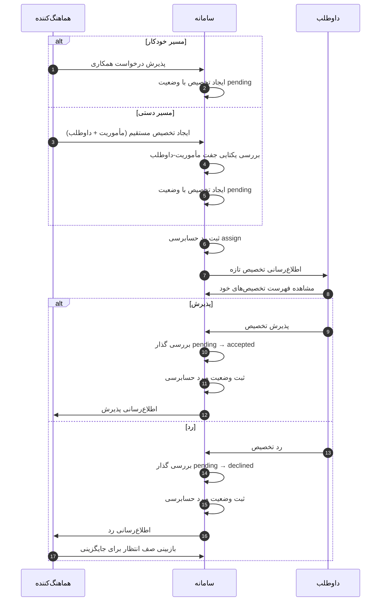

### ۳.۱۰.۲. قواعد کسب‌وکار

| شناسه | قاعده |
|---|---|
| `BR-043` | تخصیص همیشه با وضعیت `pending` ایجاد می‌شود. |
| `BR-044` | برای هر جفت مأموریت-داوطلب تنها یک تخصیص وجود دارد. |
| `BR-045` | پذیرش و رد تخصیص تنها از وضعیت `pending` مجاز است. |
| `BR-046` | گذارهای تخصیص خودتوان هستند؛ درخواست تکراری همان گذار خطا تولید نمی‌کند. |
| `BR-047` | وضعیت `declined` پایانی است؛ داوطلب پس از رد نمی‌تواند همان تخصیص را بپذیرد. |
| `BR-048` | برای پیشگیری از ایجاد تخصیص تکراری در پی ارسال چندباره درخواست، سامانه از کلید یکتاسازی (Idempotency Key) در نهانگاه بهره می‌برد. |
| `BR-049` | داوطلب تنها تخصیص‌های خود را می‌بیند. |

---

## ۳.۱۱. `BP-010` — حضورزنی و اجرای میدانی

| قلم | مقدار |
|---|---|
| شناسه فرآیند | `BP-010` |
| مالک فرآیند | هماهنگ‌کننده |
| محرک | آغاز عملیات میدانی و حضور داوطلبان پذیرفته‌شده |
| پیش‌شرط | مأموریت در وضعیت `in_progress`؛ تخصیص در وضعیت `accepted`؛ مجوز `assignments.manage` |
| پس‌شرط موفق | تخصیص به `checked_in` و سپس `completed` می‌رسد |
| نقاط پایانی درگیر | `POST /api/v1/missions/{id}/start/`، `POST /api/v1/assignments/{id}/check-in/`، `POST /api/v1/assignments/{id}/complete/` |

### ۳.۱۱.۱. جریان فرآیند

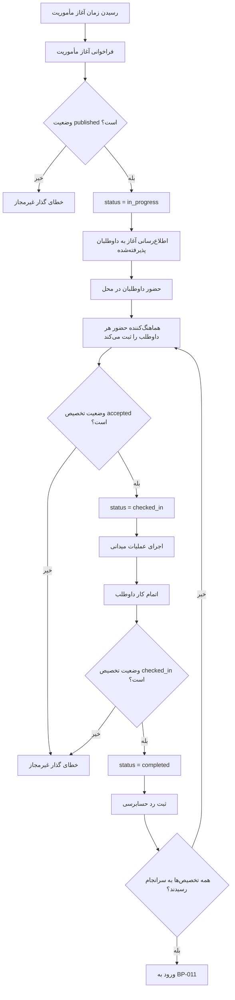

### ۳.۱۱.۲. قواعد کسب‌وکار

| شناسه | قاعده |
|---|---|
| `BR-050` | حضورزنی تنها از وضعیت `accepted` مجاز است. |
| `BR-051` | اتمام تخصیص تنها از وضعیت `checked_in` مجاز است؛ ثبت اتمام بدون حضورزنی امکان‌پذیر نیست. |
| `BR-052` | حضورزنی و اتمام تخصیص کنش‌های ستادی هستند و مجوز `assignments.manage` می‌خواهند. |
| `BR-053` | آغاز مأموریت تنها از وضعیت `published` مجاز است. |
| `BR-054` | ثبت مکان و زمان دقیق حضور (Geo-fencing) در MVP در دامنه نیست و به فاز سوم موکول است. |

---

## ۳.۱۲. `BP-011` — اتمام و بستن مأموریت

| قلم | مقدار |
|---|---|
| شناسه فرآیند | `BP-011` |
| مالک فرآیند | هماهنگ‌کننده |
| محرک | پایان عملیات میدانی |
| پیش‌شرط | مأموریت در وضعیت `in_progress`؛ مجوز `missions.create` |
| پس‌شرط موفق | مأموریت از `in_progress` به `completed` و سپس به `closed` می‌رسد |
| نقاط پایانی درگیر | `POST /api/v1/missions/{id}/complete/`، `POST /api/v1/missions/{id}/close/` |

### ۳.۱۲.۱. جریان فرآیند

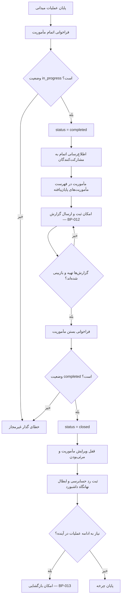

### ۳.۱۲.۲. قواعد کسب‌وکار

| شناسه | قاعده |
|---|---|
| `BR-055` | اتمام مأموریت تنها از وضعیت `in_progress` مجاز است. |
| `BR-056` | بستن مأموریت تنها از وضعیت `completed` مجاز است. |
| `BR-057` | مأموریت `closed` قابل ویرایش نیست و مرئی‌بودن آن تغییرپذیر نیست. |
| `BR-058` | خلاصه مأموریت‌های پایان‌یافته برای مأموریت‌های در وضعیت `completed` یا `closed` قابل دریافت است. |
| `BR-059` | بستن مأموریت پیش از دریافت گزارش از منظر سامانه مسدود نیست، اما مطابق رویه سازمانی توصیه نمی‌شود. |

---

## ۳.۱۳. `BP-012` — گزارش‌دهی مأموریت

| قلم | مقدار |
|---|---|
| شناسه فرآیند | `BP-012` |
| مالک فرآیند | هماهنگ‌کننده |
| محرک | رسیدن مأموریت به وضعیت `completed` یا `closed` |
| پیش‌شرط | مجوز `reports.submit` برای نگارش و `reports.view` برای بازبینی |
| پس‌شرط موفق | گزارش از `draft` به `submitted` و سپس `reviewed` می‌رسد |
| نقاط پایانی درگیر | `POST /api/v1/reports/`، `PATCH /api/v1/reports/{id}/`، `POST /api/v1/reports/{id}/attachments/`، `POST /api/v1/reports/{id}/submit/`، `POST /api/v1/reports/{id}/review/`، `GET /api/v1/reports/finished-missions/` |

### ۳.۱۳.۱. جریان فرآیند

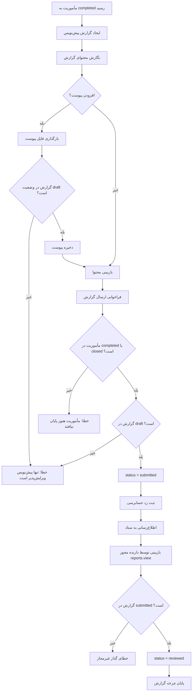

### ۳.۱۳.۲. خلاصه مأموریت‌های پایان‌یافته

| قلم خلاصه | منبع داده |
|---|---|
| مشخصات مأموریت | عنوان، بحران، اولویت، وضعیت، بازه زمانی، موقعیت |
| آمار درخواست‌ها | تعداد به تفکیک وضعیت درخواست |
| آمار تخصیص‌ها | تعداد به تفکیک وضعیت تخصیص |
| فهرست مشارکت‌کنندگان | داوطلبان با وضعیت تخصیص |
| مهارت‌های موردنیاز | مهارت‌های ثبت‌شده برای مأموریت |
| گزارش‌های ثبت‌شده | گزارش‌ها با وضعیت و نگارنده |

### ۳.۱۳.۳. قواعد کسب‌وکار

| شناسه | قاعده |
|---|---|
| `BR-060` | گزارش تازه در وضعیت `draft` ایجاد می‌شود. |
| `BR-061` | تنها گزارش در وضعیت `draft` ویرایش‌پذیر است و پیوست می‌پذیرد. |
| `BR-062` | ارسال گزارش تنها زمانی مجاز است که مأموریت مرجع در وضعیت `completed` یا `closed` باشد. |
| `BR-063` | بازبینی گزارش تنها از وضعیت `submitted` مجاز است. |
| `BR-064` | نگارنده گزارش با سیاست حفاظت از حذف نگهداری می‌شود تا اصالت سند حفظ شود. |
| `BR-065` | هر مأموریت می‌تواند بیش از یک گزارش داشته باشد. |

---

## ۳.۱۴. `BP-013` — بازگشایی مأموریت

| قلم | مقدار |
|---|---|
| شناسه فرآیند | `BP-013` |
| مالک فرآیند | هماهنگ‌کننده |
| محرک | نیاز به ادامه یا تکرار عملیات پس از بستن مأموریت |
| پیش‌شرط | مأموریت در وضعیت `closed`؛ مجوز `missions.create` |
| پس‌شرط موفق | مأموریت به وضعیت `published` بازمی‌گردد و ویرایش‌پذیر می‌شود |
| نقطه پایانی | `POST /api/v1/missions/{id}/reopen/` |

### ۳.۱۴.۱. جریان فرآیند

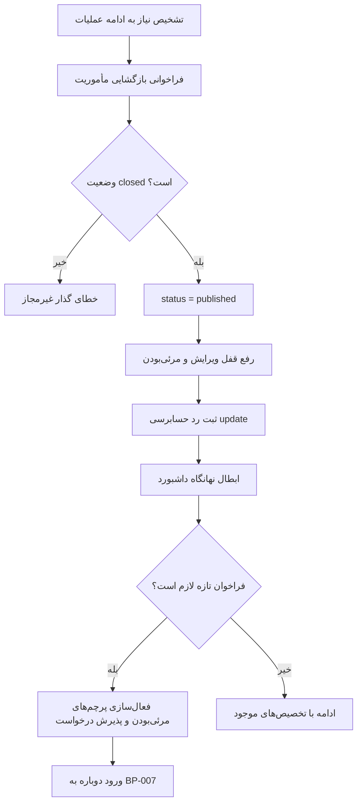

### ۳.۱۴.۲. قواعد کسب‌وکار

| شناسه | قاعده |
|---|---|
| `BR-066` | بازگشایی تنها از وضعیت `closed` مجاز است و مأموریت را به `published` بازمی‌گرداند نه به `draft`. |
| `BR-067` | بازگشایی تخصیص‌ها، درخواست‌ها و گزارش‌های پیشین را باطل نمی‌کند؛ تاریخچه دست‌نخورده می‌ماند. |
| `BR-068` | هر بازگشایی باید در رد حسابرسی ثبت شود تا سابقه تکرار عملیات قابل ردیابی باشد. |

---

## ۳.۱۵. `BP-014` — اطلاع‌رسانی رویدادها

| قلم | مقدار |
|---|---|
| شناسه فرآیند | `BP-014` |
| مالک فرآیند | سامانه (خودکار) |
| محرک | وقوع رویداد قابل‌اطلاع در دامنه |
| پیش‌شرط | وجود مخاطب معتبر |
| پس‌شرط موفق | رکورد اطلاع‌رسانی ایجاد و در صورت لزوم رایانامه در صف ارسال قرار می‌گیرد |
| نقاط پایانی درگیر | `GET /api/v1/notifications/`، `GET /api/v1/notifications/unread-count/`، `POST /api/v1/notifications/{id}/mark-read/`، `POST /api/v1/notifications/mark-all-read/` |

### ۳.۱۵.۱. جریان فرآیند

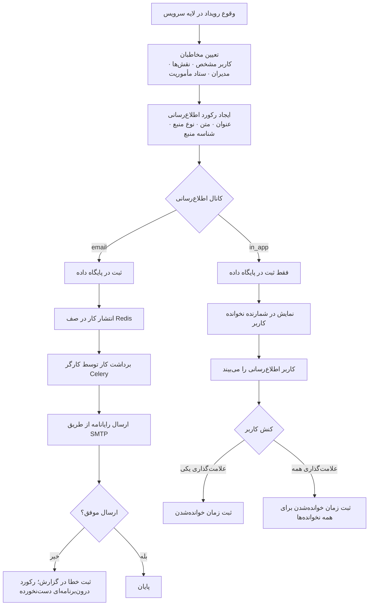

### ۳.۱۵.۲. کاتالوگ رویدادهای اطلاع‌رسانی

| رویداد | مخاطب | نوع منبع |
|---|---|---|
| ثبت‌نام داوطلب تازه | مدیران | داوطلب |
| تأیید داوطلب | خود داوطلب | داوطلب |
| رد داوطلب | خود داوطلب | داوطلب |
| ایجاد بحران تازه | هماهنگ‌کنندگان و مدیران | بحران |
| ایجاد مأموریت تازه | ستاد مأموریت | مأموریت |
| انتشار و عمومی‌سازی مأموریت | داوطلبان | مأموریت |
| ارسال درخواست همکاری | هماهنگ‌کننده مأموریت و مدیران | درخواست |
| پذیرش درخواست | داوطلب | درخواست |
| رد درخواست | داوطلب | درخواست |
| قرار گرفتن در صف انتظار | داوطلب | درخواست |
| ایجاد تخصیص | داوطلب | تخصیص |
| پذیرش تخصیص | هماهنگ‌کننده | تخصیص |
| رد تخصیص | هماهنگ‌کننده | تخصیص |
| آغاز مأموریت | داوطلبان پذیرفته‌شده | مأموریت |
| اتمام مأموریت | مشارکت‌کنندگان و ستاد | مأموریت |
| ارسال گزارش | ستاد | گزارش |
| پاسخ تازه در تیکت | طرف مقابل گفت‌وگو | تیکت |
| پیام مستقیم ستاد | کاربر مخاطب | تیکت |

### ۳.۱۵.۳. قواعد کسب‌وکار

| شناسه | قاعده |
|---|---|
| `BR-069` | کانال پیش‌فرض اطلاع‌رسانی `in_app` است. |
| `BR-070` | ارسال رایانامه به‌صورت غیرهمگام و بیرون از تراکنش اصلی انجام می‌شود؛ خطای ارسال رایانامه نباید عملیات کسب‌وکاری را با شکست مواجه کند. |
| `BR-071` | هر اطلاع‌رسانی به نوع و شناسه منبع مرتبط است تا امکان راه‌بری مستقیم از اطلاع‌رسانی به منبع فراهم شود. |
| `BR-072` | کاربر تنها اطلاع‌رسانی‌های خود را می‌بیند. |
| `BR-073` | خوانده‌شدن با ثبت مهر زمانی نشان داده می‌شود، نه با حذف رکورد. |

---

## ۳.۱۶. `BP-015` — پشتیبانی و مکاتبه تیکتی

| قلم | مقدار |
|---|---|
| شناسه فرآیند | `BP-015` |
| مالک فرآیند | کاربر (ایجاد) و ستاد (پاسخ) |
| محرک | پرسش، مشکل یا نیاز به هماهنگی کاربر؛ یا نیاز ستاد به ارسال پیام مستقیم |
| پیش‌شرط | مجوز `tickets.create` برای ایجاد؛ `tickets.view` برای مشاهده؛ `tickets.reply` برای تغییر وضعیت |
| پس‌شرط موفق | تیکت با گفت‌وگوی مستند و وضعیت مشخص |
| نقاط پایانی درگیر | `GET|POST /api/v1/tickets/`، `GET /api/v1/tickets/{id}/`، `GET|POST /api/v1/tickets/{id}/replies/`، `PATCH /api/v1/tickets/{id}/status/` |

### ۳.۱۶.۱. جریان فرآیند

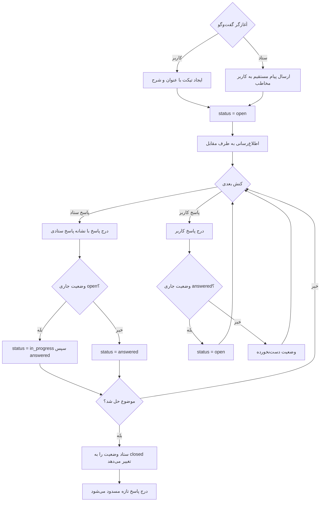

### ۳.۱۶.۲. قواعد کسب‌وکار

| شناسه | قاعده |
|---|---|
| `BR-074` | تیکت تازه در وضعیت `open` ایجاد می‌شود. |
| `BR-075` | کارشناس ستاد کاربری است که ابرکاربر باشد یا نقش `admin` یا `coordinator` داشته باشد. |
| `BR-076` | پاسخ ستاد وضعیت تیکت را به‌صورت خودکار به `answered` می‌رساند؛ پاسخ صاحب تیکت آن را دوباره به `open` بازمی‌گرداند. |
| `BR-077` | درج پاسخ در تیکت `closed` مجاز نیست. |
| `BR-078` | تغییر دستی وضعیت تیکت تنها با مجوز `tickets.reply` مجاز است. |
| `BR-079` | در پیام مستقیم ستاد، مخاطب به‌عنوان صاحب تیکت و فرستنده ستادی به‌عنوان گشاینده تیکت ثبت می‌شود. |
| `BR-080` | کاربر عادی تنها تیکت‌های خود را می‌بیند؛ ستاد به همه تیکت‌ها دسترسی دارد. |

---

## ۳.۱۷. `BP-016` — مدیریت کاربران، نقش و مجوز

| قلم | مقدار |
|---|---|
| شناسه فرآیند | `BP-016` |
| مالک فرآیند | مدیر سامانه |
| محرک | نیاز به تغییر سطح دسترسی کاربر، تعریف نقش تازه یا تغییر ترکیب مجوزها |
| پیش‌شرط | مجوز `accounts.manage_users` یا `accounts.manage_roles` |
| پس‌شرط موفق | انتساب نقش یا ترکیب مجوز نقش تغییر می‌کند و نهانگاه مجوز باطل می‌شود |
| نقاط پایانی درگیر | `GET /api/v1/accounts/users/`، `PATCH /api/v1/accounts/users/{id}/roles/`، `PATCH /api/v1/accounts/users/{id}/access/`، `GET|POST /api/v1/accounts/roles/`، `GET|PUT|PATCH|DELETE /api/v1/accounts/roles/{id}/`، `GET /api/v1/accounts/permissions/` |

### ۳.۱۷.۱. جریان فرآیند

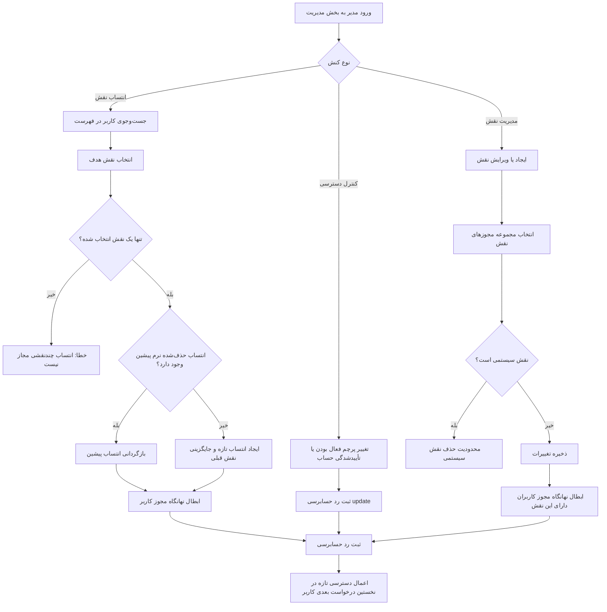

### ۳.۱۷.۲. قواعد کسب‌وکار

| شناسه | قاعده |
|---|---|
| `BR-081` | هر کاربر در هر زمان تنها یک نقش سیستمی دارد؛ انتساب همزمان چند نقش رد می‌شود. |
| `BR-082` | انتساب نقشی که پیش‌تر حذف نرم شده است، در صورت انتساب دوباره بازگردانی می‌شود نه دوباره‌سازی. |
| `BR-083` | تغییر ترکیب مجوز نقش باید نهانگاه مجوز کاربران را باطل کند تا دسترسی تازه بی‌درنگ اثر بگذارد. |
| `BR-084` | نقش‌های نشان‌دار به‌عنوان نقش سیستمی نباید حذف شوند. |
| `BR-085` | غیرفعال‌سازی حساب کاربری، ورود کاربر را مسدود می‌کند اما داده تاریخی او را حذف نمی‌کند. |
| `BR-086` | مجوز `accounts.manage_roles` تنها به نقش مدیر تعلق دارد. |
| `BR-087` | همه تغییرات نقش و دسترسی باید در رد حسابرسی ثبت شوند. |

---

## ۳.۱۸. `BP-017` — حسابرسی و پاسخگویی

| قلم | مقدار |
|---|---|
| شناسه فرآیند | `BP-017` |
| مالک فرآیند | مدیر سامانه |
| محرک | نیاز به بازبینی سابقه کنش‌ها، بررسی رخداد امنیتی یا پاسخ به پرسش پاسخگویی |
| پیش‌شرط | مجوز `audit.view` |
| پس‌شرط موفق | فهرست پالایش‌شده ردهای حسابرسی با شرح خوانا در دسترس قرار می‌گیرد |
| نقطه پایانی | `GET /api/v1/audit-logs/` |

### ۳.۱۸.۱. جریان ثبت و مرور

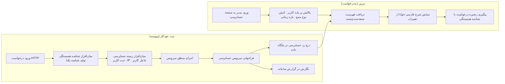

### ۳.۱۸.۲. اقلام رد حسابرسی

| قلم | شرح |
|---|---|
| شناسه کاربر | کنشگر؛ برای کنش‌های سامانه‌ای تهی است |
| کنش | یکی از `create`، `update`، `delete`، `login`، `logout`، `view`، `approve`، `assign` |
| نوع منبع | نام موجودیت هدف |
| شناسه منبع | شناسه رکورد هدف |
| نشانی IP | نشانی شبکه کنشگر |
| عامل کاربر | مشخصات مرورگر یا کارخواه |
| شناسه همبستگی | شناسه یکتای درخواست برای پیگیری زنجیره‌ای |
| ابرداده | داده افزوده مانند مقادیر پیش و پس از تغییر |
| زمان ایجاد | مهر زمانی ثبت |

### ۳.۱۸.۳. قواعد کسب‌وکار

| شناسه | قاعده |
|---|---|
| `BR-088` | همه کنش‌های حساس باید در رد حسابرسی ثبت شوند. |
| `BR-089` | رد حسابرسی از منظر کاربردی تنها-افزودنی است؛ ویرایش و حذف آن از مسیر API فراهم نیست. |
| `BR-090` | هر رد حسابرسی باید شناسه همبستگی درخواست را در بر داشته باشد. |
| `BR-091` | ثبت رد حسابرسی نباید مانع تکمیل عملیات کسب‌وکاری اصلی شود. |
| `BR-092` | تنها نقش مدیر با مجوز `audit.view` می‌تواند ردهای حسابرسی را مرور کند. |
| `BR-093` | ردهای حسابرسی نباید داده حساسی مانند رمز عبور یا نشانه دسترسی را در ابرداده نگه دارند. |

---

## ۳.۱۹. `BP-018` — پایش عملیات و بینش مدیریتی

| قلم | مقدار |
|---|---|
| شناسه فرآیند | `BP-018` |
| مالک فرآیند | مدیر و هماهنگ‌کننده |
| محرک | نیاز به تصویر لحظه‌ای از وضعیت عملیات |
| پیش‌شرط | مجوز `dashboard.view` |
| پس‌شرط موفق | شاخص‌ها و نمودارهای متناسب با نقش کاربر نمایش داده می‌شود |
| نقطه پایانی | `GET /api/v1/dashboard/stats/` |

### ۳.۱۹.۱. جریان فرآیند

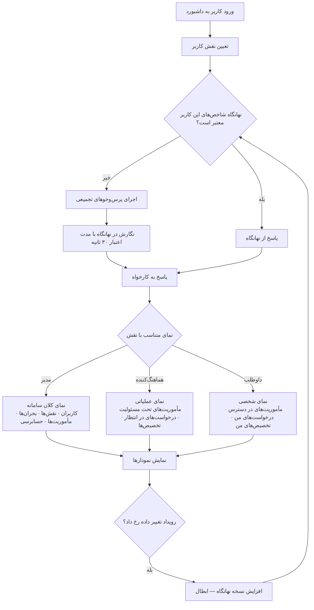

### ۳.۱۹.۲. شاخص‌های داشبورد به تفکیک نقش

| نقش | شاخص‌های کلیدی | نمودارها |
|---|---|---|
| مدیر | تعداد کاربران، تعداد داوطلبان فعال، بحران‌های فعال، مأموریت‌های باز، درخواست‌های در انتظار، تخصیص‌های فعال، تیکت‌های باز، ردهای حسابرسی اخیر | توزیع مأموریت بر وضعیت، توزیع بحران بر شدت، روند ثبت‌نام، توزیع نقش کاربران |
| هماهنگ‌کننده | مأموریت‌های تحت مسئولیت، مأموریت‌های در حال اجرا، درخواست‌های در انتظار بررسی، تخصیص‌های در انتظار پاسخ، گزارش‌های ارسال‌نشده | توزیع مأموریت بر وضعیت، توزیع درخواست بر وضعیت، روند تخصیص |
| داوطلب | مأموریت‌های در دسترس، درخواست‌های ارسالی، تخصیص‌های فعال، مأموریت‌های تکمیل‌شده، اطلاع‌رسانی‌های نخوانده، درصد تکمیل پروفایل | وضعیت درخواست‌های من، سابقه مشارکت |

### ۳.۱۹.۳. قواعد کسب‌وکار

| شناسه | قاعده |
|---|---|
| `BR-094` | شاخص‌های داشبورد باید بر پایه نقش کاربر پالایش شوند؛ داوطلب نباید شاخص‌های کلان سامانه را ببیند. |
| `BR-095` | شاخص‌ها با مدت اعتبار کوتاه (۳۰ ثانیه) در نهانگاه نگهداری می‌شوند تا بار پایگاه داده کاهش یابد. |
| `BR-096` | تغییرات مؤثر بر شاخص‌ها (مأموریت، بحران، داوطلب) باید نسخه نهانگاه را افزایش دهند تا داده کهنه نمایش داده نشود. |
| `BR-097` | داشبورد داده خام اشخاص را افشا نمی‌کند و تنها مقادیر تجمیعی نمایش می‌دهد. |

---

## ۳.۲۰. `BP-019` — مدیریت کاتالوگ مهارت

| قلم | مقدار |
|---|---|
| شناسه فرآیند | `BP-019` |
| مالک فرآیند | هماهنگ‌کننده |
| محرک | نیاز به افزودن، اصلاح یا حذف مهارت در کاتالوگ سازمانی |
| پیش‌شرط | مجوز `skills.manage` برای نگارش و `skills.view` برای مشاهده |
| پس‌شرط موفق | کاتالوگ مهارت به‌روز می‌شود و در فرم‌های ثبت‌نام، پروفایل و تعریف مأموریت نمایان می‌گردد |
| نقاط پایانی درگیر | `GET /api/v1/skills/public/`، `GET|POST /api/v1/skills/`، `GET|PUT|PATCH|DELETE /api/v1/skills/{id}/`، `GET /api/v1/skills/volunteers/{vid}/`، `POST /api/v1/skills/volunteers/{vid}/assign/` |

### ۳.۲۰.۱. قواعد کسب‌وکار

| شناسه | قاعده |
|---|---|
| `BR-098` | نام مهارت در کاتالوگ یکتاست. |
| `BR-099` | هر مهارت به یک دسته تعلق دارد تا نمایش گروهی در رابط کاربری ممکن شود. |
| `BR-100` | فهرست عمومی مهارت‌ها بدون احراز هویت در دسترس است تا فرم ثبت‌نام بتواند آن را بارگذاری کند. |
| `BR-101` | انتساب مهارت به داوطلب همراه با سطح تخصص عددی انجام می‌شود و برای هر جفت داوطلب-مهارت یکتاست. |
| `BR-102` | حذف مهارت به‌صورت حذف نرم انجام می‌شود تا انتساب‌های تاریخی معنا و اعتبار خود را از دست ندهند. |

---

## ۳.۲۱. `BP-020` — مدیریت نشست و امنیت دسترسی

| قلم | مقدار |
|---|---|
| شناسه فرآیند | `BP-020` |
| مالک فرآیند | سامانه |
| محرک | ورود کاربر، انقضای نشانه دسترسی، خروج کاربر |
| پیش‌شرط | حساب فعال |
| پس‌شرط موفق | کاربر نشست معتبر دارد؛ در خروج، نشانه نوسازی باطل می‌شود |
| نقاط پایانی درگیر | `POST /api/v1/auth/login/`، `POST /api/v1/auth/refresh/`، `POST /api/v1/auth/logout/`، `GET /api/v1/auth/me/` |

### ۳.۲۱.۱. جریان فرآیند

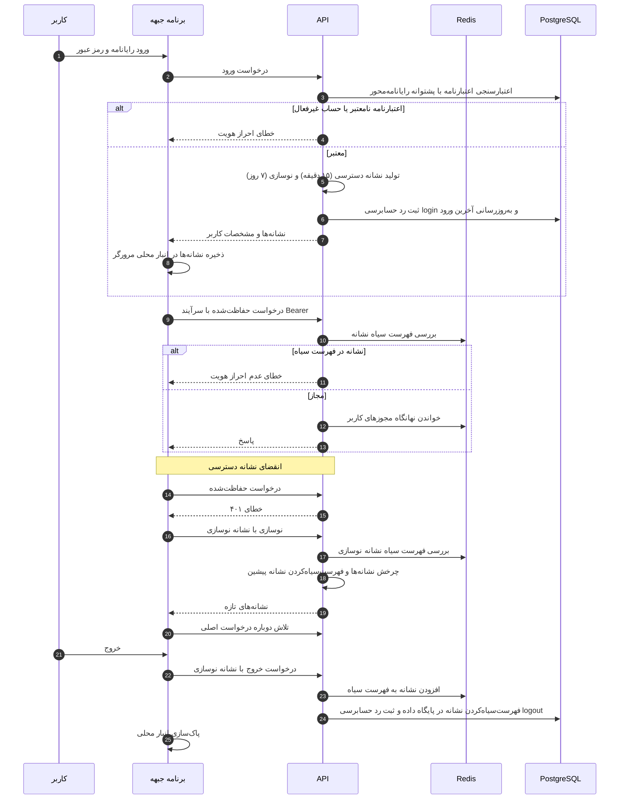

### ۳.۲۱.۲. قواعد کسب‌وکار

| شناسه | قاعده |
|---|---|
| `BR-103` | نام کاربری الزاماً نشانی رایانامه است. |
| `BR-104` | ورود حساب غیرفعال باید رد شود. |
| `BR-105` | نشانه دسترسی حدود ۱۵ دقیقه و نشانه نوسازی ۷ روز اعتبار دارد و این مقادیر از متغیر محیطی خوانده می‌شوند. |
| `BR-106` | نشانه نوسازی در هر نوسازی چرخش می‌یابد و نشانه پیشین بی‌درنگ به فهرست سیاه می‌رود. |
| `BR-107` | خروج کاربر باید نشانه نوسازی را در هر دو لایه (نهانگاه Redis و جدول فهرست سیاه) باطل کند. |
| `BR-108` | نوسازی نشانه باید یک‌باره (Single-flight) اجرا شود تا درخواست‌های همزمان چند نشانه موازی تولید نکنند. |
| `BR-109` | ورود و خروج باید در رد حسابرسی ثبت شوند. |

---

## ۳.۲۲. تحلیل شکاف: وضعیت موجود در برابر وضعیت مطلوب

| حوزه | وضعیت پیش از سامانه | وضعیت با MVP پناه | شکاف باقیمانده (فاز آتی) |
|---|---|---|---|
| ثبت‌نام داوطلب | فرم کاغذی و صفحه گسترده پراکنده | جادوگر چهارگامی برخط با یکتایی کد ملی | راستی‌آزمایی هویت با سامانه ملی |
| بانک مهارت | بدون ساختار و غیرقابل جست‌وجو | کاتالوگ دسته‌بندی‌شده با سطح تخصص | گواهی‌نامه و اعتبارسنجی مهارت |
| فراخوان داوطلب | پیام‌رسان و تماس تلفنی | مأموریت منتشرشده با کنترل مرئی‌بودن و درخواست‌پذیری | فراخوان هدفمند مکان‌محور و رتبه‌بندی خودکار |
| تصمیم‌گیری پذیرش | شخصی و غیرمستند | فرآیند سه‌گانه پذیرش/رد/صف انتظار با یادداشت و بررسی‌کننده | امتیازدهی خودکار تناسب |
| ثبت مسئولیت | فهرست دستی نام‌ها | تخصیص با چرخه حیات چهارمرحله‌ای | امضای دیجیتال تعهدنامه |
| حضور و غیاب | کاغذی یا شفاهی | حضورزنی و اتمام در سامانه | حضورزنی مکان‌محور با محدوده جغرافیایی |
| گزارش‌دهی | روایی و با تأخیر | گزارش سه‌وضعیتی با پیوست و خلاصه خودکار مأموریت | تولید خودکار گزارش تحلیلی و برون‌ریزی PDF |
| پاسخگویی | نبود سابقه | رد حسابرسی کامل با شناسه همبستگی | تحلیل رفتار و کشف بی‌هنجاری |
| بینش مدیریتی | گزارش دستی موردی | داشبورد نقش‌محور با نهانگاه | پیش‌بینی نیاز و تحلیل روند |
| ارتباط با داوطلب | کانال شخصی | تیکت دوسویه با چرخه وضعیت | پیامک، اعلان فشاری، گفت‌وگوی همزمان |
| تحلیل مکانی | بدون قابلیت | نگهداشت توصیفی موقعیت | PostGIS، پرس‌وجوی شعاعی، نقشه عملیاتی زنده |

---

## ۳.۲۳. جدول تجمیعی قواعد کسب‌وکار

| محدوده | شناسه‌های قاعده | تعداد |
|---|---|---|
| ثبت‌نام داوطلب | `BR-001` تا `BR-006` | ۶ |
| پروفایل و مهارت شخصی | `BR-007` تا `BR-011` | ۵ |
| تأیید صلاحیت داوطلب | `BR-012` تا `BR-015` | ۴ |
| بحران | `BR-016` تا `BR-021` | ۶ |
| تعریف مأموریت | `BR-022` تا `BR-027` | ۶ |
| انتشار مأموریت | `BR-028` تا `BR-031` | ۴ |
| درخواست همکاری | `BR-032` تا `BR-036` | ۵ |
| بررسی درخواست | `BR-037` تا `BR-042` | ۶ |
| تخصیص | `BR-043` تا `BR-049` | ۷ |
| اجرای میدانی | `BR-050` تا `BR-054` | ۵ |
| اتمام و بستن | `BR-055` تا `BR-059` | ۵ |
| گزارش | `BR-060` تا `BR-065` | ۶ |
| بازگشایی | `BR-066` تا `BR-068` | ۳ |
| اطلاع‌رسانی | `BR-069` تا `BR-073` | ۵ |
| تیکت | `BR-074` تا `BR-080` | ۷ |
| کاربر و نقش | `BR-081` تا `BR-087` | ۷ |
| حسابرسی | `BR-088` تا `BR-093` | ۶ |
| داشبورد | `BR-094` تا `BR-097` | ۴ |
| مهارت | `BR-098` تا `BR-102` | ۵ |
| نشست و امنیت | `BR-103` تا `BR-109` | ۷ |
| **مجموع** | — | **۱۰۹** |

---

## ۳.۲۴. ماتریس ردیابی فرآیند به مورد کاربرد و نیازمندی

| فرآیند | موارد کاربرد مرتبط | نیازمندی‌های کارکردی مرتبط |
|---|---|---|
| `BP-001` | `UC-001`، `UC-002` | `FR-001`، `FR-002`، `FR-003` |
| `BP-002` | `UC-006`، `UC-007` | `FR-011`، `FR-012`، `FR-013` |
| `BP-003` | `UC-014`، `UC-015` | `FR-018`، `FR-019` |
| `BP-004` | `UC-016`، `UC-017`، `UC-018` | `FR-023` تا `FR-026` |
| `BP-005` | `UC-019`، `UC-020` | `FR-027`، `FR-028`، `FR-029` |
| `BP-006` | `UC-021`، `UC-025` | `FR-030`، `FR-035` |
| `BP-007` | `UC-026`، `UC-027` | `FR-036`، `FR-037` |
| `BP-008` | `UC-028`، `UC-029`، `UC-030`، `UC-031` | `FR-038` تا `FR-041` |
| `BP-009` | `UC-032`، `UC-033`، `UC-034` | `FR-042` تا `FR-045` |
| `BP-010` | `UC-023`، `UC-035`، `UC-036` | `FR-032`، `FR-046`، `FR-047` |
| `BP-011` | `UC-023`، `UC-024` | `FR-033`، `FR-034` |
| `BP-012` | `UC-037` تا `UC-041` | `FR-048` تا `FR-053` |
| `BP-013` | `UC-025` | `FR-035` |
| `BP-014` | `UC-042` تا `UC-045` | `FR-054` تا `FR-057` |
| `BP-015` | `UC-046` تا `UC-050` | `FR-058` تا `FR-062` |
| `BP-016` | `UC-052` تا `UC-057` | `FR-064` تا `FR-070` |
| `BP-017` | `UC-058` | `FR-071`، `FR-072` |
| `BP-018` | `UC-051` | `FR-063` |
| `BP-019` | `UC-008` تا `UC-013` | `FR-014` تا `FR-017` |
| `BP-020` | `UC-003`، `UC-004`، `UC-005` | `FR-004` تا `FR-010` |

---

## ۳.۲۵. خلاصه اجرایی فصل

سامانه پناه ۲۰ فرآیند کسب‌وکار را در پنج زنجیره ارزش سازمان می‌دهد: آماده‌سازی سرمایه انسانی، پاسخ به بحران، بسیج نیرو، بستن پرونده و فرآیندهای پشتیبان. جریان اصلی ارزش، زنجیره‌ای پیوسته از `BP-004` (ثبت بحران) تا `BP-012` (گزارش‌دهی) است که در آن هر گام با یک گذار وضعیت صریح و ثبت‌شده در رد حسابرسی همراه می‌شود.

مجموعاً **۱۰۹ قاعده کسب‌وکار** استخراج و شناسه‌گذاری شده است. مهم‌ترین قواعد ساختاری عبارت‌اند از: یکتایی کد ملی داوطلب، الزام سه‌شرطی برای ارسال درخواست همکاری، ایجاد اتمی تخصیص در پی پذیرش درخواست، ترتیب اجباری حضورزنی پیش از اتمام تخصیص، وابستگی ارسال گزارش به پایان‌یافتن مأموریت، و انتساب تک‌نقشی به هر کاربر.

تحلیل شکاف نشان می‌دهد MVP همه نیازهای هسته‌ای جریان کاری را پوشش می‌دهد؛ شکاف‌های باقیمانده به‌طور غالب در حوزه هوشمندسازی (امتیازدهی خودکار تناسب)، مکان‌محوری (تحلیل مکانی و حضورزنی جغرافیایی) و کانال‌های ارتباطی افزوده (پیامک و اعلان فشاری) قرار دارند که همه به فاز سوم موکول شده‌اند.

---

**پایان فصل ۳**

> فصل پیشین: [نمای کلی سامانه](./02-system-overview.md) — فصل بعد: [موارد کاربرد](./04-usecases.md)
