# فصل ۴ — موارد کاربرد

> این فصل موارد کاربرد سامانه **پناه** را با شناسه‌های `UC-001` به بالا مستند می‌کند. هر مورد کاربرد در قالب استاندارد شامل بازیگر، هدف، پیش‌شرط، پس‌شرط، جریان اصلی، جریان‌های بدیل، جریان‌های استثنا، قواعد کسب‌وکار و نیازمندی‌های مرتبط ارائه شده است.

---

## ۴.۱. نمای کلی موارد کاربرد

### ۴.۱.۱. نمودار موارد کاربرد سطح بالا

```mermaid
graph TB
    subgraph بازیگران
        V0(("بازدیدکننده"))
        V1(("داوطلب"))
        V2(("هماهنگ‌کننده"))
        V3(("مدیر"))
        V4(("سامانه"))
    end

    subgraph بسته1["بسته ۱ — هویت و دسترسی"]
        U1["UC-001 ثبت‌نام داوطلب"]
        U3["UC-003 ورود به سامانه"]
        U4["UC-004 نوسازی نشانه"]
        U5["UC-005 خروج از سامانه"]
        U6["UC-006 مشاهده پروفایل"]
        U7["UC-007 ویرایش پروفایل"]
    end

    subgraph بسته2["بسته ۲ — مهارت و داوطلب"]
        U9["UC-009 مشاهده کاتالوگ مهارت"]
        U10["UC-010 ایجاد مهارت"]
        U13["UC-013 انتساب مهارت"]
        U14["UC-014 تأیید داوطلب"]
        U15["UC-015 رد داوطلب"]
    end

    subgraph بسته3["بسته ۳ — بحران و مأموریت"]
        U16["UC-016 ایجاد بحران"]
        U19["UC-019 ایجاد مأموریت"]
        U21["UC-021 انتشار مأموریت"]
        U25["UC-025 بازگشایی مأموریت"]
    end

    subgraph بسته4["بسته ۴ — بسیج نیرو"]
        U26["UC-026 مشاهده مأموریت در دسترس"]
        U27["UC-027 ارسال درخواست"]
        U29["UC-029 پذیرش درخواست"]
        U32["UC-032 ایجاد تخصیص"]
        U33["UC-033 پذیرش تخصیص"]
        U35["UC-035 حضورزنی"]
    end

    subgraph بسته5["بسته ۵ — گزارش و پاسخگویی"]
        U37["UC-037 ایجاد گزارش"]
        U40["UC-040 ارسال گزارش"]
        U41["UC-041 بازبینی گزارش"]
        U58["UC-058 مرور رد حسابرسی"]
    end

    subgraph بسته6["بسته ۶ — تعامل و مدیریت"]
        U42["UC-042 مشاهده اطلاع‌رسانی"]
        U46["UC-046 ایجاد تیکت"]
        U51["UC-051 مشاهده داشبورد"]
        U54["UC-054 انتساب نقش"]
    end

    V0 --> U1
    V0 --> U3
    V0 --> U9
    V1 --> U3
    V1 --> U6
    V1 --> U7
    V1 --> U26
    V1 --> U27
    V1 --> U33
    V1 --> U42
    V1 --> U46
    V1 --> U51
    V2 --> U10
    V2 --> U13
    V2 --> U14
    V2 --> U15
    V2 --> U16
    V2 --> U19
    V2 --> U21
    V2 --> U25
    V2 --> U29
    V2 --> U32
    V2 --> U35
    V2 --> U37
    V2 --> U40
    V2 --> U41
    V3 --> U54
    V3 --> U58
    V4 --> U4
```

### ۴.۱.۲. فهرست کامل موارد کاربرد

| شناسه | نام مورد کاربرد | بازیگر اصلی | بسته | اولویت | پیچیدگی |
|---|---|---|---|---|---|
| `UC-001` | ثبت‌نام داوطلب | بازدیدکننده | هویت | باید | زیاد |
| `UC-002` | واکشی کاتالوگ مهارت عمومی در ثبت‌نام | بازدیدکننده | هویت | باید | کم |
| `UC-003` | ورود به سامانه | همه | هویت | باید | متوسط |
| `UC-004` | نوسازی نشانه دسترسی | سامانه | هویت | باید | متوسط |
| `UC-005` | خروج از سامانه | همه احراز هویت‌شده | هویت | باید | متوسط |
| `UC-006` | مشاهده پروفایل خود | همه احراز هویت‌شده | هویت | باید | کم |
| `UC-007` | ویرایش پروفایل خود | همه احراز هویت‌شده | هویت | باید | متوسط |
| `UC-008` | بارگذاری تصویر پروفایل | همه احراز هویت‌شده | هویت | بایسته | متوسط |
| `UC-009` | مشاهده کاتالوگ مهارت | همه | مهارت | باید | کم |
| `UC-010` | ایجاد مهارت | هماهنگ‌کننده | مهارت | بایسته | کم |
| `UC-011` | ویرایش مهارت | هماهنگ‌کننده | مهارت | بایسته | کم |
| `UC-012` | حذف مهارت | هماهنگ‌کننده | مهارت | می‌تواند | کم |
| `UC-013` | انتساب مهارت به داوطلب | هماهنگ‌کننده | مهارت | بایسته | متوسط |
| `UC-014` | تأیید داوطلب | هماهنگ‌کننده | داوطلب | باید | متوسط |
| `UC-015` | رد داوطلب | هماهنگ‌کننده | داوطلب | باید | متوسط |
| `UC-016` | ایجاد بحران | هماهنگ‌کننده | بحران | باید | زیاد |
| `UC-017` | مشاهده و پالایش فهرست بحران‌ها | هماهنگ‌کننده | بحران | باید | متوسط |
| `UC-018` | ویرایش و ابطال بحران | هماهنگ‌کننده | بحران | باید | متوسط |
| `UC-019` | ایجاد مأموریت | هماهنگ‌کننده | مأموریت | باید | زیاد |
| `UC-020` | ویرایش مأموریت | هماهنگ‌کننده | مأموریت | باید | متوسط |
| `UC-021` | انتشار مأموریت | هماهنگ‌کننده | مأموریت | باید | متوسط |
| `UC-022` | آغاز مأموریت | هماهنگ‌کننده | مأموریت | باید | کم |
| `UC-023` | اتمام مأموریت | هماهنگ‌کننده | مأموریت | باید | کم |
| `UC-024` | بستن مأموریت | هماهنگ‌کننده | مأموریت | باید | کم |
| `UC-025` | بازگشایی مأموریت | هماهنگ‌کننده | مأموریت | بایسته | کم |
| `UC-026` | مشاهده مأموریت‌های در دسترس | داوطلب | بسیج | باید | متوسط |
| `UC-027` | ارسال درخواست همکاری | داوطلب | بسیج | باید | متوسط |
| `UC-028` | مشاهده صندوق درخواست‌ها | هماهنگ‌کننده | بسیج | باید | متوسط |
| `UC-029` | پذیرش درخواست همکاری | هماهنگ‌کننده | بسیج | باید | زیاد |
| `UC-030` | رد درخواست همکاری | هماهنگ‌کننده | بسیج | باید | متوسط |
| `UC-031` | قرار دادن درخواست در صف انتظار | هماهنگ‌کننده | بسیج | بایسته | متوسط |
| `UC-032` | ایجاد تخصیص مستقیم | هماهنگ‌کننده | بسیج | باید | متوسط |
| `UC-033` | پذیرش تخصیص | داوطلب | بسیج | باید | متوسط |
| `UC-034` | رد تخصیص | داوطلب | بسیج | باید | متوسط |
| `UC-035` | ثبت حضور داوطلب | هماهنگ‌کننده | بسیج | باید | کم |
| `UC-036` | ثبت اتمام تخصیص | هماهنگ‌کننده | بسیج | باید | کم |
| `UC-037` | ایجاد گزارش مأموریت | هماهنگ‌کننده | گزارش | باید | متوسط |
| `UC-038` | ویرایش گزارش پیش‌نویس | هماهنگ‌کننده | گزارش | باید | کم |
| `UC-039` | افزودن پیوست به گزارش | هماهنگ‌کننده | گزارش | بایسته | متوسط |
| `UC-040` | ارسال گزارش | هماهنگ‌کننده | گزارش | باید | متوسط |
| `UC-041` | بازبینی گزارش | هماهنگ‌کننده | گزارش | باید | کم |
| `UC-042` | مشاهده فهرست اطلاع‌رسانی‌ها | همه احراز هویت‌شده | تعامل | باید | کم |
| `UC-043` | مشاهده شمارنده نخوانده | همه احراز هویت‌شده | تعامل | باید | کم |
| `UC-044` | علامت‌گذاری اطلاع‌رسانی به‌عنوان خوانده‌شده | همه احراز هویت‌شده | تعامل | باید | کم |
| `UC-045` | علامت‌گذاری همه اطلاع‌رسانی‌ها | همه احراز هویت‌شده | تعامل | بایسته | کم |
| `UC-046` | ایجاد تیکت | همه احراز هویت‌شده | تعامل | باید | متوسط |
| `UC-047` | مشاهده فهرست تیکت‌ها | همه احراز هویت‌شده | تعامل | باید | متوسط |
| `UC-048` | مشاهده گفت‌وگوی تیکت | همه احراز هویت‌شده | تعامل | باید | کم |
| `UC-049` | درج پاسخ در تیکت | همه احراز هویت‌شده | تعامل | باید | متوسط |
| `UC-050` | تغییر وضعیت تیکت | هماهنگ‌کننده | تعامل | بایسته | کم |
| `UC-050-A` | ارسال پیام مستقیم ستاد به کاربر | هماهنگ‌کننده | تعامل | بایسته | متوسط |
| `UC-051` | مشاهده داشبورد نقش‌محور | همه احراز هویت‌شده | بینش | باید | زیاد |
| `UC-052` | مشاهده فهرست کاربران | مدیر | مدیریت | باید | متوسط |
| `UC-053` | برون‌ریزی فهرست کاربران | مدیر | مدیریت | می‌تواند | کم |
| `UC-054` | انتساب نقش به کاربر | مدیر | مدیریت | باید | متوسط |
| `UC-055` | تغییر وضعیت دسترسی کاربر | مدیر | مدیریت | باید | متوسط |
| `UC-056` | مدیریت نقش‌ها | مدیر | مدیریت | باید | زیاد |
| `UC-057` | مشاهده فهرست مجوزها | مدیر | مدیریت | بایسته | کم |
| `UC-058` | مرور رد حسابرسی | مدیر | پاسخگویی | باید | متوسط |
| `UC-059` | مشاهده خلاصه مأموریت‌های پایان‌یافته | هماهنگ‌کننده | گزارش | بایسته | متوسط |
| `UC-060` | بررسی سلامت سامانه | سامانه/عملیات | زیرساخت | باید | کم |
| `UC-061` | مشاهده مستندات تعاملی API | توسعه‌دهنده | زیرساخت | بایسته | کم |
| `UC-062` | مشاهده مأموریت‌ها و فهرست داوطلبان (ستاد) | هماهنگ‌کننده | عملیات | باید | متوسط |

---

## بسته ۱ — هویت و دسترسی

## ۴.۲. `UC-001` — ثبت‌نام داوطلب

| قلم | مقدار |
|---|---|
| شناسه | `UC-001` |
| نام | ثبت‌نام داوطلب در سامانه |
| بازیگر اصلی | بازدیدکننده ناشناس |
| بازیگران ثانویه | سامانه، مدیران (دریافت‌کننده اطلاع‌رسانی) |
| ذی‌نفعان و علایق | **داوطلب:** ورود سریع و بی‌دردسر؛ **ستاد:** داده کامل و معتبر؛ **سازمان:** بانک داوطلب یکتا |
| سطح | هدف کاربر |
| فرآیند مرتبط | `BP-001` |
| نقطه پایانی | `POST /api/v1/volunteers/register/` |
| صفحه جبهه | `/register` |
| مجوز موردنیاز | ندارد (عمومی) |
| بسامد | زیاد |
| اولویت | باید داشته باشد |

### پیش‌شرط‌ها

| # | پیش‌شرط |
|---|---|
| ۱ | بازدیدکننده به صفحه `/register` دسترسی دارد. |
| ۲ | نشانی رایانامه موردنظر پیش‌تر در سامانه ثبت نشده است. |
| ۳ | کد ملی موردنظر پیش‌تر در سامانه ثبت نشده است. |
| ۴ | کاتالوگ مهارت عمومی دارای حداقل یک مهارت است (در غیر این صورت گام مهارت خالی نمایش داده می‌شود). |

### پس‌شرط‌ها

| نوع | پس‌شرط |
|---|---|
| موفق | حساب کاربری با نقش `volunteer`، پروفایل داوطلب در وضعیت `active` و پرچم تأییدشدگی روشن، مهارت‌های انتخابی ثبت‌شده، رد حسابرسی `create`، اطلاع‌رسانی به مدیران |
| ناموفق | هیچ رکوردی پایا نمی‌شود (بازگردانی تراکنش) و خطای ساخت‌یافته بازگردانده می‌شود |

### جریان اصلی

| گام | کنشگر | کنش |
|---|---|---|
| ۱ | بازدیدکننده | به مسیر `/register` می‌رود. |
| ۲ | سامانه | جادوگر چهارگامی را نمایش می‌دهد و کاتالوگ مهارت عمومی و داده تقسیمات کشوری را در پس‌زمینه بارگذاری می‌کند. |
| ۳ | بازدیدکننده | گام «حساب» را با رایانامه، کد ملی، رمز عبور، تکرار رمز و شماره تماس تکمیل می‌کند. |
| ۴ | سامانه | طرح اعتبارسنجی گام یک را اجرا می‌کند: قالب رایانامه، طول رمز عبور حداقل ۸ نویسه، همسانی تکرار رمز. |
| ۵ | بازدیدکننده | گام «پروفایل» را با نام، نام خانوادگی، استان، شهر و معرفی کوتاه تکمیل می‌کند. |
| ۶ | سامانه | فهرست شهرها را بر پایه استان انتخابی پالایش می‌کند و اعتبارسنجی گام دو را اجرا می‌کند. |
| ۷ | بازدیدکننده | گام «مهارت» را با انتخاب چند مهارت از کاتالوگ و در صورت نیاز افزودن مهارت آزاد تکمیل می‌کند. |
| ۸ | بازدیدکننده | گام «بازبینی» را می‌بیند و پس از تأیید صحت داده، درخواست را ارسال می‌کند. |
| ۹ | سامانه | بار درخواست را در لایه کارساز اعتبارسنجی می‌کند و یکتایی رایانامه و کد ملی را بررسی می‌نماید. |
| ۱۰ | سامانه | در یک تراکنش اتمی: حساب کاربری را با رمز عبور درهم‌سازی‌شده می‌سازد، نقش `volunteer` را منتسب می‌کند، پروفایل داوطلب را با وضعیت `active` ایجاد می‌کند و مهارت‌های انتخابی را ثبت می‌نماید. |
| ۱۱ | سامانه | رد حسابرسی با کنش `create` روی منبع داوطلب ثبت می‌کند. |
| ۱۲ | سامانه | اطلاع‌رسانی «ثبت‌نام داوطلب تازه» را برای مدیران ایجاد می‌کند. |
| ۱۳ | سامانه | نهانگاه داشبورد را باطل می‌کند. |
| ۱۴ | سامانه | پاسخ موفق را با مشخصات پروفایل ایجادشده بازمی‌گرداند. |
| ۱۵ | بازدیدکننده | به صفحه ورود هدایت می‌شود و می‌تواند با اعتبارنامه تازه وارد شود. |

### جریان‌های بدیل

| شناسه | نقطه انشعاب | جریان بدیل |
|---|---|---|
| `UC-001-A1` | گام ۷ | بازدیدکننده هیچ مهارتی انتخاب نمی‌کند؛ ثبت‌نام تکمیل می‌شود اما پروفایل بدون مهارت خواهد بود و درصد تکمیل پروفایل پایین می‌ماند. |
| `UC-001-A2` | گام ۷ | بازدیدکننده مهارتی خارج از کاتالوگ وارد می‌کند؛ مهارت در فهرست مهارت‌های آزاد پروفایل ثبت می‌شود. |
| `UC-001-A3` | گام ۲ | داده تقسیمات کشوری از منبع بیرونی بارگذاری نمی‌شود؛ کاربر استان و شهر را به‌صورت متن آزاد وارد می‌کند و جریان ادامه می‌یابد. |
| `UC-001-A4` | هر گام | بازدیدکننده به گام پیشین بازمی‌گردد؛ داده واردشده حفظ می‌شود. |

### جریان‌های استثنا

| شناسه | استثنا | رفتار سامانه |
|---|---|---|
| `UC-001-E1` | رایانامه تکراری | خطای اعتبارسنجی با کد وضعیت ۴۰۰ و پیام فارسی؛ کاربر به گام حساب بازمی‌گردد. |
| `UC-001-E2` | کد ملی تکراری | خطای اعتبارسنجی با پیام روشن؛ راهنمایی به ورود یا تماس با ستاد. |
| `UC-001-E3` | رمز عبور کوتاه‌تر از ۸ نویسه | اعتبارسنجی سمت کارخواه مانع ارسال می‌شود. |
| `UC-001-E4` | ناهمسانی رمز و تکرار آن | اعتبارسنجی سمت کارخواه مانع ارسال می‌شود. |
| `UC-001-E5` | خطای شبکه در ارسال | نمایش پیام خطای شبکه؛ داده فرم حفظ می‌شود و امکان تلاش دوباره فراهم است. |
| `UC-001-E6` | شکست در ایجاد یکی از رکوردها | تراکنش بازگردانی می‌شود؛ هیچ رکورد نیمه‌کاره باقی نمی‌ماند. |
| `UC-001-E7` | خطای ارسال اطلاع‌رسانی رایانامه‌ای | ثبت‌نام موفق باقی می‌ماند؛ خطا در گزارش سامانه ثبت می‌شود. |

### قواعد کسب‌وکار مرتبط

`BR-001`، `BR-002`، `BR-003`، `BR-004`، `BR-005`، `BR-006`

### نیازمندی‌های مرتبط

`FR-001`، `FR-002`، `FR-003`، `NFR-005`، `NFR-013`، `NFR-021`

---

## ۴.۳. `UC-002` — واکشی کاتالوگ مهارت عمومی در ثبت‌نام

| قلم | مقدار |
|---|---|
| شناسه | `UC-002` |
| بازیگر اصلی | بازدیدکننده ناشناس |
| هدف | دریافت فهرست مهارت‌های سازمانی بدون نیاز به احراز هویت، جهت نمایش در فرم ثبت‌نام |
| نقطه پایانی | `GET /api/v1/skills/public/` |
| مجوز موردنیاز | ندارد (عمومی) |
| فرآیند مرتبط | `BP-001`، `BP-019` |

### جریان اصلی

| گام | کنش |
|---|---|
| ۱ | صفحه ثبت‌نام بارگذاری می‌شود. |
| ۲ | برنامه جبهه فهرست مهارت‌های عمومی را درخواست می‌کند. |
| ۳ | سامانه فهرست مهارت‌های زنده (حذف‌نشده) را با نام و دسته بازمی‌گرداند. |
| ۴ | برنامه جبهه مهارت‌ها را بر پایه دسته گروه‌بندی و در مؤلفه انتخاب چندگانه نمایش می‌دهد. |

### جریان استثنا

| شناسه | استثنا | رفتار |
|---|---|---|
| `UC-002-E1` | خطای سرویس یا شبکه | نمایش پیام خطای بارگذاری مهارت‌ها؛ کاربر می‌تواند بدون انتخاب مهارت ادامه دهد یا مهارت آزاد وارد کند. |
| `UC-002-E2` | کاتالوگ خالی | نمایش وضعیت خالی با راهنمای وارد کردن مهارت آزاد. |

### نیازمندی مرتبط

`FR-014`، `NFR-002`

---

## ۴.۴. `UC-003` — ورود به سامانه

| قلم | مقدار |
|---|---|
| شناسه | `UC-003` |
| بازیگر اصلی | همه کاربران |
| هدف | دریافت نشانه دسترسی و نوسازی برای برقراری نشست |
| نقطه پایانی | `POST /api/v1/auth/login/` |
| صفحه جبهه | `/login` |
| مجوز موردنیاز | ندارد (عمومی) |
| فرآیند مرتبط | `BP-020` |
| اولویت | باید داشته باشد |

### پیش‌شرط‌ها

| # | پیش‌شرط |
|---|---|
| ۱ | کاربر حساب فعال دارد. |
| ۲ | کاربر رایانامه و رمز عبور خود را می‌داند. |

### پس‌شرط‌ها

| نوع | پس‌شرط |
|---|---|
| موفق | نشانه دسترسی و نوسازی صادر و در انبار محلی مرورگر ذخیره می‌شود؛ مشخصات کاربر و نقش‌ها در وضعیت سراسری قرار می‌گیرد؛ آخرین ورود به‌روز و رد حسابرسی `login` ثبت می‌شود. |
| ناموفق | نشست برقرار نمی‌شود؛ پیام خطای احراز هویت نمایش داده می‌شود. |

### جریان اصلی

| گام | کنشگر | کنش |
|---|---|---|
| ۱ | کاربر | به مسیر `/login` می‌رود. |
| ۲ | سامانه | در صورت وجود نشست معتبر، کاربر را به مسیر پس از ورود هدایت می‌کند. |
| ۳ | کاربر | رایانامه و رمز عبور را وارد می‌کند. |
| ۴ | سامانه | اعتبارسنجی طرح‌محور سمت کارخواه را اجرا می‌کند. |
| ۵ | سامانه | درخواست ورود را به API می‌فرستد. |
| ۶ | سامانه | اعتبارنامه را با پشتوانه احراز هویت رایانامه‌محور بررسی می‌کند. |
| ۷ | سامانه | فعال بودن حساب را بررسی می‌کند. |
| ۸ | سامانه | جفت نشانه دسترسی (۱۵ دقیقه) و نوسازی (۷ روز) را صادر می‌کند. |
| ۹ | سامانه | مهر آخرین ورود را به‌روز و رد حسابرسی `login` را ثبت می‌کند. |
| ۱۰ | سامانه | نشانه‌ها و مشخصات کاربر (شامل نقش‌ها و مجوزها) را بازمی‌گرداند. |
| ۱۱ | سامانه | نشانه‌ها را در انبار محلی مرورگر ذخیره و وضعیت احراز هویت را برقرار می‌کند. |
| ۱۲ | سامانه | درصد تکمیل پروفایل را می‌سنجد و مسیر پس از ورود را تعیین می‌کند. |
| ۱۳ | کاربر | به داشبورد یا صفحه تکمیل پروفایل هدایت می‌شود. |

### جریان‌های بدیل

| شناسه | جریان بدیل |
|---|---|
| `UC-003-A1` | کاربر تنها نقش داوطلب دارد و درصد تکمیل پروفایل او کمتر از ۵۰٪ است؛ سامانه او را به `/profile` با کارت فراخوان تکمیل پروفایل هدایت می‌کند. |
| `UC-003-A2` | کاربر پیش از ورود قصد دسترسی به مسیر حفاظت‌شده‌ای داشته است؛ پس از ورود موفق به همان مسیر بازگردانده می‌شود. |
| `UC-003-A3` | کاربر با نشست فعال به صفحه ورود می‌رود؛ سامانه او را بی‌درنگ به مسیر پس از ورود هدایت می‌کند. |

### جریان‌های استثنا

| شناسه | استثنا | رفتار سامانه |
|---|---|---|
| `UC-003-E1` | رایانامه یا رمز عبور نادرست | پیام یکسان و عام «اعتبارنامه نامعتبر است» تا از نشت اطلاعات وجود حساب پیشگیری شود. |
| `UC-003-E2` | حساب غیرفعال | خطای احراز هویت؛ راهنمایی به تماس با ستاد. |
| `UC-003-E3` | خطای شبکه یا در دسترس نبودن سرویس | پیام خطای شبکه با امکان تلاش دوباره. |
| `UC-003-E4` | رمز عبور کوتاه‌تر از حد مجاز در فرم | اعتبارسنجی سمت کارخواه مانع ارسال می‌شود. |

### قواعد کسب‌وکار مرتبط

`BR-103`، `BR-104`، `BR-105`، `BR-109`

### نیازمندی‌های مرتبط

`FR-004`، `FR-005`، `NFR-020`، `NFR-024`

---

## ۴.۵. `UC-004` — نوسازی نشانه دسترسی

| قلم | مقدار |
|---|---|
| شناسه | `UC-004` |
| بازیگر اصلی | سامانه (برنامه جبهه، به‌صورت خودکار) |
| هدف | ادامه نشست کاربر بدون درخواست دوباره اعتبارنامه |
| نقطه پایانی | `POST /api/v1/auth/refresh/` |
| فرآیند مرتبط | `BP-020` |

### جریان اصلی

| گام | کنش |
|---|---|
| ۱ | نشانه دسترسی منقضی می‌شود و درخواست حفاظت‌شده با کد ۴۰۱ رد می‌گردد. |
| ۲ | میان‌گیر پاسخ در کارخواه HTTP، پاسخ ۴۰۱ را می‌گیرد. |
| ۳ | کارخواه بررسی می‌کند آیا نوسازی دیگری در جریان است؛ در این صورت درخواست را در صف انتظار قرار می‌دهد (الگوی یک‌باره). |
| ۴ | کارخواه نشانه نوسازی ذخیره‌شده را به نقطه پایانی نوسازی می‌فرستد. |
| ۵ | سامانه نشانه نوسازی را در فهرست سیاه نهانگاه بررسی می‌کند. |
| ۶ | سامانه نشانه‌های تازه را صادر می‌کند و نشانه نوسازی پیشین را به فهرست سیاه می‌فرستد (چرخش نشانه). |
| ۷ | کارخواه نشانه‌های تازه را ذخیره می‌کند. |
| ۸ | کارخواه درخواست اصلی و همه درخواست‌های در صف را با نشانه تازه دوباره اجرا می‌کند. |

### جریان‌های استثنا

| شناسه | استثنا | رفتار سامانه |
|---|---|---|
| `UC-004-E1` | نشانه نوسازی منقضی است | خطای عدم احراز هویت؛ نشانه‌ها پاک می‌شود و کاربر به صفحه ورود هدایت می‌گردد. |
| `UC-004-E2` | نشانه نوسازی در فهرست سیاه است (مثلاً پس از خروج) | خطای عدم احراز هویت؛ نشست خاتمه می‌یابد. |
| `UC-004-E3` | چند درخواست همزمان با نشانه منقضی | تنها یک فراخوانی نوسازی اجرا می‌شود و بقیه پس از تکمیل آن ادامه می‌یابند. |
| `UC-004-E4` | Redis در دسترس نیست | بررسی فهرست سیاه ناموفق می‌شود؛ سامانه به‌صورت محافظه‌کارانه رفتار می‌کند و رخداد در گزارش ثبت می‌گردد. |

### قواعد کسب‌وکار مرتبط

`BR-106`، `BR-108`

### نیازمندی مرتبط

`FR-006`، `NFR-022`

---

## ۴.۶. `UC-005` — خروج از سامانه

| قلم | مقدار |
|---|---|
| شناسه | `UC-005` |
| بازیگر اصلی | همه کاربران احراز هویت‌شده |
| هدف | خاتمه امن نشست و ابطال نشانه نوسازی |
| نقطه پایانی | `POST /api/v1/auth/logout/` |
| فرآیند مرتبط | `BP-020` |

### جریان اصلی

| گام | کنش |
|---|---|
| ۱ | کاربر گزینه خروج را در منوی کاربری برمی‌گزیند. |
| ۲ | کارخواه نشانه نوسازی را همراه درخواست خروج می‌فرستد. |
| ۳ | سامانه نشانه نوسازی را در فهرست سیاه نهانگاه ثبت می‌کند. |
| ۴ | سامانه نشانه را در جدول فهرست سیاه پایگاه داده نیز باطل می‌کند. |
| ۵ | سامانه رد حسابرسی `logout` را ثبت می‌کند. |
| ۶ | کارخواه انبار محلی نشانه‌ها و وضعیت سراسری احراز هویت را پاک می‌کند. |
| ۷ | کارخواه نهانگاه داده سرویس را پاک می‌کند تا داده کاربر پیشین نمایش داده نشود. |
| ۸ | کاربر به صفحه ورود هدایت می‌شود. |

### جریان‌های استثنا

| شناسه | استثنا | رفتار سامانه |
|---|---|---|
| `UC-005-E1` | فراخوانی خروج در کارساز ناموفق است | کارخواه به‌هرحال نشانه‌های محلی را پاک می‌کند تا کاربر عملاً خارج شود. |
| `UC-005-E2` | نشانه نوسازی در انبار محلی موجود نیست | کارخواه بی‌درنگ وضعیت را پاک و کاربر را خارج می‌کند. |

### قواعد کسب‌وکار مرتبط

`BR-107`، `BR-109`

### نیازمندی مرتبط

`FR-007`، `NFR-023`

---

## ۴.۷. `UC-006` و `UC-007` — مشاهده و ویرایش پروفایل خود

| قلم | مقدار |
|---|---|
| شناسه‌ها | `UC-006` (مشاهده)، `UC-007` (ویرایش) |
| بازیگر اصلی | همه کاربران احراز هویت‌شده |
| نقاط پایانی | `GET /api/v1/auth/me/`، `PATCH /api/v1/auth/me/` |
| صفحه جبهه | `/profile` |
| فرآیند مرتبط | `BP-002` |

### جریان اصلی `UC-006`

| گام | کنش |
|---|---|
| ۱ | کاربر به مسیر `/profile` می‌رود یا برنامه در آغاز نشست مشخصات کاربر را واکشی می‌کند. |
| ۲ | سامانه مشخصات حساب، پروفایل کاربری، پروفایل داوطلبی (در صورت وجود)، نقش‌ها و مجوزها را بازمی‌گرداند. |
| ۳ | برنامه جبهه درصد تکمیل پروفایل را محاسبه و نمایش می‌دهد. |
| ۴ | کاربر داده خود را در بخش‌های تفکیک‌شده مشاهده می‌کند. |

### جریان اصلی `UC-007`

| گام | کنش |
|---|---|
| ۱ | کاربر بخش موردنظر را برای ویرایش باز می‌کند. |
| ۲ | کاربر اقلام قابل‌ویرایش را تغییر می‌دهد. |
| ۳ | سامانه اعتبارسنجی سمت کارخواه را اجرا می‌کند. |
| ۴ | سامانه تغییرات را با فعل `PATCH` می‌فرستد. |
| ۵ | سامانه داده را اعتبارسنجی و حساب و پروفایل را به‌روز می‌کند. |
| ۶ | سامانه مشخصات به‌روز کاربر را بازمی‌گرداند. |
| ۷ | برنامه جبهه وضعیت سراسری و درصد تکمیل پروفایل را به‌روز و پیام موفقیت را نمایش می‌دهد. |

### جریان‌های استثنا

| شناسه | استثنا | رفتار |
|---|---|---|
| `UC-007-E1` | تلاش برای تغییر رایانامه | فیلد رایانامه فقط خواندنی است و تغییر آن اعمال نمی‌شود. |
| `UC-007-E2` | داده نامعتبر (مثلاً قالب نادرست شماره تماس) | خطای اعتبارسنجی در سطح فیلد نمایش داده می‌شود. |
| `UC-007-E3` | نشست منقضی در میانه ویرایش | نوسازی خودکار نشانه اجرا می‌شود؛ در صورت ناکامی، کاربر به ورود هدایت و داده فرم از دست می‌رود. |

### قواعد کسب‌وکار مرتبط

`BR-007`، `BR-008`، `BR-010`، `BR-011`

### نیازمندی‌های مرتبط

`FR-011`، `FR-012`، `NFR-011`، `NFR-028`

---

## ۴.۸. `UC-008` — بارگذاری تصویر پروفایل

| قلم | مقدار |
|---|---|
| شناسه | `UC-008` |
| بازیگر اصلی | همه کاربران احراز هویت‌شده |
| نقطه پایانی | `POST /api/v1/auth/me/avatar/` |
| قالب درخواست | `multipart/form-data` |
| فرآیند مرتبط | `BP-002` |

### جریان اصلی

| گام | کنش |
|---|---|
| ۱ | کاربر گزینه تغییر تصویر پروفایل را برمی‌گزیند. |
| ۲ | کاربر فایل تصویری را از دستگاه خود انتخاب می‌کند. |
| ۳ | کارخواه قالب فایل را در برابر فهرست قالب‌های مجاز بررسی می‌کند. |
| ۴ | کارخواه حجم فایل را در برابر بیشینه مجاز (۳ مگابایت) بررسی می‌کند. |
| ۵ | کارخواه فایل را در قالب چندبخشی ارسال می‌کند. |
| ۶ | سامانه فایل را در مسیر اختصاصی کاربر در ذخیره‌ساز رسانه می‌نویسد. |
| ۷ | سامانه مسیر فایل را در رکورد کاربر ثبت و مشخصات به‌روز را بازمی‌گرداند. |
| ۸ | کارخواه تصویر تازه را در همه نقاط نمایش (نوار بالا، منوی کاربری، پروفایل) به‌روز می‌کند. |

### جریان‌های استثنا

| شناسه | استثنا | رفتار |
|---|---|---|
| `UC-008-E1` | قالب غیرمجاز | خطای سمت کارخواه پیش از ارسال با پیام روشن قالب‌های مجاز. |
| `UC-008-E2` | حجم بیش از ۳ مگابایت | خطای سمت کارخواه با اعلام بیشینه مجاز. |
| `UC-008-E3` | خطای نگارش در ذخیره‌ساز | خطای کارساز؛ تصویر پیشین دست‌نخورده می‌ماند. |

### قاعده کسب‌وکار مرتبط

`BR-009`

### نیازمندی مرتبط

`FR-013`، `NFR-026`

---

## بسته ۲ — مهارت و داوطلب

## ۴.۹. `UC-009` تا `UC-013` — مدیریت مهارت

| شناسه | نام | بازیگر | نقطه پایانی | مجوز |
|---|---|---|---|---|
| `UC-009` | مشاهده کاتالوگ مهارت | هماهنگ‌کننده، مدیر | `GET /api/v1/skills/` | `skills.view` |
| `UC-010` | ایجاد مهارت | هماهنگ‌کننده، مدیر | `POST /api/v1/skills/` | `skills.manage` |
| `UC-011` | ویرایش مهارت | هماهنگ‌کننده، مدیر | `PUT|PATCH /api/v1/skills/{id}/` | `skills.manage` |
| `UC-012` | حذف مهارت | هماهنگ‌کننده، مدیر | `DELETE /api/v1/skills/{id}/` | `skills.manage` |
| `UC-013` | انتساب مهارت به داوطلب | هماهنگ‌کننده، مدیر | `POST /api/v1/skills/volunteers/{vid}/assign/` | `skills.manage` |

### جریان اصلی `UC-010` — ایجاد مهارت

| گام | کنش |
|---|---|
| ۱ | هماهنگ‌کننده فرم مهارت تازه را باز می‌کند. |
| ۲ | نام مهارت، دسته و شرح را وارد می‌کند. |
| ۳ | سامانه یکتایی نام مهارت را بررسی می‌کند. |
| ۴ | سامانه مهارت را ایجاد و رد حسابرسی `create` را ثبت می‌کند. |
| ۵ | مهارت تازه بی‌درنگ در فهرست عمومی و در فرم‌های ثبت‌نام، پروفایل و تعریف مأموریت نمایان می‌شود. |

### جریان اصلی `UC-013` — انتساب مهارت به داوطلب

| گام | کنش |
|---|---|
| ۱ | هماهنگ‌کننده صفحه جزئیات داوطلب را باز می‌کند. |
| ۲ | مهارت هدف و سطح تخصص عددی را انتخاب می‌کند. |
| ۳ | سامانه یکتایی جفت داوطلب-مهارت را بررسی می‌کند. |
| ۴ | در صورت وجود انتساب پیشین، سطح تخصص به‌روزرسانی می‌شود؛ در غیر این صورت انتساب تازه ایجاد می‌گردد. |
| ۵ | سامانه رد حسابرسی ثبت و مشخصات مهارت داوطلب را بازمی‌گرداند. |

### جریان‌های استثنا

| شناسه | استثنا | رفتار |
|---|---|---|
| `UC-010-E1` | نام مهارت تکراری | خطای یکتایی با پیام روشن. |
| `UC-012-E1` | تلاش برای حذف مهارتی که در انتساب‌ها به کار رفته است | حذف نرم انجام می‌شود و انتساب‌های تاریخی معنای خود را حفظ می‌کنند. |
| `UC-013-E1` | سطح تخصص نامعتبر (غیرعدد یا منفی) | خطای اعتبارسنجی. |
| `UC-013-E2` | داوطلب یافت نمی‌شود | خطای منبع یافت‌نشده. |

### قواعد کسب‌وکار مرتبط

`BR-098` تا `BR-102`

### نیازمندی‌های مرتبط

`FR-014` تا `FR-017`

---

## ۴.۱۰. `UC-014` و `UC-015` — تأیید و رد داوطلب

| قلم | مقدار |
|---|---|
| شناسه‌ها | `UC-014` (تأیید)، `UC-015` (رد) |
| بازیگر اصلی | هماهنگ‌کننده، مدیر |
| نقاط پایانی | `POST /api/v1/volunteers/{id}/approve/`، `POST /api/v1/volunteers/{id}/reject/` |
| مجوز موردنیاز | `volunteers.approve` |
| فرآیند مرتبط | `BP-003` |

### پیش‌شرط

| # | پیش‌شرط |
|---|---|
| ۱ | کاربر مجوز `volunteers.approve` دارد. |
| ۲ | داوطلب هدف در وضعیت `registered` یا `pending_approval` است. |

### جریان اصلی `UC-014`

| گام | کنش |
|---|---|
| ۱ | هماهنگ‌کننده صفحه داوطلبان را باز و بر پایه وضعیت پالایش می‌کند. |
| ۲ | داوطلب موردنظر را برمی‌گزیند و جزئیات او را مشاهده می‌کند. |
| ۳ | مهارت‌ها، سابقه، اطلاعات تماس و ملاحظات سلامتی را بررسی می‌کند. |
| ۴ | کنش تأیید را اجرا می‌کند. |
| ۵ | سامانه مجاز بودن گذار وضعیت را بررسی می‌کند. |
| ۶ | سامانه وضعیت داوطلب را به `active` و پرچم تأییدشدگی حساب را روشن می‌کند. |
| ۷ | سامانه رد حسابرسی `approve` را ثبت می‌کند. |
| ۸ | سامانه اطلاع‌رسانی تأیید را برای داوطلب ایجاد می‌کند. |
| ۹ | سامانه نهانگاه داشبورد را باطل می‌کند. |

### جریان اصلی `UC-015`

مانند `UC-014`، با این تفاوت که وضعیت به `rejected` تغییر می‌یابد و پرچم تأییدشدگی روشن نمی‌شود.

### جریان‌های استثنا

| شناسه | استثنا | رفتار |
|---|---|---|
| `UC-014-E1` | داوطلب در وضعیت `active` است | خطای گذار غیرمجاز با پیام روشن. |
| `UC-014-E2` | داوطلب در وضعیت `rejected` است | خطای گذار غیرمجاز. |
| `UC-014-E3` | کاربر مجوز لازم را ندارد | خطای عدم دسترسی با کد ۴۰۳. |
| `UC-014-E4` | داوطلب یافت نمی‌شود یا حذف نرم شده است | خطای منبع یافت‌نشده. |

### قواعد کسب‌وکار مرتبط

`BR-012` تا `BR-015`

### نیازمندی‌های مرتبط

`FR-018`، `FR-019`، `FR-020`

---

## بسته ۳ — بحران و مأموریت

## ۴.۱۱. `UC-016` — ایجاد بحران

| قلم | مقدار |
|---|---|
| شناسه | `UC-016` |
| بازیگر اصلی | هماهنگ‌کننده، مدیر |
| هدف | ثبت رسمی یک رویداد بحرانی به‌عنوان چارچوب بالادست مأموریت‌ها |
| نقطه پایانی | `POST /api/v1/disasters/` |
| صفحه جبهه | `/disasters` (پنجره ایجاد بحران) |
| مجوز موردنیاز | `disasters.create` |
| فرآیند مرتبط | `BP-004` |
| اولویت | باید داشته باشد |

### پیش‌شرط‌ها

| # | پیش‌شرط |
|---|---|
| ۱ | کاربر احراز هویت شده و مجوز `disasters.create` دارد. |
| ۲ | اطلاعات پایه رویداد در اختیار کاربر است. |

### پس‌شرط‌ها

| نوع | پس‌شرط |
|---|---|
| موفق | رکورد بحران با وضعیت `active` ایجاد می‌شود؛ رد حسابرسی ثبت و نهانگاه داشبورد باطل می‌گردد؛ اطلاع‌رسانی به ستاد ارسال می‌شود. |
| ناموفق | رکوردی ایجاد نمی‌شود و خطای اعتبارسنجی بازگردانده می‌شود. |

### جریان اصلی

| گام | کنشگر | کنش |
|---|---|---|
| ۱ | هماهنگ‌کننده | صفحه بحران‌ها را باز و پنجره ایجاد بحران را می‌گشاید. |
| ۲ | هماهنگ‌کننده | عنوان و شرح بحران را وارد می‌کند. |
| ۳ | هماهنگ‌کننده | نوع بحران را از فهرست ۹ گانه برمی‌گزیند. |
| ۴ | هماهنگ‌کننده | شدت را از چهار سطح انتخاب می‌کند. |
| ۵ | هماهنگ‌کننده | استان و شهر را از فهرست آبشاری و نشانی دقیق را وارد می‌کند. |
| ۶ | هماهنگ‌کننده | در صورت نیاز نقطه وقوع را روی نقشه تعاملی برمی‌گزیند. |
| ۷ | هماهنگ‌کننده | زمان وقوع را با تقویم هجری شمسی ثبت می‌کند. |
| ۸ | هماهنگ‌کننده | فهرست نیازهای فوری و برآورد جمعیت آسیب‌دیده را وارد می‌کند. |
| ۹ | هماهنگ‌کننده | فرم را ارسال می‌کند. |
| ۱۰ | سامانه | داده را در لایه کارساز اعتبارسنجی می‌کند. |
| ۱۱ | سامانه | بحران را با وضعیت `active` ایجاد می‌کند و مختصات را در ابرداده نگه می‌دارد. |
| ۱۲ | سامانه | رد حسابرسی `create` را ثبت می‌کند. |
| ۱۳ | سامانه | نسخه نهانگاه داشبورد را افزایش می‌دهد. |
| ۱۴ | سامانه | اطلاع‌رسانی «بحران تازه» را برای هماهنگ‌کنندگان و مدیران ایجاد می‌کند. |
| ۱۵ | سامانه | فهرست بحران‌ها را به‌روز و پیام موفقیت را نمایش می‌دهد. |

### جریان‌های بدیل

| شناسه | جریان بدیل |
|---|---|
| `UC-016-A1` | هماهنگ‌کننده زمان وقوع را وارد نمی‌کند؛ بحران با زمان وقوع تهی ثبت می‌شود. |
| `UC-016-A2` | نقطه‌ای روی نقشه انتخاب نمی‌شود؛ موقعیت تنها به‌صورت متنی نگه داشته می‌شود. |
| `UC-016-A3` | هماهنگ‌کننده بی‌درنگ پس از ایجاد بحران، مأموریت مرتبط را تعریف می‌کند (`UC-019`). |

### جریان‌های استثنا

| شناسه | استثنا | رفتار |
|---|---|---|
| `UC-016-E1` | عنوان تهی است | خطای اعتبارسنجی در سطح فیلد. |
| `UC-016-E2` | نوع یا شدت خارج از مقادیر مجاز | خطای اعتبارسنجی مقدار برشمرده. |
| `UC-016-E3` | جمعیت آسیب‌دیده عدد منفی | خطای اعتبارسنجی. |
| `UC-016-E4` | کاربر مجوز `disasters.create` ندارد | خطای عدم دسترسی. |
| `UC-016-E5` | نقشه بارگذاری نمی‌شود | فرم بدون نقشه قابل تکمیل است. |

### قواعد کسب‌وکار مرتبط

`BR-016` تا `BR-021`

### نیازمندی‌های مرتبط

`FR-023`، `FR-024`، `NFR-004`، `NFR-014`

---

## ۴.۱۲. `UC-017` و `UC-018` — مشاهده، پالایش، ویرایش و ابطال بحران

| شناسه | نام | نقطه پایانی | مجوز |
|---|---|---|---|
| `UC-017` | مشاهده و پالایش فهرست بحران‌ها | `GET /api/v1/disasters/` | `disasters.view` |
| `UC-017-A` | مشاهده جزئیات یک بحران | `GET /api/v1/disasters/{id}/` | `disasters.view` |
| `UC-018` | ویرایش بحران | `PUT|PATCH /api/v1/disasters/{id}/` | `disasters.update` |
| `UC-018-A` | ابطال (حذف نرم) بحران | `DELETE /api/v1/disasters/{id}/` | `disasters.update` |

### پالایه‌ها و قابلیت‌های فهرست

| قابلیت | اقلام |
|---|---|
| پالایش | نوع بحران، شدت، وضعیت، استان، شهر |
| جست‌وجو | عنوان و شرح |
| مرتب‌سازی | زمان ایجاد، زمان وقوع، شدت |
| صفحه‌بندی | ۲۰ رکورد در هر صفحه؛ بیشینه ۱۰۰ |

### جریان‌های استثنا

| شناسه | استثنا | رفتار |
|---|---|---|
| `UC-017-E1` | فهرست خالی | نمایش وضعیت خالی با فراخوان ایجاد بحران تازه. |
| `UC-018-E1` | بحران یافت نمی‌شود یا حذف نرم شده است | خطای منبع یافت‌نشده. |
| `UC-018-E2` | کاربر مجوز `disasters.update` ندارد | خطای عدم دسترسی. |

### نیازمندی‌های مرتبط

`FR-025`، `FR-026`

---

## ۴.۱۳. `UC-019` — ایجاد مأموریت

| قلم | مقدار |
|---|---|
| شناسه | `UC-019` |
| بازیگر اصلی | هماهنگ‌کننده، مدیر |
| هدف | تعریف یک واحد عملیاتی مشخص در چارچوب یک بحران |
| نقطه پایانی | `POST /api/v1/missions/` |
| صفحه جبهه | `/missions` (پنجره ایجاد مأموریت) |
| مجوز موردنیاز | `missions.create` |
| فرآیند مرتبط | `BP-005` |
| اولویت | باید داشته باشد |

### پیش‌شرط‌ها

| # | پیش‌شرط |
|---|---|
| ۱ | کاربر مجوز `missions.create` دارد. |
| ۲ | حداقل یک بحران در سامانه ثبت شده است. |
| ۳ | کاربری با نقش مناسب برای انتساب به‌عنوان هماهنگ‌کننده مأموریت وجود دارد. |

### پس‌شرط‌ها

| نوع | پس‌شرط |
|---|---|
| موفق | مأموریت با وضعیت `draft` و پرچم‌های مرئی‌بودن و پذیرش درخواست خاموش ایجاد می‌شود؛ مهارت‌های موردنیاز ثبت می‌گردد؛ رد حسابرسی ثبت و نهانگاه داشبورد باطل می‌شود. |
| ناموفق | مأموریتی ایجاد نمی‌شود. |

### جریان اصلی

| گام | کنشگر | کنش |
|---|---|---|
| ۱ | هماهنگ‌کننده | پنجره ایجاد مأموریت را باز می‌کند. |
| ۲ | هماهنگ‌کننده | بحران مرجع را برمی‌گزیند. |
| ۳ | هماهنگ‌کننده | عنوان و شرح مأموریت را وارد می‌کند. |
| ۴ | هماهنگ‌کننده | هماهنگ‌کننده مسئول را تعیین می‌کند (به‌طور پیش‌فرض خود او). |
| ۵ | هماهنگ‌کننده | اولویت مأموریت را از چهار سطح برمی‌گزیند. |
| ۶ | هماهنگ‌کننده | موقعیت مأموریت (استان، شهر، نشانی) را وارد می‌کند. |
| ۷ | هماهنگ‌کننده | زمان آغاز را با تقویم شمسی ثبت می‌کند. |
| ۸ | هماهنگ‌کننده | زمان پایان را ثبت می‌کند یا پرچم «زمان پایان نامعلوم» را فعال می‌سازد. |
| ۹ | هماهنگ‌کننده | تعداد داوطلب موردنیاز را وارد می‌کند. |
| ۱۰ | هماهنگ‌کننده | مهارت‌های موردنیاز را انتخاب و الزامی یا مطلوب بودن هریک را تعیین می‌کند. |
| ۱۱ | هماهنگ‌کننده | ملاحظات ویژه، تجهیزات موردنیاز و نکات ایمنی را ثبت می‌کند. |
| ۱۲ | هماهنگ‌کننده | فرم را ارسال می‌کند. |
| ۱۳ | سامانه | داده را اعتبارسنجی می‌کند و فیلد وضعیت ارسالی را نادیده می‌گیرد. |
| ۱۴ | سامانه | مأموریت را با وضعیت `draft` و پرچم‌های خاموش ایجاد می‌کند. |
| ۱۵ | سامانه | مهارت‌های موردنیاز را با رعایت یکتایی جفت مأموریت-مهارت ثبت می‌کند. |
| ۱۶ | سامانه | رد حسابرسی `create` را ثبت و نهانگاه داشبورد را باطل می‌کند. |
| ۱۷ | سامانه | اطلاع‌رسانی به ستاد ارسال می‌کند. |
| ۱۸ | سامانه | مأموریت را در فهرست ستادی نمایش می‌دهد و امکان انتشار را فراهم می‌سازد. |

### جریان‌های بدیل

| شناسه | جریان بدیل |
|---|---|
| `UC-019-A1` | هماهنگ‌کننده هیچ مهارتی به‌عنوان نیاز انتخاب نمی‌کند؛ مأموریت بدون قید مهارتی ایجاد می‌شود. |
| `UC-019-A2` | زمان پایان مشخص نیست؛ پرچم زمان پایان نامعلوم فعال می‌شود و رابط کاربری «نامعلوم» نمایش می‌دهد. |
| `UC-019-A3` | هماهنگ‌کننده مأموریت را ذخیره و بعداً ویرایش و منتشر می‌کند (`UC-020`، `UC-021`). |

### جریان‌های استثنا

| شناسه | استثنا | رفتار |
|---|---|---|
| `UC-019-E1` | بحران مرجع انتخاب نشده است | خطای اعتبارسنجی فیلد الزامی. |
| `UC-019-E2` | عنوان تهی است | خطای اعتبارسنجی. |
| `UC-019-E3` | تعداد داوطلب موردنیاز صفر یا منفی | خطای اعتبارسنجی (مقدار باید عدد صحیح مثبت باشد). |
| `UC-019-E4` | هماهنگ‌کننده انتخابی وجود ندارد | خطای ارجاع نامعتبر. |
| `UC-019-E5` | تلاش برای تعیین وضعیت غیر از `draft` | فیلد وضعیت نادیده گرفته می‌شود و مأموریت در `draft` ایجاد می‌گردد. |
| `UC-019-E6` | مهارت تکراری در فهرست نیازها | تنها یک رکورد ثبت می‌شود (قید یکتایی). |

### قواعد کسب‌وکار مرتبط

`BR-022` تا `BR-027`

### نیازمندی‌های مرتبط

`FR-027`، `FR-028`، `FR-029`

---

## ۴.۱۴. `UC-020` — ویرایش مأموریت

| قلم | مقدار |
|---|---|
| شناسه | `UC-020` |
| بازیگر اصلی | هماهنگ‌کننده، مدیر |
| نقطه پایانی | `PATCH /api/v1/missions/{id}/` |
| مجوز موردنیاز | `missions.create` |

### جریان اصلی

| گام | کنش |
|---|---|
| ۱ | هماهنگ‌کننده صفحه جزئیات مأموریت را باز می‌کند. |
| ۲ | اقلام قابل‌ویرایش را تغییر می‌دهد. |
| ۳ | سامانه بررسی می‌کند که مأموریت در وضعیت `closed` نباشد. |
| ۴ | سامانه فیلد وضعیت را از بار درخواست حذف می‌کند. |
| ۵ | سامانه تغییرات را ذخیره و رد حسابرسی `update` را ثبت می‌کند. |
| ۶ | سامانه نهانگاه داشبورد را باطل و مشخصات به‌روز را بازمی‌گرداند. |

### جریان‌های استثنا

| شناسه | استثنا | رفتار |
|---|---|---|
| `UC-020-E1` | مأموریت در وضعیت `closed` است | خطای اعتبارسنجی با پیام «مأموریت بسته قابل ویرایش نیست». |
| `UC-020-E2` | تلاش برای تغییر وضعیت از این مسیر | فیلد نادیده گرفته می‌شود؛ گذار باید از نقاط پایانی اختصاصی انجام شود. |

### قاعده کسب‌وکار مرتبط

`BR-023`، `BR-025`

### نیازمندی مرتبط

`FR-028`

---

## ۴.۱۵. `UC-021` تا `UC-025` — گذارهای چرخه حیات مأموریت

| شناسه | نام | گذار | نقطه پایانی |
|---|---|---|---|
| `UC-021` | انتشار مأموریت | `draft` → `published` | `POST /api/v1/missions/{id}/publish/` |
| `UC-022` | آغاز مأموریت | `published` → `in_progress` | `POST /api/v1/missions/{id}/start/` |
| `UC-023` | اتمام مأموریت | `in_progress` → `completed` | `POST /api/v1/missions/{id}/complete/` |
| `UC-024` | بستن مأموریت | `completed` → `closed` | `POST /api/v1/missions/{id}/close/` |
| `UC-025` | بازگشایی مأموریت | `closed` → `published` | `POST /api/v1/missions/{id}/reopen/` |
| `UC-025-A` | تغییر مرئی‌بودن و درخواست‌پذیری | مستقل از وضعیت | `PATCH /api/v1/missions/{id}/visibility/` |

همه این موارد کاربرد مجوز `missions.create` می‌خواهند و فرآیندهای `BP-006`، `BP-010`، `BP-011` و `BP-013` را پوشش می‌دهند.

### جریان اصلی مشترک

| گام | کنش |
|---|---|
| ۱ | هماهنگ‌کننده کنش گذار موردنظر را در صفحه جزئیات مأموریت اجرا می‌کند. |
| ۲ | سامانه وضعیت جاری مأموریت را می‌خواند. |
| ۳ | سامانه جدول گذارهای مجاز را بررسی می‌کند. |
| ۴ | در صورت مجاز بودن، سامانه وضعیت را تغییر می‌دهد. |
| ۵ | سامانه رد حسابرسی `update` را با ذکر کنش گذار ثبت می‌کند. |
| ۶ | سامانه نسخه نهانگاه داشبورد را افزایش می‌دهد. |
| ۷ | سامانه اطلاع‌رسانی متناسب با گذار را ایجاد می‌کند. |
| ۸ | سامانه مشخصات به‌روز مأموریت را بازمی‌گرداند و رابط کاربری دکمه‌های مجاز بعدی را نمایش می‌دهد. |

### جریان اصلی `UC-025-A` — تغییر مرئی‌بودن

| گام | کنش |
|---|---|
| ۱ | هماهنگ‌کننده کلیدهای «مرئی برای داوطلبان» و «پذیرش درخواست» را تنظیم می‌کند. |
| ۲ | سامانه بررسی می‌کند مأموریت در وضعیت `closed` نباشد. |
| ۳ | سامانه پرچم‌ها را به‌روز می‌کند. |
| ۴ | در صورت روشن شدن هر دو پرچم و بودن مأموریت در وضعیت `published`، مأموریت در فهرست مأموریت‌های در دسترس داوطلبان نمایان می‌شود. |
| ۵ | سامانه اطلاع‌رسانی فراخوان را برای داوطلبان ایجاد می‌کند. |

### جدول جریان‌های استثنا

| شناسه | استثنا | رفتار |
|---|---|---|
| `UC-021-E1` | انتشار مأموریتی که در `draft` نیست | خطای گذار غیرمجاز با ذکر وضعیت جاری و وضعیت‌های مجاز. |
| `UC-022-E1` | آغاز مأموریتی که در `published` نیست | خطای گذار غیرمجاز. |
| `UC-023-E1` | اتمام مأموریتی که در `in_progress` نیست | خطای گذار غیرمجاز. |
| `UC-024-E1` | بستن مأموریتی که در `completed` نیست | خطای گذار غیرمجاز. |
| `UC-025-E1` | بازگشایی مأموریتی که در `closed` نیست | خطای گذار غیرمجاز. |
| `UC-025-A-E1` | تغییر مرئی‌بودن مأموریت بسته | خطای اعتبارسنجی. |
| مشترک | کاربر مجوز `missions.create` ندارد | خطای عدم دسترسی. |
| مشترک | مأموریت یافت نمی‌شود | خطای منبع یافت‌نشده. |

### قواعد کسب‌وکار مرتبط

`BR-028` تا `BR-031`، `BR-053`، `BR-055` تا `BR-057`، `BR-066` تا `BR-068`

### نیازمندی‌های مرتبط

`FR-030` تا `FR-035`

---

## بسته ۴ — بسیج نیرو

## ۴.۱۶. `UC-026` — مشاهده مأموریت‌های در دسترس

| قلم | مقدار |
|---|---|
| شناسه | `UC-026` |
| بازیگر اصلی | داوطلب |
| هدف | یافتن مأموریت‌های عمومی‌شده و متناسب با توان داوطلب |
| نقاط پایانی | `GET /api/v1/missions/`، `GET /api/v1/missions/{id}/` |
| صفحه جبهه | `/missions/available`، `/missions/available/:id` |
| مجوز موردنیاز | `missions.view` |
| فرآیند مرتبط | `BP-007` |

### جریان اصلی

| گام | کنش |
|---|---|
| ۱ | داوطلب به مسیر مأموریت‌های در دسترس می‌رود. |
| ۲ | سامانه تنها مأموریت‌هایی را بازمی‌گرداند که در وضعیت `published` و با پرچم مرئی‌بودن روشن باشند. |
| ۳ | داوطلب فهرست را بر پایه استان، اولویت و مهارت پالایش می‌کند. |
| ۴ | داوطلب مأموریت را برمی‌گزیند و جزئیات آن را می‌خواند. |
| ۵ | سامانه در صفحه جزئیات، مهارت‌های موردنیاز، بازه زمانی، تعداد داوطلب موردنیاز، تجهیزات و نکات ایمنی را نمایش می‌دهد. |
| ۶ | سامانه وضعیت درخواست پیشین داوطلب برای این مأموریت (در صورت وجود) را نشان می‌دهد. |
| ۷ | سامانه دکمه ارسال درخواست را با توجه به شرایط فعال یا غیرفعال می‌کند. |

### جریان‌های بدیل

| شناسه | جریان بدیل |
|---|---|
| `UC-026-A1` | داوطلب پیش‌تر درخواست فعال دارد؛ سامانه وضعیت درخواست را نمایش و دکمه را غیرفعال می‌کند. |
| `UC-026-A2` | پرچم پذیرش درخواست خاموش است؛ مأموریت نمایش داده می‌شود اما دکمه ارسال درخواست غیرفعال است. |
| `UC-026-A3` | فهرست خالی است؛ وضعیت خالی با پیام راهنما نمایش داده می‌شود. |

### جریان استثنا

| شناسه | استثنا | رفتار |
|---|---|---|
| `UC-026-E1` | داوطلب مسیر مأموریت‌های ستادی را باز می‌کند | نگهبان مسیر او را به داشبورد بازمی‌گرداند. |
| `UC-026-E2` | مأموریت با شناسه معتبر اما نامرئی درخواست می‌شود | سامانه دسترسی را رد می‌کند یا منبع را یافت‌نشده گزارش می‌دهد. |

### نیازمندی مرتبط

`FR-036`، `NFR-003`

---

## ۴.۱۷. `UC-027` — ارسال درخواست همکاری

| قلم | مقدار |
|---|---|
| شناسه | `UC-027` |
| بازیگر اصلی | داوطلب |
| هدف | ابراز رسمی آمادگی برای مشارکت در یک مأموریت |
| نقطه پایانی | `POST /api/v1/missions/{id}/apply/` |
| مجوز موردنیاز | `missions.apply` |
| فرآیند مرتبط | `BP-007` |
| اولویت | باید داشته باشد |

### پیش‌شرط‌ها

| # | پیش‌شرط |
|---|---|
| ۱ | داوطلب احراز هویت شده و مجوز `missions.apply` دارد. |
| ۲ | کاربر پروفایل داوطلبی دارد. |
| ۳ | مأموریت در وضعیت `published` است. |
| ۴ | پرچم مرئی‌بودن مأموریت روشن است. |
| ۵ | پرچم پذیرش درخواست مأموریت روشن است. |
| ۶ | داوطلب درخواست فعالی برای این مأموریت ندارد. |

### پس‌شرط‌ها

| نوع | پس‌شرط |
|---|---|
| موفق | درخواست در وضعیت `submitted` ثبت می‌شود؛ رد حسابرسی ثبت می‌گردد؛ اطلاع‌رسانی برای هماهنگ‌کننده مأموریت و مدیران ایجاد می‌شود. |
| ناموفق | درخواستی ثبت نمی‌شود و علت رد به کاربر اعلام می‌گردد. |

### جریان اصلی

| گام | کنشگر | کنش |
|---|---|---|
| ۱ | داوطلب | در صفحه جزئیات مأموریت در دسترس، کنش ارسال درخواست را برمی‌گزیند. |
| ۲ | داوطلب | در صورت تمایل پیام همراه درخواست را می‌نویسد. |
| ۳ | داوطلب | درخواست را ارسال می‌کند. |
| ۴ | سامانه | وجود پروفایل داوطلبی برای کاربر را بررسی می‌کند. |
| ۵ | سامانه | سه شرط مأموریت (وضعیت، مرئی‌بودن، درخواست‌پذیری) را بررسی می‌کند. |
| ۶ | سامانه | وجود درخواست فعال پیشین را بررسی می‌کند. |
| ۷ | سامانه | در صورت وجود درخواست ردشده یا حذف‌نرم‌شده پیشین، همان رکورد را به وضعیت `submitted` بازمی‌گرداند؛ در غیر این صورت رکورد تازه ایجاد می‌کند. |
| ۸ | سامانه | رد حسابرسی `create` را ثبت می‌کند. |
| ۹ | سامانه | اطلاع‌رسانی درخواست تازه را برای هماهنگ‌کننده مأموریت و مدیران ایجاد می‌کند. |
| ۱۰ | سامانه | مشخصات درخواست را بازمی‌گرداند و رابط کاربری وضعیت «در انتظار بررسی» را نمایش می‌دهد. |

### جریان‌های بدیل

| شناسه | جریان بدیل |
|---|---|
| `UC-027-A1` | داوطلب پیام همراه را وارد نمی‌کند؛ درخواست با پیام تهی ثبت می‌شود. |
| `UC-027-A2` | درخواست پیشین داوطلب رد شده است؛ همان رکورد به `submitted` بازمی‌گردد و تاریخچه بررسی پیشین حفظ می‌شود. |

### جریان‌های استثنا

| شناسه | استثنا | رفتار |
|---|---|---|
| `UC-027-E1` | مأموریت در وضعیت `published` نیست | خطای اعتبارسنجی با پیام «مأموریت پذیرای درخواست نیست». |
| `UC-027-E2` | پرچم مرئی‌بودن خاموش است | خطای اعتبارسنجی. |
| `UC-027-E3` | پرچم پذیرش درخواست خاموش است | خطای اعتبارسنجی. |
| `UC-027-E4` | درخواست فعال پیشین وجود دارد | خطای اعتبارسنجی با پیام «شما پیش‌تر درخواست فرستاده‌اید». |
| `UC-027-E5` | کاربر پروفایل داوطلبی ندارد | خطای اعتبارسنجی با راهنمای تکمیل پروفایل داوطلبی. |
| `UC-027-E6` | کاربر مجوز `missions.apply` ندارد | خطای عدم دسترسی. |
| `UC-027-E7` | مأموریت یافت نمی‌شود | خطای منبع یافت‌نشده. |

### قواعد کسب‌وکار مرتبط

`BR-030`، `BR-032` تا `BR-036`

### نیازمندی‌های مرتبط

`FR-037`، `NFR-004`

---

## ۴.۱۸. `UC-028` — مشاهده صندوق درخواست‌ها

| قلم | مقدار |
|---|---|
| شناسه | `UC-028` |
| بازیگر اصلی | هماهنگ‌کننده، مدیر |
| هدف | مرور یک‌جای همه درخواست‌های ورودی به همه مأموریت‌ها |
| نقاط پایانی | `GET /api/v1/missions/applications/inbox/`، `GET /api/v1/missions/{id}/applications/` |
| مجوز موردنیاز | `missions.create` |
| فرآیند مرتبط | `BP-008` |

### جریان اصلی

| گام | کنش |
|---|---|
| ۱ | هماهنگ‌کننده صفحه درخواست‌ها را باز می‌کند. |
| ۲ | سامانه فهرست صفحه‌بندی‌شده درخواست‌ها را با مشخصات داوطلب، مأموریت و وضعیت بازمی‌گرداند. |
| ۳ | هماهنگ‌کننده فهرست را بر پایه مأموریت و وضعیت درخواست پالایش می‌کند. |
| ۴ | هماهنگ‌کننده درخواست را برمی‌گزیند و پنجره جزئیات را می‌گشاید. |
| ۵ | سامانه مهارت‌ها، شهر، سابقه، اطلاعات تماس داوطلب و پیام همراه درخواست را نمایش می‌دهد. |
| ۶ | هماهنگ‌کننده در همان پنجره یکی از سه کنش پذیرش، رد یا صف انتظار را اجرا می‌کند. |

### جریان استثنا

| شناسه | استثنا | رفتار |
|---|---|---|
| `UC-028-E1` | داوطلب تلاش می‌کند صندوق درخواست‌ها را ببیند | خطای عدم دسترسی و بازگرداندن به داشبورد در سطح نگهبان مسیر. |
| `UC-028-E2` | صندوق خالی | نمایش وضعیت خالی. |

### قاعده کسب‌وکار مرتبط

`BR-042`

### نیازمندی مرتبط

`FR-038`

---

## ۴.۱۹. `UC-029` — پذیرش درخواست همکاری

| قلم | مقدار |
|---|---|
| شناسه | `UC-029` |
| بازیگر اصلی | هماهنگ‌کننده، مدیر |
| هدف | پذیرش داوطلب برای مأموریت و ایجاد خودکار تخصیص |
| نقطه پایانی | `POST /api/v1/missions/{id}/applications/{aid}/approve/` |
| مجوز موردنیاز | `missions.create` |
| فرآیند مرتبط | `BP-008`، `BP-009` |
| اولویت | باید داشته باشد |

### پیش‌شرط‌ها

| # | پیش‌شرط |
|---|---|
| ۱ | کاربر مجوز `missions.create` دارد. |
| ۲ | درخواست در وضعیت `submitted` یا `waitlist` است. |
| ۳ | داوطلب و مأموریت هر دو موجود و زنده هستند. |

### پس‌شرط‌ها

| نوع | پس‌شرط |
|---|---|
| موفق | درخواست به وضعیت `approved` می‌رسد؛ شناسه بررسی‌کننده، زمان و یادداشت ثبت می‌شود؛ تخصیصی با وضعیت `pending` ایجاد می‌گردد؛ رد حسابرسی ثبت و اطلاع‌رسانی به داوطلب ارسال می‌شود. |
| ناموفق | وضعیت درخواست تغییر نمی‌کند و تخصیصی ایجاد نمی‌شود. |

### جریان اصلی

| گام | کنشگر | کنش |
|---|---|---|
| ۱ | هماهنگ‌کننده | جزئیات درخواست و تناسب داوطلب را بررسی می‌کند. |
| ۲ | هماهنگ‌کننده | یادداشت بررسی را می‌نویسد (اختیاری). |
| ۳ | هماهنگ‌کننده | کنش پذیرش را اجرا می‌کند. |
| ۴ | سامانه | مجاز بودن گذار وضعیت را بررسی می‌کند. |
| ۵ | سامانه | در یک تراکنش، وضعیت درخواست را `approved` می‌کند و شناسه بررسی‌کننده، زمان بررسی و یادداشت را ثبت می‌نماید. |
| ۶ | سامانه | در همان تراکنش، تخصیصی با وضعیت `pending` برای جفت مأموریت-داوطلب ایجاد می‌کند. |
| ۷ | سامانه | با کلید یکتاسازی در نهانگاه، از ایجاد تخصیص تکراری در فراخوانی‌های همزمان پیشگیری می‌کند. |
| ۸ | سامانه | ردهای حسابرسی `approve` و `assign` را ثبت می‌کند. |
| ۹ | سامانه | اطلاع‌رسانی پذیرش و اطلاع‌رسانی تخصیص تازه را برای داوطلب ایجاد می‌کند. |
| ۱۰ | سامانه | نهانگاه داشبورد را باطل و مشخصات به‌روز درخواست را بازمی‌گرداند. |

### جریان‌های بدیل

| شناسه | جریان بدیل |
|---|---|
| `UC-029-A1` | پذیرش از وضعیت `waitlist` انجام می‌شود؛ جریان یکسان است. |
| `UC-029-A2` | تخصیصی برای این جفت از پیش وجود دارد؛ سامانه تخصیص موجود را بازمی‌گرداند و تخصیص تکراری نمی‌سازد. |
| `UC-029-A3` | هماهنگ‌کننده یادداشت وارد نمی‌کند؛ یادداشت تهی ثبت می‌شود. |

### جریان‌های استثنا

| شناسه | استثنا | رفتار |
|---|---|---|
| `UC-029-E1` | درخواست در وضعیت `approved` است | خطای گذار غیرمجاز. |
| `UC-029-E2` | درخواست در وضعیت `rejected` است | خطای گذار غیرمجاز. |
| `UC-029-E3` | درخواست در وضعیت `withdrawn` است | خطای گذار غیرمجاز. |
| `UC-029-E4` | کاربر مجوز لازم را ندارد | خطای عدم دسترسی. |
| `UC-029-E5` | شکست در ایجاد تخصیص | تراکنش بازگردانی می‌شود؛ درخواست در وضعیت پیشین می‌ماند. |
| `UC-029-E6` | درخواست یا مأموریت یافت نمی‌شود | خطای منبع یافت‌نشده. |

### قواعد کسب‌وکار مرتبط

`BR-037`، `BR-039`، `BR-040`، `BR-041`، `BR-043`، `BR-044`، `BR-048`

### نیازمندی‌های مرتبط

`FR-039`، `FR-042`، `NFR-018`

---

## ۴.۲۰. `UC-030` و `UC-031` — رد و صف انتظار درخواست

| شناسه | نام | گذار | نقطه پایانی |
|---|---|---|---|
| `UC-030` | رد درخواست | `submitted`/`waitlist` → `rejected` | `POST /api/v1/missions/{id}/applications/{aid}/reject/` |
| `UC-031` | قرار دادن در صف انتظار | `submitted` → `waitlist` | `POST /api/v1/missions/{id}/applications/{aid}/waitlist/` |

هر دو مجوز `missions.create` می‌خواهند.

### جریان اصلی مشترک

| گام | کنش |
|---|---|
| ۱ | هماهنگ‌کننده درخواست را بررسی و یادداشت بررسی را می‌نویسد. |
| ۲ | کنش موردنظر را اجرا می‌کند. |
| ۳ | سامانه مجاز بودن گذار را بررسی می‌کند. |
| ۴ | سامانه وضعیت درخواست را تغییر و شناسه بررسی‌کننده، زمان و یادداشت را ثبت می‌کند. |
| ۵ | سامانه رد حسابرسی ثبت و اطلاع‌رسانی برای داوطلب ایجاد می‌کند. |
| ۶ | مشخصات به‌روز درخواست بازگردانده می‌شود. |

### جریان‌های استثنا

| شناسه | استثنا | رفتار |
|---|---|---|
| `UC-030-E1` | رد درخواست پذیرفته‌شده | خطای گذار غیرمجاز. |
| `UC-031-E1` | قرار دادن درخواست غیر از `submitted` در صف انتظار | خطای گذار غیرمجاز. |
| مشترک | نبود مجوز | خطای عدم دسترسی. |

### قواعد کسب‌وکار مرتبط

`BR-037`، `BR-038`، `BR-040`، `BR-041`

### نیازمندی‌های مرتبط

`FR-040`، `FR-041`

---

## ۴.۲۱. `UC-032` — ایجاد تخصیص مستقیم

| قلم | مقدار |
|---|---|
| شناسه | `UC-032` |
| بازیگر اصلی | هماهنگ‌کننده، مدیر |
| هدف | تخصیص داوطلب به مأموریت بدون گذر از فرآیند درخواست |
| نقطه پایانی | `POST /api/v1/assignments/` |
| مجوز موردنیاز | `assignments.manage` |
| فرآیند مرتبط | `BP-009` |

### جریان اصلی

| گام | کنش |
|---|---|
| ۱ | هماهنگ‌کننده مأموریت و داوطلب هدف را برمی‌گزیند. |
| ۲ | سامانه یکتایی جفت مأموریت-داوطلب را بررسی می‌کند. |
| ۳ | سامانه تخصیص را با وضعیت `pending` ایجاد می‌کند. |
| ۴ | سامانه رد حسابرسی `assign` را ثبت می‌کند. |
| ۵ | سامانه اطلاع‌رسانی تخصیص تازه را برای داوطلب ایجاد می‌کند. |
| ۶ | مشخصات تخصیص بازگردانده می‌شود. |

### جریان‌های استثنا

| شناسه | استثنا | رفتار |
|---|---|---|
| `UC-032-E1` | تخصیص تکراری برای همان جفت | خطای یکتایی یا بازگرداندن تخصیص موجود. |
| `UC-032-E2` | مأموریت یا داوطلب یافت نمی‌شود | خطای ارجاع نامعتبر. |
| `UC-032-E3` | نبود مجوز `assignments.manage` | خطای عدم دسترسی. |

### قواعد کسب‌وکار مرتبط

`BR-043`، `BR-044`، `BR-048`

### نیازمندی مرتبط

`FR-042`

---

## ۴.۲۲. `UC-033` و `UC-034` — پذیرش و رد تخصیص

| شناسه | نام | گذار | نقطه پایانی | مجوز |
|---|---|---|---|---|
| `UC-033` | پذیرش تخصیص | `pending` → `accepted` | `POST|PATCH /api/v1/assignments/{id}/accept/` | `assignments.accept` |
| `UC-034` | رد تخصیص | `pending` → `declined` | `POST|PATCH /api/v1/assignments/{id}/decline/` | `assignments.decline` |

### جریان اصلی `UC-033`

| گام | کنش |
|---|---|
| ۱ | داوطلب اطلاع‌رسانی تخصیص تازه را دریافت می‌کند. |
| ۲ | داوطلب به صفحه «مأموریت‌های من» می‌رود. |
| ۳ | سامانه فهرست تخصیص‌های داوطلب را با مشخصات مأموریت و وضعیت نمایش می‌دهد. |
| ۴ | داوطلب جزئیات مأموریت را مطالعه می‌کند. |
| ۵ | داوطلب کنش پذیرش را اجرا می‌کند. |
| ۶ | سامانه مجاز بودن گذار از `pending` را بررسی می‌کند. |
| ۷ | سامانه وضعیت را به `accepted` تغییر و رد حسابرسی را ثبت می‌کند. |
| ۸ | سامانه اطلاع‌رسانی پذیرش را برای هماهنگ‌کننده ایجاد می‌کند. |
| ۹ | رابط کاربری وضعیت تازه و گام بعدی (انتظار حضورزنی) را نمایش می‌دهد. |

### جریان اصلی `UC-034`

مانند `UC-033`، با تغییر وضعیت به `declined` و اطلاع‌رسانی رد به هماهنگ‌کننده؛ سپس هماهنگ‌کننده می‌تواند از صف انتظار جایگزین برگزیند.

### جریان‌های بدیل

| شناسه | جریان بدیل |
|---|---|
| `UC-033-A1` | تخصیص از پیش در وضعیت `accepted` است؛ فراخوانی خودتوان بدون خطا پاسخ موفق می‌دهد. |
| `UC-034-A1` | تخصیص از پیش در وضعیت `declined` است؛ فراخوانی خودتوان بدون خطا پاسخ موفق می‌دهد. |

### جریان‌های استثنا

| شناسه | استثنا | رفتار |
|---|---|---|
| `UC-033-E1` | تخصیص در وضعیت `declined` است | خطای گذار غیرمجاز؛ رد پایانی است. |
| `UC-033-E2` | تخصیص در وضعیت `checked_in` یا `completed` است | خطای گذار غیرمجاز. |
| `UC-034-E1` | تخصیص در وضعیت `accepted` است | خطای گذار غیرمجاز؛ رد پس از پذیرش تعریف نشده است. |
| مشترک | داوطلب تخصیص دیگری را هدف می‌گیرد | تنها تخصیص‌های خود کاربر در فهرست او دیده می‌شوند. |
| مشترک | نبود مجوز | خطای عدم دسترسی. |

### قواعد کسب‌وکار مرتبط

`BR-045`، `BR-046`، `BR-047`، `BR-049`

### نیازمندی‌های مرتبط

`FR-043`، `FR-044`، `FR-045`

---

## ۴.۲۳. `UC-035` و `UC-036` — حضورزنی و اتمام تخصیص

| شناسه | نام | گذار | نقطه پایانی | مجوز |
|---|---|---|---|---|
| `UC-035` | ثبت حضور داوطلب | `accepted` → `checked_in` | `POST /api/v1/assignments/{id}/check-in/` | `assignments.manage` |
| `UC-036` | ثبت اتمام تخصیص | `checked_in` → `completed` | `POST /api/v1/assignments/{id}/complete/` | `assignments.manage` |

### جریان اصلی

| گام | کنش |
|---|---|
| ۱ | داوطلب در محل مأموریت حاضر می‌شود. |
| ۲ | هماهنگ‌کننده فهرست تخصیص‌های مأموریت را باز می‌کند. |
| ۳ | هماهنگ‌کننده کنش حضورزنی را برای داوطلب اجرا می‌کند. |
| ۴ | سامانه مجاز بودن گذار از `accepted` را بررسی و وضعیت را به `checked_in` تغییر می‌دهد. |
| ۵ | داوطلب مأموریت خود را انجام می‌دهد. |
| ۶ | هماهنگ‌کننده کنش اتمام را اجرا می‌کند. |
| ۷ | سامانه مجاز بودن گذار از `checked_in` را بررسی و وضعیت را به `completed` تغییر می‌دهد. |
| ۸ | سامانه ردهای حسابرسی متناظر را ثبت می‌کند. |

### جریان‌های استثنا

| شناسه | استثنا | رفتار |
|---|---|---|
| `UC-035-E1` | حضورزنی تخصیصی که در `pending` است | خطای گذار غیرمجاز؛ داوطلب نخست باید بپذیرد. |
| `UC-036-E1` | اتمام تخصیصی که حضورزنی نشده است | خطای گذار غیرمجاز. |
| مشترک | داوطلب تلاش می‌کند خود حضورزنی کند | خطای عدم دسترسی؛ این کنش ستادی است. |

### قواعد کسب‌وکار مرتبط

`BR-050`، `BR-051`، `BR-052`، `BR-054`

### نیازمندی‌های مرتبط

`FR-046`، `FR-047`

---

## بسته ۵ — گزارش و پاسخگویی

## ۴.۲۴. `UC-037` تا `UC-041` — چرخه گزارش مأموریت

| شناسه | نام | نقطه پایانی | مجوز |
|---|---|---|---|
| `UC-037` | ایجاد گزارش مأموریت | `POST /api/v1/reports/` | `reports.submit` |
| `UC-038` | ویرایش گزارش پیش‌نویس | `PATCH /api/v1/reports/{id}/` | `reports.submit` |
| `UC-039` | افزودن پیوست به گزارش | `POST /api/v1/reports/{id}/attachments/` | `reports.submit` |
| `UC-040` | ارسال گزارش | `POST /api/v1/reports/{id}/submit/` | `reports.submit` |
| `UC-041` | بازبینی گزارش | `POST /api/v1/reports/{id}/review/` | `reports.view` |
| `UC-041-A` | مشاهده فهرست گزارش‌ها | `GET /api/v1/reports/` | `reports.view` |

### جریان اصلی `UC-037` تا `UC-041`

| گام | کنشگر | کنش |
|---|---|---|
| ۱ | هماهنگ‌کننده | صفحه گزارش‌ها را باز و مأموریت پایان‌یافته را برمی‌گزیند. |
| ۲ | هماهنگ‌کننده | گزارش تازه ایجاد و محتوای آن را می‌نویسد. |
| ۳ | سامانه | گزارش را با وضعیت `draft` ایجاد و نگارنده را ثبت می‌کند. |
| ۴ | هماهنگ‌کننده | در صورت نیاز محتوای پیش‌نویس را ویرایش می‌کند. |
| ۵ | سامانه | بررسی می‌کند گزارش در وضعیت `draft` باشد و سپس تغییر را ذخیره می‌کند. |
| ۶ | هماهنگ‌کننده | فایل پیوست (تصویر یا سند) را بارگذاری می‌کند. |
| ۷ | سامانه | بررسی می‌کند گزارش پیش‌نویس باشد و پیوست را در ذخیره‌ساز رسانه می‌نویسد. |
| ۸ | هماهنگ‌کننده | کنش ارسال گزارش را اجرا می‌کند. |
| ۹ | سامانه | بررسی می‌کند مأموریت در وضعیت `completed` یا `closed` باشد. |
| ۱۰ | سامانه | وضعیت گزارش را به `submitted` تغییر و رد حسابرسی را ثبت می‌کند. |
| ۱۱ | سامانه | اطلاع‌رسانی ارسال گزارش را برای ستاد ایجاد می‌کند. |
| ۱۲ | بازبین (دارنده `reports.view`) | گزارش را می‌خواند و کنش بازبینی را اجرا می‌کند. |
| ۱۳ | سامانه | بررسی می‌کند گزارش در وضعیت `submitted` باشد و آن را به `reviewed` می‌برد. |

### جریان‌های استثنا

| شناسه | استثنا | رفتار |
|---|---|---|
| `UC-038-E1` | ویرایش گزارش ارسال‌شده یا بازبینی‌شده | خطای اعتبارسنجی: تنها پیش‌نویس ویرایش‌پذیر است. |
| `UC-039-E1` | افزودن پیوست به گزارش غیرپیش‌نویس | خطای اعتبارسنجی. |
| `UC-040-E1` | ارسال گزارش برای مأموریتی که پایان نیافته است | خطای اعتبارسنجی با پیام روشن. |
| `UC-040-E2` | ارسال گزارشی که در `draft` نیست | خطای گذار غیرمجاز. |
| `UC-041-E1` | بازبینی گزارشی که در `submitted` نیست | خطای گذار غیرمجاز. |
| مشترک | نبود مجوز | خطای عدم دسترسی. |

### قواعد کسب‌وکار مرتبط

`BR-060` تا `BR-065`

### نیازمندی‌های مرتبط

`FR-048` تا `FR-053`

---

## ۴.۲۵. `UC-059` — مشاهده خلاصه مأموریت‌های پایان‌یافته

| قلم | مقدار |
|---|---|
| شناسه | `UC-059` |
| بازیگر اصلی | هماهنگ‌کننده، مدیر |
| هدف | دریافت تصویر یک‌پارچه از عملکرد یک مأموریت پایان‌یافته |
| نقاط پایانی | `GET /api/v1/reports/finished-missions/`، `GET /api/v1/reports/finished-missions/{id}/` |
| مجوز موردنیاز | `reports.view` |
| فرآیند مرتبط | `BP-012` |

### جریان اصلی

| گام | کنش |
|---|---|
| ۱ | هماهنگ‌کننده بخش مأموریت‌های پایان‌یافته را باز می‌کند. |
| ۲ | سامانه فهرست صفحه‌بندی‌شده مأموریت‌های در وضعیت `completed` یا `closed` را بازمی‌گرداند. |
| ۳ | هماهنگ‌کننده یک مأموریت را برمی‌گزیند. |
| ۴ | سامانه خلاصه تجمیعی را بازمی‌گرداند: مشخصات مأموریت، آمار درخواست‌ها بر وضعیت، آمار تخصیص‌ها بر وضعیت، فهرست مشارکت‌کنندگان، مهارت‌های موردنیاز و گزارش‌های ثبت‌شده. |
| ۵ | رابط کاربری خلاصه را در پنجره‌ای ساخت‌یافته نمایش می‌دهد. |

### جریان استثنا

| شناسه | استثنا | رفتار |
|---|---|---|
| `UC-059-E1` | مأموریت هنوز پایان نیافته است | مأموریت در فهرست نمایان نمی‌شود. |
| `UC-059-E2` | نبود مجوز `reports.view` | خطای عدم دسترسی. |

### قاعده کسب‌وکار مرتبط

`BR-058`

### نیازمندی مرتبط

`FR-053`

---

## ۴.۲۶. `UC-058` — مرور رد حسابرسی

| قلم | مقدار |
|---|---|
| شناسه | `UC-058` |
| بازیگر اصلی | مدیر |
| هدف | بازبینی سابقه کنش‌های حساس برای پاسخگویی و بررسی رخداد |
| نقطه پایانی | `GET /api/v1/audit-logs/` |
| صفحه جبهه | `/admin/audit` |
| مجوز موردنیاز | `audit.view` |
| فرآیند مرتبط | `BP-017` |

### جریان اصلی

| گام | کنش |
|---|---|
| ۱ | مدیر صفحه حسابرسی را باز می‌کند. |
| ۲ | سامانه فهرست صفحه‌بندی‌شده ردهای حسابرسی را به ترتیب زمانی نزولی بازمی‌گرداند. |
| ۳ | مدیر فهرست را بر پایه کاربر، کنش، نوع منبع، شناسه منبع و بازه زمانی پالایش می‌کند. |
| ۴ | سامانه برای هر رد، شرح فارسی خوانا از تغییرات تولید و نمایش می‌دهد. |
| ۵ | مدیر با شناسه همبستگی، همه ردهای مربوط به یک درخواست را دنبال می‌کند. |

### جریان‌های استثنا

| شناسه | استثنا | رفتار |
|---|---|---|
| `UC-058-E1` | هماهنگ‌کننده تلاش می‌کند به این صفحه دسترسی یابد | نگهبان مسیر او را به داشبورد بازمی‌گرداند و API خطای عدم دسترسی می‌دهد. |
| `UC-058-E2` | نتیجه پالایش خالی است | نمایش وضعیت خالی. |
| `UC-058-E3` | تلاش برای ویرایش یا حذف رد حسابرسی | چنین نقطه پایانی‌ای وجود ندارد؛ داده تنها-افزودنی است. |

### قواعد کسب‌وکار مرتبط

`BR-088` تا `BR-093`

### نیازمندی‌های مرتبط

`FR-071`، `FR-072`، `NFR-029`

---

## بسته ۶ — تعامل، بینش و مدیریت

## ۴.۲۷. `UC-042` تا `UC-045` — اطلاع‌رسانی

| شناسه | نام | نقطه پایانی | مجوز |
|---|---|---|---|
| `UC-042` | مشاهده فهرست اطلاع‌رسانی‌ها | `GET /api/v1/notifications/` | `notifications.view` |
| `UC-043` | مشاهده شمارنده نخوانده | `GET /api/v1/notifications/unread-count/` | `notifications.view` |
| `UC-044` | علامت‌گذاری یک اطلاع‌رسانی | `POST /api/v1/notifications/{id}/mark-read/` | `notifications.view` |
| `UC-045` | علامت‌گذاری همه اطلاع‌رسانی‌ها | `POST /api/v1/notifications/mark-all-read/` | `notifications.view` |

### جریان اصلی

| گام | کنش |
|---|---|
| ۱ | کاربر وارد سامانه می‌شود؛ برنامه جبهه شمارنده نخوانده را به‌صورت دوره‌ای واکشی می‌کند. |
| ۲ | نشان شمارنده روی نماد زنگ در نوار بالا نمایش داده می‌شود. |
| ۳ | کاربر روی نماد زنگ یا مسیر `/notifications` می‌رود. |
| ۴ | سامانه فهرست صفحه‌بندی‌شده اطلاع‌رسانی‌های همان کاربر را به ترتیب زمانی نزولی بازمی‌گرداند. |
| ۵ | کاربر اطلاع‌رسانی را می‌خواند؛ سامانه مهر خوانده‌شدن را ثبت می‌کند. |
| ۶ | در صورت وجود نوع و شناسه منبع، کاربر می‌تواند مستقیم به منبع مرتبط راه‌بری کند. |
| ۷ | کاربر در صورت تمایل همه اطلاع‌رسانی‌ها را یک‌جا خوانده‌شده علامت می‌زند. |
| ۸ | شمارنده نخوانده به‌روز می‌شود. |

### جریان‌های استثنا

| شناسه | استثنا | رفتار |
|---|---|---|
| `UC-042-E1` | فهرست خالی | نمایش وضعیت خالی. |
| `UC-044-E1` | اطلاع‌رسانی متعلق به کاربر دیگری است | خطای منبع یافت‌نشده؛ فهرست تنها بر مالکیت کاربر جاری پالایش می‌شود. |
| `UC-044-E2` | اطلاع‌رسانی پیش‌تر خوانده شده است | فراخوانی خودتوان است و خطا نمی‌دهد. |

### قواعد کسب‌وکار مرتبط

`BR-069` تا `BR-073`

### نیازمندی‌های مرتبط

`FR-054` تا `FR-057`

---

## ۴.۲۸. `UC-046` تا `UC-050` — تیکت و پشتیبانی

| شناسه | نام | نقطه پایانی | مجوز |
|---|---|---|---|
| `UC-046` | ایجاد تیکت | `POST /api/v1/tickets/` | `tickets.create` |
| `UC-047` | مشاهده فهرست تیکت‌ها | `GET /api/v1/tickets/` | `tickets.view` |
| `UC-048` | مشاهده گفت‌وگوی تیکت | `GET /api/v1/tickets/{id}/`، `GET /api/v1/tickets/{id}/replies/` | `tickets.view` |
| `UC-049` | درج پاسخ در تیکت | `POST /api/v1/tickets/{id}/replies/` | `tickets.view` |
| `UC-050` | تغییر وضعیت تیکت | `PATCH /api/v1/tickets/{id}/status/` | `tickets.reply` |
| `UC-050-A` | ارسال پیام مستقیم ستاد | `POST /api/v1/tickets/` با تعیین مخاطب | `tickets.create` + نقش ستادی |

### جریان اصلی `UC-046` و `UC-049`

| گام | کنشگر | کنش |
|---|---|---|
| ۱ | کاربر | صفحه تیکت‌ها را باز و پنجره تیکت تازه را می‌گشاید. |
| ۲ | کاربر | عنوان و شرح را وارد می‌کند. |
| ۳ | سامانه | پس از حذف فاصله‌های ابتدا و انتها، تهی نبودن عنوان و شرح را بررسی می‌کند. |
| ۴ | سامانه | تیکت را با وضعیت `open` ایجاد و کاربر جاری را صاحب تیکت ثبت می‌کند. |
| ۵ | سامانه | اطلاع‌رسانی تیکت تازه را برای ستاد ایجاد می‌کند. |
| ۶ | کارشناس ستاد | تیکت را باز و پاسخ خود را درج می‌کند. |
| ۷ | سامانه | پاسخ را با نشانه پاسخ ستادی ثبت می‌کند. |
| ۸ | سامانه | وضعیت تیکت را از `open` به `in_progress` و سپس به `answered` می‌برد. |
| ۹ | سامانه | اطلاع‌رسانی پاسخ تازه را برای صاحب تیکت ایجاد می‌کند. |
| ۱۰ | کاربر | در صورت نیاز پاسخ دوباره درج می‌کند؛ وضعیت تیکت به `open` بازمی‌گردد. |
| ۱۱ | کارشناس ستاد | پس از فیصله موضوع، وضعیت را به `closed` تغییر می‌دهد. |

### جریان اصلی `UC-050-A` — پیام مستقیم ستاد

| گام | کنش |
|---|---|
| ۱ | کارشناس ستاد پنجره ارسال پیام را باز می‌کند. |
| ۲ | کاربر مخاطب را از فهرست کاربران برمی‌گزیند. |
| ۳ | عنوان و متن پیام را وارد می‌کند. |
| ۴ | سامانه ستادی بودن فرستنده را بررسی می‌کند. |
| ۵ | سامانه تیکتی می‌سازد که مخاطب، صاحب آن و فرستنده ستادی، گشاینده آن است. |
| ۶ | سامانه اطلاع‌رسانی را برای مخاطب ایجاد می‌کند. |

### جریان‌های استثنا

| شناسه | استثنا | رفتار |
|---|---|---|
| `UC-046-E1` | عنوان یا شرح پس از حذف فاصله تهی است | خطای اعتبارسنجی. |
| `UC-049-E1` | درج پاسخ در تیکت `closed` | خطای اعتبارسنجی با پیام «تیکت بسته است». |
| `UC-047-E1` | کاربر عادی تلاش می‌کند تیکت دیگران را ببیند | فهرست تنها بر مالکیت پالایش می‌شود؛ دسترسی مستقیم خطای یافت‌نشده می‌دهد. |
| `UC-050-E1` | کاربر بدون مجوز `tickets.reply` تلاش به تغییر وضعیت می‌کند | خطای عدم دسترسی. |
| `UC-050-A-E1` | کاربر غیرستادی تلاش به ارسال پیام مستقیم می‌کند | مخاطب نادیده گرفته می‌شود و تیکت عادی برای خود کاربر ایجاد می‌گردد. |

### قواعد کسب‌وکار مرتبط

`BR-074` تا `BR-080`

### نیازمندی‌های مرتبط

`FR-058` تا `FR-062`

---

## ۴.۲۹. `UC-051` — مشاهده داشبورد نقش‌محور

| قلم | مقدار |
|---|---|
| شناسه | `UC-051` |
| بازیگر اصلی | همه کاربران احراز هویت‌شده |
| هدف | دریافت تصویر لحظه‌ای متناسب با نقش از وضعیت عملیات |
| نقطه پایانی | `GET /api/v1/dashboard/stats/` |
| صفحه جبهه | `/dashboard` |
| مجوز موردنیاز | `dashboard.view` |
| فرآیند مرتبط | `BP-018` |
| اولویت | باید داشته باشد |

### جریان اصلی

| گام | کنش |
|---|---|
| ۱ | کاربر پس از ورود به داشبورد هدایت می‌شود. |
| ۲ | برنامه جبهه شاخص‌های داشبورد را درخواست می‌کند. |
| ۳ | سامانه نقش کاربر را تعیین می‌کند. |
| ۴ | سامانه نهانگاه شاخص‌های همان کاربر را بررسی می‌کند. |
| ۵ | در صورت اعتبار نهانگاه، پاسخ از نهانگاه بازگردانده می‌شود. |
| ۶ | در غیر این صورت، پرس‌وجوهای تجمیعی اجرا و نتیجه با مدت اعتبار ۳۰ ثانیه در نهانگاه نوشته می‌شود. |
| ۷ | برنامه جبهه کارت‌های شاخص و نمودارهای متناسب با نقش را نمایش می‌دهد. |
| ۸ | با هر تغییر مؤثر در داده، نسخه نهانگاه افزایش می‌یابد و شاخص‌ها در واکشی بعدی به‌روز می‌شوند. |

### جریان‌های بدیل

| شناسه | جریان بدیل |
|---|---|
| `UC-051-A1` | کاربر داوطلب است؛ نمای شخصی با مأموریت‌های در دسترس، درخواست‌ها و تخصیص‌های او نمایش داده می‌شود. |
| `UC-051-A2` | کاربر هماهنگ‌کننده است؛ نمای عملیاتی با مأموریت‌های تحت مسئولیت و درخواست‌های در انتظار نمایش داده می‌شود. |
| `UC-051-A3` | کاربر مدیر است؛ نمای کلان سامانه نمایش داده می‌شود. |
| `UC-051-A4` | داده کافی برای نمودار وجود ندارد؛ وضعیت خالی نمودار نمایش داده می‌شود. |

### جریان‌های استثنا

| شناسه | استثنا | رفتار |
|---|---|---|
| `UC-051-E1` | Redis در دسترس نیست | شاخص‌ها به‌صورت مستقیم از پایگاه داده محاسبه می‌شوند؛ زمان پاسخ افزایش می‌یابد اما سرویس در دسترس می‌ماند. |
| `UC-051-E2` | نبود مجوز `dashboard.view` | خطای عدم دسترسی. |

### قواعد کسب‌وکار مرتبط

`BR-094` تا `BR-097`

### نیازمندی مرتبط

`FR-063`، `NFR-001`، `NFR-008`

---

## ۴.۳۰. `UC-052` تا `UC-057` — مدیریت کاربران، نقش و مجوز

| شناسه | نام | نقطه پایانی | مجوز |
|---|---|---|---|
| `UC-052` | مشاهده فهرست کاربران | `GET /api/v1/accounts/users/` | `accounts.manage_users` یا `accounts.view_users` |
| `UC-053` | برون‌ریزی فهرست کاربران | سمت کارخواه از داده واکشی‌شده | همان |
| `UC-054` | انتساب نقش به کاربر | `PATCH /api/v1/accounts/users/{id}/roles/` | `accounts.manage_roles` |
| `UC-055` | تغییر وضعیت دسترسی کاربر | `PATCH /api/v1/accounts/users/{id}/access/` | `accounts.manage_users` |
| `UC-056` | مدیریت نقش‌ها | `GET|POST /api/v1/accounts/roles/`، `GET|PUT|PATCH|DELETE /api/v1/accounts/roles/{id}/` | `accounts.manage_roles` |
| `UC-057` | مشاهده فهرست مجوزها | `GET /api/v1/accounts/permissions/` | `accounts.manage_roles` |

### جریان اصلی `UC-054` — انتساب نقش

| گام | کنش |
|---|---|
| ۱ | مدیر صفحه کاربران را باز و کاربر هدف را جست‌وجو می‌کند. |
| ۲ | مدیر نقش موردنظر را برمی‌گزیند. |
| ۳ | سامانه بررسی می‌کند تنها یک نقش انتخاب شده باشد. |
| ۴ | سامانه بررسی می‌کند آیا انتساب حذف‌نرم‌شده پیشینی برای همان جفت کاربر-نقش وجود دارد. |
| ۵ | در صورت وجود، انتساب پیشین بازگردانی می‌شود؛ در غیر این صورت انتساب تازه ایجاد و انتساب قبلی جایگزین می‌گردد. |
| ۶ | سامانه نهانگاه مجوزهای کاربر را باطل می‌کند. |
| ۷ | سامانه رد حسابرسی ثبت می‌کند. |
| ۸ | دسترسی تازه از نخستین درخواست بعدی کاربر اعمال می‌شود. |

### جریان اصلی `UC-056` — مدیریت نقش

| گام | کنش |
|---|---|
| ۱ | مدیر صفحه نقش‌ها را باز می‌کند. |
| ۲ | سامانه فهرست نقش‌ها با مجوزهای هریک را نمایش می‌دهد. |
| ۳ | مدیر نقش تازه می‌سازد یا نقش موجود را ویرایش می‌کند. |
| ۴ | مدیر مجموعه مجوزهای نقش را از فهرست ۲۸ مجوز اتمی برمی‌گزیند. |
| ۵ | سامانه یکتایی نام و شناسه نقش را بررسی می‌کند. |
| ۶ | سامانه نقش و انتساب مجوزها را ذخیره می‌کند. |
| ۷ | سامانه نهانگاه مجوز کاربران دارای این نقش را باطل می‌کند. |

### جریان‌های استثنا

| شناسه | استثنا | رفتار |
|---|---|---|
| `UC-054-E1` | انتخاب همزمان چند نقش | خطای اعتبارسنجی: انتساب چندنقشی مجاز نیست. |
| `UC-054-E2` | نقش انتخابی وجود ندارد | خطای ارجاع نامعتبر. |
| `UC-055-E1` | مدیر تلاش می‌کند حساب خود را غیرفعال کند | هشدار در رابط کاربری و توصیه به پرهیز؛ رویه سازمانی مانع قفل‌شدگی کامل سامانه است. |
| `UC-056-E1` | تلاش برای حذف نقش سیستمی | حذف مسدود می‌شود. |
| `UC-056-E2` | نام نقش تکراری | خطای یکتایی. |
| `UC-052-E1` | هماهنگ‌کننده تلاش می‌کند نقش کاربری را تغییر دهد | خطای عدم دسترسی؛ هماهنگ‌کننده تنها مشاهده‌گر فهرست کاربران است. |

### قواعد کسب‌وکار مرتبط

`BR-081` تا `BR-087`

### نیازمندی‌های مرتبط

`FR-064` تا `FR-070`

---

## ۴.۳۱. `UC-060` و `UC-061` — موارد کاربرد زیرساختی

| شناسه | نام | بازیگر | نقطه پایانی | مجوز |
|---|---|---|---|---|
| `UC-060` | بررسی سلامت سامانه | پایشگر، Docker | `GET /api/v1/health/`، `GET /health` | ندارد (عمومی) |
| `UC-061` | مشاهده مستندات تعاملی API | توسعه‌دهنده | `GET /api/docs/`، `GET /api/schema/` | مطابق پیکربندی محیط |

### جریان اصلی `UC-060`

| گام | کنش |
|---|---|
| ۱ | پایشگر یا زیرساخت Docker نقطه پایانی سلامت را فراخوانی می‌کند. |
| ۲ | سامانه وضعیت سرویس را بررسی می‌کند. |
| ۳ | سامانه پاسخ با کد ۲۰۰ و نشانگر وضعیت بازمی‌گرداند. |
| ۴ | در صورت ناکامی مکرر، زیرساخت سرویس را ناسالم علامت می‌زند و مطابق سیاست، آن را دوباره راه‌اندازی می‌کند. |

### نیازمندی‌های مرتبط

`FR-073`، `FR-074`، `NFR-030`، `NFR-034`

---

## ۴.۳۲. ماتریس ردیابی موارد کاربرد

| مورد کاربرد | فرآیند | نیازمندی کارکردی | نقش‌های مجاز |
|---|---|---|---|
| `UC-001`، `UC-002` | `BP-001` | `FR-001` تا `FR-003`، `FR-014` | بازدیدکننده |
| `UC-003` تا `UC-005` | `BP-020` | `FR-004` تا `FR-007` | همه |
| `UC-006` تا `UC-008` | `BP-002` | `FR-011` تا `FR-013` | همه احراز هویت‌شده |
| `UC-009` تا `UC-013` | `BP-019` | `FR-014` تا `FR-017` | هماهنگ‌کننده، مدیر |
| `UC-014`، `UC-015` | `BP-003` | `FR-018` تا `FR-020` | هماهنگ‌کننده، مدیر |
| `UC-016` تا `UC-018` | `BP-004` | `FR-023` تا `FR-026` | هماهنگ‌کننده، مدیر |
| `UC-019`، `UC-020` | `BP-005` | `FR-027` تا `FR-029` | هماهنگ‌کننده، مدیر |
| `UC-021` تا `UC-025` | `BP-006`، `BP-010`، `BP-011`، `BP-013` | `FR-030` تا `FR-035` | هماهنگ‌کننده، مدیر |
| `UC-026`، `UC-027` | `BP-007` | `FR-036`، `FR-037` | داوطلب |
| `UC-028` تا `UC-031` | `BP-008` | `FR-038` تا `FR-041` | هماهنگ‌کننده، مدیر |
| `UC-032` تا `UC-034` | `BP-009` | `FR-042` تا `FR-045` | هماهنگ‌کننده (ایجاد)، داوطلب (پاسخ) |
| `UC-035`، `UC-036` | `BP-010` | `FR-046`، `FR-047` | هماهنگ‌کننده، مدیر |
| `UC-037` تا `UC-041`، `UC-059` | `BP-012` | `FR-048` تا `FR-053` | هماهنگ‌کننده، مدیر |
| `UC-042` تا `UC-045` | `BP-014` | `FR-054` تا `FR-057` | همه احراز هویت‌شده |
| `UC-046` تا `UC-050` | `BP-015` | `FR-058` تا `FR-062` | همه احراز هویت‌شده (تغییر وضعیت: ستاد) |
| `UC-051` | `BP-018` | `FR-063` | همه احراز هویت‌شده |
| `UC-052` تا `UC-057` | `BP-016` | `FR-064` تا `FR-070` | مدیر (مشاهده کاربران: هماهنگ‌کننده نیز) |
| `UC-058` | `BP-017` | `FR-071`، `FR-072` | مدیر |
| `UC-060`، `UC-061` | — | `FR-073`، `FR-074` | عملیات، توسعه |

---

## ۴.۳۳. خلاصه اجرایی فصل

این فصل **۶۲ مورد کاربرد** را در شش بسته کارکردی مستند می‌کند: هویت و دسترسی، مهارت و داوطلب، بحران و مأموریت، بسیج نیرو، گزارش و پاسخگویی، و تعامل و مدیریت. موارد کاربرد بحرانی سامانه که بیشترین قاعده کسب‌وکار و پیچیدگی گذار وضعیت را در خود دارند عبارت‌اند از: `UC-001` (ثبت‌نام داوطلب با تراکنش چهاربخشی اتمی)، `UC-027` (ارسال درخواست با شرط سه‌گانه مأموریت)، `UC-029` (پذیرش درخواست با ایجاد اتمی تخصیص) و `UC-051` (داشبورد نقش‌محور با نهانگاه نسخه‌دار).

الگوی مشترک همه گذارهای وضعیت در سامانه یکسان است: خواندن وضعیت جاری، بررسی در برابر جدول گذارهای مجاز، تغییر وضعیت در تراکنش، ثبت رد حسابرسی، ابطال نهانگاه و ارسال اطلاع‌رسانی. گذارهای تخصیص علاوه بر این، خودتوان هستند تا فراخوانی تکراری در شبکه ناپایدار موجب خطا نشود.

هر مورد کاربرد به فرآیند کسب‌وکار بالادست، قواعد کسب‌وکار اعمال‌شده و نیازمندی‌های کارکردی پایین‌دست خود پیوند داده شده است تا ردیابی دوسویه کامل برقرار بماند.

---

**پایان فصل ۴**

> فصل پیشین: [فرآیندهای کسب‌وکار](./03-business-process.md) — فصل بعد: [دامنه MVP](./05-mvp.md)
