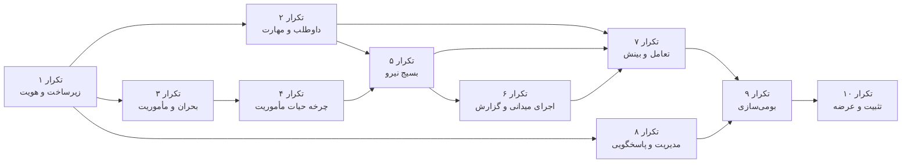

# فصل ۵ — دامنه نسخه کمینه قابل‌عرضه (MVP)

> این فصل دامنه نسخه کمینه قابل‌عرضه سامانه **پناه** را تعیین می‌کند: راهبرد محصول، اولویت‌بندی MoSCoW، داستان‌های کاربر، معیارهای خروج از MVP، تفکیک صریح دامنه فازهای آتی و برنامه انتشار.

---

## ۵.۱. راهبرد و منطق MVP

### ۵.۱.۱. بیانیه دامنه MVP

نسخه کمینه قابل‌عرضه سامانه پناه بر یک اصل بنا شده است: **پوشش کامل و انتها‌به‌انتهای جریان ارزش اصلی، بدون قابلیت‌های هوشمندسازی و بهینه‌سازی.**

جریان ارزش اصلی که MVP باید بی‌نقص پوشش دهد، این زنجیره است:

> ثبت‌نام داوطلب → تکمیل مهارت‌ها → ثبت بحران → تعریف مأموریت → انتشار و عمومی‌سازی → ارسال درخواست همکاری → بررسی و پذیرش → تخصیص و پذیرش تخصیص → حضورزنی → اتمام → گزارش‌دهی → بستن پرونده

هر قابلیتی که برای تکمیل این زنجیره **ضروری** است، در دامنه MVP قرار دارد. هر قابلیتی که این زنجیره را **سریع‌تر، هوشمندتر یا خوش‌آیندتر** می‌کند اما بی آن هم زنجیره کامل می‌شود، به فازهای بعد موکول شده است.

### ۵.۱.۲. معیارهای گنجاندن در MVP

| شناسه معیار | معیار | پرسش راهنما |
|---|---|---|
| `CRT-01` | ضرورت برای زنجیره ارزش | آیا بدون این قابلیت، زنجیره اصلی قطع می‌شود؟ |
| `CRT-02` | الزام امنیتی یا حقوقی | آیا نبود آن سامانه را از منظر امنیت یا صیانت داده غیرقابل‌عرضه می‌کند؟ |
| `CRT-03` | الزام پاسخگویی | آیا نبود آن، ردیابی تصمیم‌های حساس را ناممکن می‌سازد؟ |
| `CRT-04` | حداقل قابلیت استفاده | آیا نبود آن موجب رهاسازی کاربر در مسیر اصلی می‌شود؟ |
| `CRT-05` | امکان‌پذیری در بازه MVP | آیا با پشته فناوری مصوب و در زمان مقرر قابل‌تحقق است؟ |

### ۵.۱.۳. معیارهای خروج از دامنه MVP

| شناسه معیار | معیار | نمونه |
|---|---|---|
| `EXC-01` | وابستگی به فناوری خارج از پشته مصوب | PostGIS، FastAPI، WebSocket |
| `EXC-02` | هوشمندسازی و بهینه‌سازی خودکار | امتیازدهی تناسب داوطلب-مأموریت |
| `EXC-03` | وابستگی به سامانه بیرونی ثالث | ثبت احوال، درگاه پیامک، درگاه پرداخت |
| `EXC-04` | بستر افزوده | برنامه بومی موبایل |
| `EXC-05` | کارکرد جانبی بدون اثر بر زنجیره اصلی | مدیریت انبار، زنجیره تأمین |
| `EXC-06` | پیچیدگی معماری نامتناسب با حجم داده MVP | چنددادگانی، ریزسرویس، Kubernetes |

---

## ۵.۲. اولویت‌بندی MoSCoW

### ۵.۲.۱. توزیع کلی

| اولویت | معنا | تعداد قابلیت | سهم از تلاش برآوردی |
|---|---|---|---|
| **باید داشته باشد** (Must have) | بدون آن سامانه قابل‌عرضه نیست | ۳۸ | حدود ۷۰٪ |
| **بایسته است داشته باشد** (Should have) | مهم اما با راهکار جانشین موقت قابل‌تحمل | ۱۶ | حدود ۲۰٪ |
| **می‌تواند داشته باشد** (Could have) | مطلوب؛ در صورت وجود ظرفیت | ۹ | حدود ۱۰٪ |
| **نخواهد داشت** (Won't have this time) | صریحاً خارج از دامنه این نسخه | ۲۲ | صفر |

### ۵.۲.۲. «باید داشته باشد» — Must have

| # | قابلیت | ماژول | نیازمندی | توجیه |
|---|---|---|---|---|
| ۱ | ثبت‌نام داوطلب با جادوگر چندگامی | `volunteers` | `FR-001` | ورودی زنجیره ارزش |
| ۲ | یکتایی کد ملی و رایانامه | `volunteers`، `accounts` | `FR-002` | صیانت یکپارچگی بانک داوطلب |
| ۳ | ایجاد اتمی حساب، نقش، پروفایل و مهارت | `volunteers` | `FR-003` | پیشگیری از داده نیمه‌کاره |
| ۴ | ورود با رایانامه و رمز عبور | `authentication` | `FR-004` | دسترسی به سامانه |
| ۵ | صدور نشانه دسترسی و نوسازی JWT | `authentication` | `FR-005` | احراز هویت بدون حالت |
| ۶ | نوسازی خودکار نشانه با چرخش | `authentication` | `FR-006` | تداوم نشست |
| ۷ | خروج امن با فهرست سیاه نشانه | `authentication` | `FR-007` | الزام امنیتی |
| ۸ | کنترل دسترسی مبتنی بر نقش و مجوز داده‌محور | `accounts`، `common` | `FR-008` | الزام امنیتی و تفکیک وظایف |
| ۹ | نهانگاه مجوز با ابطال هنگام تغییر | `accounts` | `FR-009` | کارایی با حفظ صحت دسترسی |
| ۱۰ | مشاهده مشخصات کاربر جاری با نقش و مجوز | `authentication` | `FR-010` | مبنای رابط نقش‌محور |
| ۱۱ | مشاهده و ویرایش پروفایل خود | `authentication` | `FR-011`، `FR-012` | تکمیل داده داوطلب |
| ۱۲ | کاتالوگ مهارت و فهرست عمومی آن | `skills` | `FR-014` | پیش‌نیاز ثبت‌نام و تعریف مأموریت |
| ۱۳ | مشاهده فهرست و جزئیات داوطلبان | `volunteers` | `FR-021`، `FR-022` | مبنای تصمیم بررسی درخواست |
| ۱۴ | ایجاد بحران | `disasters` | `FR-023` | چارچوب بالادست مأموریت |
| ۱۵ | مشاهده، پالایش و ویرایش بحران | `disasters` | `FR-025`، `FR-026` | راهبری بحران |
| ۱۶ | ایجاد مأموریت با مهارت‌های موردنیاز | `missions` | `FR-027`، `FR-029` | واحد عملیاتی زنجیره |
| ۱۷ | ویرایش مأموریت با قفل وضعیت بسته | `missions` | `FR-028` | صیانت داده پایان‌یافته |
| ۱۸ | انتشار مأموریت | `missions` | `FR-030` | آغاز فراخوان |
| ۱۹ | آغاز مأموریت | `missions` | `FR-031` | آغاز عملیات |
| ۲۰ | اتمام مأموریت | `missions` | `FR-032` | پایان عملیات |
| ۲۱ | بستن مأموریت | `missions` | `FR-033` | بستن پرونده |
| ۲۲ | کنترل مرئی‌بودن و درخواست‌پذیری مأموریت | `missions` | `FR-034` | کنترل دقیق فراخوان |
| ۲۳ | مشاهده مأموریت‌های در دسترس برای داوطلب | `missions` | `FR-036` | نمای داوطلب |
| ۲۴ | ارسال درخواست همکاری | `missions` | `FR-037` | مشارکت داوطلب |
| ۲۵ | صندوق ورودی درخواست‌ها | `missions` | `FR-038` | مدیریت جریان درخواست |
| ۲۶ | پذیرش درخواست با ایجاد اتمی تخصیص | `missions`، `assignments` | `FR-039`، `FR-042` | هسته بسیج نیرو |
| ۲۷ | رد درخواست | `missions` | `FR-040` | تصمیم قطعی |
| ۲۸ | مشاهده تخصیص‌های خود | `assignments` | `FR-045` | آگاهی داوطلب |
| ۲۹ | پذیرش و رد تخصیص | `assignments` | `FR-043`، `FR-044` | تعهد داوطلب |
| ۳۰ | حضورزنی | `assignments` | `FR-046` | ثبت حضور میدانی |
| ۳۱ | اتمام تخصیص | `assignments` | `FR-047` | پایان مشارکت |
| ۳۲ | ایجاد و ویرایش گزارش پیش‌نویس | `reports` | `FR-048`، `FR-049` | مستندسازی عملیات |
| ۳۳ | ارسال و بازبینی گزارش | `reports` | `FR-051`، `FR-052` | چرخه پاسخگویی |
| ۳۴ | اطلاع‌رسانی درون‌برنامه‌ای با شمارنده نخوانده | `notifications` | `FR-054`، `FR-055` | آگاهی‌رسانی رویدادها |
| ۳۵ | داشبورد نقش‌محور | `dashboard` | `FR-063` | بینش عملیاتی |
| ۳۶ | مدیریت کاربران و انتساب نقش | `accounts` | `FR-064`، `FR-066` | راهبری دسترسی |
| ۳۷ | ثبت خودکار رد حسابرسی | `audit_logs` | `FR-071` | الزام پاسخگویی |
| ۳۸ | رابط راست‌به‌چپ فارسی با قلم Vazirmatn | جبهه | `FR-075` | الزام بومی‌سازی |

### ۵.۲.۳. «بایسته است داشته باشد» — Should have

| # | قابلیت | نیازمندی | راهکار جانشین موقت در صورت نبود |
|---|---|---|---|
| ۱ | بارگذاری تصویر پروفایل | `FR-013` | نمایش حرف نخست نام به‌جای تصویر |
| ۲ | ایجاد و ویرایش مهارت در کاتالوگ | `FR-015`، `FR-016` | ورود مهارت آزاد از سوی داوطلب |
| ۳ | انتساب مهارت به داوطلب توسط ستاد | `FR-017` | اتکا به خوداظهاری داوطلب در ثبت‌نام |
| ۴ | تأیید و رد داوطلب | `FR-018`، `FR-019` | فعال‌سازی مستقیم در ثبت‌نام (رفتار جاری) |
| ۵ | ابطال (حذف نرم) بحران | `FR-024` | تغییر وضعیت بحران به `archived` |
| ۶ | بازگشایی مأموریت | `FR-035` | تعریف مأموریت تازه با محتوای مشابه |
| ۷ | قرار دادن درخواست در صف انتظار | `FR-041` | رد درخواست و درخواست دوباره در آینده |
| ۸ | افزودن پیوست به گزارش | `FR-050` | ارجاع به سند بیرونی در متن گزارش |
| ۹ | خلاصه مأموریت‌های پایان‌یافته | `FR-053` | تجمیع دستی از فهرست تخصیص‌ها |
| ۱۰ | اطلاع‌رسانی رایانامه‌ای غیرهمگام | `FR-056` | اتکا به کانال درون‌برنامه‌ای |
| ۱۱ | علامت‌گذاری گروهی اطلاع‌رسانی‌ها | `FR-057` | علامت‌گذاری یکایک |
| ۱۲ | سامانه تیکت دوسویه | `FR-058` تا `FR-061` | مکاتبه رایانامه‌ای بیرون از سامانه |
| ۱۳ | پیام مستقیم ستاد به کاربر | `FR-062` | ایجاد تیکت به‌جای کاربر |
| ۱۴ | مدیریت کامل نقش و مجوز از رابط کاربری | `FR-067` تا `FR-069` | پیکربندی از پیشخان مدیریت جنگو |
| ۱۵ | مرور و پالایش رد حسابرسی از رابط کاربری | `FR-072` | پرس‌وجوی مستقیم پایگاه داده |
| ۱۶ | حالت تاریک و روشن با ترجیح ماندگار | `FR-076` | تنها حالت تاریک |

### ۵.۲.۴. «می‌تواند داشته باشد» — Could have

| # | قابلیت | نیازمندی | توضیح |
|---|---|---|---|
| ۱ | حذف مهارت از کاتالوگ | — | کاربرد اداری محدود |
| ۲ | برون‌ریزی فهرست کاربران به CSV | — | تسهیل گزارش‌گیری |
| ۳ | ایجاد تخصیص مستقیم بدون فرآیند درخواست | `FR-042` | مسیر میان‌بر ستادی |
| ۴ | انتخاب نقطه بحران روی نقشه تعاملی | `FR-023` | تسهیل ثبت موقعیت |
| ۵ | فهرست آبشاری استان و شهر از منبع بیرونی | — | تسهیل ورود داده مکانی |
| ۶ | نمودارهای تحلیلی داشبورد | `FR-063` | افزودن بینش بصری |
| ۷ | مستندات تعاملی API (Swagger UI) | `FR-074` | تسهیل توسعه و یکپارچه‌سازی |
| ۸ | ورودی تاریخ هجری شمسی با گزینشگر اختصاصی | `FR-077` | تجربه بومی |
| ۹ | کارت فراخوان تکمیل پروفایل | — | افزایش نرخ تکمیل پروفایل |

### ۵.۲.۵. «نخواهد داشت در این نسخه» — Won't have this time

| # | قابلیت | فاز هدف | دلیل خروج | معیار خروج |
|---|---|---|---|---|
| ۱ | تحلیل مکانی با **PostGIS** (پرس‌وجوی شعاعی، چندضلعی، فاصله) | فاز سوم | فناوری خارج از پشته MVP | `EXC-01` |
| ۲ | ریزسرویس‌های **FastAPI** برای محاسبات تخصیص | فاز سوم | فناوری و معماری خارج از دامنه | `EXC-01`، `EXC-06` |
| ۳ | موتور امتیازدهی و توصیه خودکار تناسب داوطلب-مأموریت | فاز سوم | هوشمندسازی | `EXC-02` |
| ۴ | تخصیص خودکار انبوه بر پایه مکان و مهارت | فاز سوم | هوشمندسازی | `EXC-02` |
| ۵ | ارتباط همزمان با **WebSocket** و اعلان زنده | فاز سوم | فناوری خارج از پشته MVP | `EXC-01` |
| ۶ | رهگیری زنده موقعیت داوطلب و نقشه عملیاتی زنده | فاز سوم | فناوری و ملاحظات حریم خصوصی | `EXC-01` |
| ۷ | حضورزنی مکان‌محور با محدوده جغرافیایی (Geo-fencing) | فاز سوم | وابسته به تحلیل مکانی | `EXC-01` |
| ۸ | برنامه بومی موبایل iOS و Android | فاز سوم | بستر افزوده | `EXC-04` |
| ۹ | کارکرد برون‌خط و همگام‌سازی تأخیری | فاز سوم | پیچیدگی معماری | `EXC-06` |
| ۱۰ | پیام‌رسانی پیامکی (SMS) | فاز آتی | وابستگی به سرویس ثالث | `EXC-03` |
| ۱۱ | اعلان فشاری مرورگر و موبایل (Push) | فاز آتی | وابستگی به سرویس ثالث | `EXC-03` |
| ۱۲ | ورود یکپارچه سازمانی (SSO/SAML/OIDC) | فاز آتی | وابستگی به سرویس ثالث | `EXC-03` |
| ۱۳ | احراز هویت دوعاملی (2FA/TOTP) | فاز آتی | ظرفیت زمانی MVP | `CRT-05` |
| ۱۴ | بازیابی خودکار رمز عبور از مسیر رایانامه | فاز آتی | در MVP از مسیر ستاد انجام می‌شود | `CRT-05` |
| ۱۵ | یکپارچه‌سازی با سامانه ثبت احوال و اورژانس ملی | خارج از برنامه | وابستگی سازمانی بیرونی | `EXC-03` |
| ۱۶ | درگاه پرداخت و مدیریت کمک نقدی | خارج از برنامه | خارج از دامنه محصول | `EXC-05` |
| ۱۷ | مدیریت انبار، اقلام امدادی و زنجیره تأمین | خارج از برنامه | خارج از دامنه محصول | `EXC-05` |
| ۱۸ | چنددادگانی و جداسازی سازمانی داده | خارج از برنامه | پیچیدگی نامتناسب با حجم MVP | `EXC-06` |
| ۱۹ | استقرار روی Kubernetes با مقیاس‌پذیری خودکار | خارج از برنامه | پیچیدگی نامتناسب | `EXC-06` |
| ۲۰ | بسته‌های زبانی افزوده (انگلیسی، عربی) | فاز آتی | زیرساخت i18n آماده است اما بسته عرضه نمی‌شود | `CRT-05` |
| ۲۱ | برون‌ریزی گزارش تحلیلی به PDF و Excel | فاز آتی | ظرفیت زمانی MVP | `CRT-05` |
| ۲۲ | زمان‌بندی کارهای دوره‌ای فعال (یادآور، پاک‌سازی خودکار) | فاز آتی | زیرساخت زمان‌بند مستقر است اما زمان‌بندی تعریف‌شده‌ای ندارد | `CRT-05` |

> **تأکید مهم:** موارد ۱ تا ۹ جدول بالا (`PostGIS`، `FastAPI`، تخصیص خودکار، `WebSocket`، رهگیری زنده، حضورزنی مکان‌محور، برنامه موبایل و کارکرد برون‌خط) **قابلیت‌های فاز سوم (P3)** هستند و **در MVP جاری وجود ندارند**. هرگونه ارجاع به این قابلیت‌ها در اسناد بازاریابی یا ارائه، باید صریحاً با برچسب «فاز آتی» همراه شود.

---

## ۵.۳. داستان‌های کاربر

### ۵.۳.۱. حماسه ۱ — هویت و دسترسی

| شناسه | داستان کاربر | معیار پذیرش | اولویت | برآورد |
|---|---|---|---|---|
| `US-001` | **به‌عنوان** یک شهروند علاقه‌مند به کمک، **می‌خواهم** با پر کردن یک فرم گام‌به‌گام در سامانه ثبت‌نام کنم، **تا** بتوانم در فراخوان‌های امدادی مشارکت کنم. | جادوگر چهارگامی؛ اعتبارسنجی هر گام پیش از عبور؛ پیام موفقیت و هدایت به ورود | باید | ۸ |
| `US-002` | **به‌عنوان** یک متقاضی ثبت‌نام، **می‌خواهم** مهارت‌های خود را از یک فهرست آماده برگزینم، **تا** لازم نباشد آن‌ها را دستی تایپ کنم. | فهرست مهارت دسته‌بندی‌شده بدون نیاز به ورود؛ امکان افزودن مهارت آزاد | باید | ۳ |
| `US-003` | **به‌عنوان** یک کاربر ثبت‌نام‌شده، **می‌خواهم** با رایانامه و رمز عبور وارد شوم، **تا** به بخش شخصی خود دسترسی یابم. | ورود موفق با اعتبارنامه صحیح؛ پیام عام برای اعتبارنامه نادرست؛ رد ورود حساب غیرفعال | باید | ۵ |
| `US-004` | **به‌عنوان** یک کاربر در حال کار، **می‌خواهم** نشست من در میانه کار قطع نشود، **تا** داده فرم را از دست ندهم. | نوسازی خودکار نشانه؛ اجرای یک‌باره؛ تلاش دوباره خودکار درخواست ناموفق | باید | ۵ |
| `US-005` | **به‌عنوان** یک کاربر، **می‌خواهم** با خروج، نشست من به‌طور قطعی باطل شود، **تا** حساب من روی دستگاه مشترک در امان باشد. | نشانه نوسازی در فهرست سیاه هر دو لایه؛ پاک‌سازی انبار محلی و نهانگاه کارخواه | باید | ۳ |
| `US-006` | **به‌عنوان** یک کاربر، **می‌خواهم** پروفایل خود را ببینم و کامل کنم، **تا** ستاد تصویر دقیقی از توانمندی من داشته باشد. | نمایش درصد تکمیل؛ ویرایش بخش‌به‌بخش؛ فقط‌خواندنی بودن رایانامه | باید | ۸ |
| `US-007` | **به‌عنوان** یک کاربر، **می‌خواهم** تصویر پروفایل بگذارم، **تا** در فهرست‌ها شناخته شوم. | محدودیت قالب و حجم ۳ مگابایت؛ به‌روزرسانی بی‌درنگ در همه نقاط نمایش | بایسته | ۳ |

### ۵.۳.۲. حماسه ۲ — راهبری بحران و مأموریت

| شناسه | داستان کاربر | معیار پذیرش | اولویت | برآورد |
|---|---|---|---|---|
| `US-008` | **به‌عنوان** هماهنگ‌کننده، **می‌خواهم** بحران تازه را با نوع، شدت و موقعیت ثبت کنم، **تا** چارچوبی برای مأموریت‌ها داشته باشم. | ثبت با وضعیت `active`؛ نمایش بی‌درنگ در فهرست و داشبورد؛ ثبت رد حسابرسی | باید | ۸ |
| `US-009` | **به‌عنوان** هماهنگ‌کننده، **می‌خواهم** بحران‌ها را بر پایه نوع، شدت و استان پالایش کنم، **تا** در انبوه رکوردها گم نشوم. | پالایش چندمعیاره؛ جست‌وجوی متنی؛ صفحه‌بندی ۲۰ رکوردی | باید | ۵ |
| `US-010` | **به‌عنوان** هماهنگ‌کننده، **می‌خواهم** مأموریت را با مهارت‌های موردنیاز و سهمیه داوطلب تعریف کنم، **تا** فراخوان دقیق منتشر شود. | ایجاد در وضعیت `draft` با پرچم‌های خاموش؛ ثبت مهارت‌های موردنیاز؛ امکان تعیین زمان پایان نامعلوم | باید | ۱۳ |
| `US-011` | **به‌عنوان** هماهنگ‌کننده، **می‌خواهم** مأموریت را پیش‌نویس نگه دارم و بعد منتشر کنم، **تا** بی‌آمادگی فراخوان ندهم. | ذخیره پیش‌نویس؛ ویرایش پیش‌نویس؛ انتشار جداگانه | باید | ۵ |
| `US-012` | **به‌عنوان** هماهنگ‌کننده، **می‌خواهم** مستقل از انتشار، مرئی‌بودن و درخواست‌پذیری مأموریت را کنترل کنم، **تا** بتوانم فراخوان را باز و بسته کنم. | دو کلید مستقل؛ الزام سه‌شرطی برای درخواست‌پذیری؛ قفل در وضعیت بسته | باید | ۵ |
| `US-013` | **به‌عنوان** هماهنگ‌کننده، **می‌خواهم** چرخه مأموریت را گام‌به‌گام پیش ببرم، **تا** وضعیت واقعی عملیات در سامانه بازتاب یابد. | پنج گذار مجاز؛ رد گذار غیرمجاز با پیام روشن؛ نمایش تنها دکمه‌های مجاز | باید | ۸ |
| `US-014` | **به‌عنوان** هماهنگ‌کننده، **می‌خواهم** مأموریت بسته را در صورت نیاز بازگشایی کنم، **تا** لازم نباشد مأموریت تازه بسازم. | بازگشت از `closed` به `published`؛ حفظ تاریخچه درخواست و تخصیص؛ ثبت رد حسابرسی | بایسته | ۳ |

### ۵.۳.۳. حماسه ۳ — بسیج نیرو

| شناسه | داستان کاربر | معیار پذیرش | اولویت | برآورد |
|---|---|---|---|---|
| `US-015` | **به‌عنوان** داوطلب، **می‌خواهم** مأموریت‌های در دسترس را ببینم، **تا** مأموریت متناسب با توان خود را بیابم. | نمایش تنها مأموریت‌های منتشرشده و مرئی؛ پالایش بر استان، اولویت و مهارت | باید | ۸ |
| `US-016` | **به‌عنوان** داوطلب، **می‌خواهم** برای مأموریت درخواست همکاری بفرستم، **تا** آمادگی خود را رسماً اعلام کنم. | ارسال با پیام اختیاری؛ رد درخواست تکراری؛ نمایش وضعیت درخواست | باید | ۸ |
| `US-017` | **به‌عنوان** داوطلب، **می‌خواهم** وضعیت درخواست خود را روشن ببینم، **تا** بدانم باید منتظر بمانم یا نه. | نمایش وضعیت `submitted`، `waitlist`، `approved`، `rejected`؛ اطلاع‌رسانی هر تغییر | باید | ۵ |
| `US-018` | **به‌عنوان** هماهنگ‌کننده، **می‌خواهم** همه درخواست‌های ورودی را در یک صندوق ببینم، **تا** هیچ درخواستی بی‌پاسخ نماند. | صندوق تجمیعی همه مأموریت‌ها؛ پالایش بر مأموریت و وضعیت؛ صفحه‌بندی | باید | ۸ |
| `US-019` | **به‌عنوان** هماهنگ‌کننده، **می‌خواهم** پیش از تصمیم‌گیری مهارت و سابقه داوطلب را ببینم، **تا** انتخاب من مستند و درست باشد. | پنجره جزئیات با مهارت، سطح تخصص، شهر، سابقه و پیام درخواست | باید | ۵ |
| `US-020` | **به‌عنوان** هماهنگ‌کننده، **می‌خواهم** با پذیرش درخواست، تخصیص خودکار ساخته شود، **تا** گام دستی افزوده لازم نباشد. | ایجاد اتمی تخصیص در همان تراکنش؛ پیشگیری از تخصیص تکراری؛ اطلاع‌رسانی به داوطلب | باید | ۱۳ |
| `US-021` | **به‌عنوان** هماهنگ‌کننده، **می‌خواهم** درخواست را در صف انتظار بگذارم، **تا** در صورت انصراف پذیرفته‌شدگان جایگزین داشته باشم. | گذار از `submitted` به `waitlist`؛ امکان پذیرش یا رد بعدی از صف | بایسته | ۵ |
| `US-022` | **به‌عنوان** داوطلب، **می‌خواهم** تخصیص خود را بپذیرم یا رد کنم، **تا** تعهد من روشن باشد. | گذار تنها از `pending`؛ خودتوانی؛ اطلاع‌رسانی به هماهنگ‌کننده | باید | ۵ |
| `US-023` | **به‌عنوان** هماهنگ‌کننده، **می‌خواهم** حضور داوطلب را ثبت کنم، **تا** مشارکت واقعی مستند شود. | گذار تنها از `accepted`؛ کنش ستادی؛ ثبت رد حسابرسی | باید | ۳ |
| `US-024` | **به‌عنوان** هماهنگ‌کننده، **می‌خواهم** اتمام کار داوطلب را ثبت کنم، **تا** سابقه مشارکت او کامل شود. | گذار تنها از `checked_in`؛ ناممکن بودن اتمام بدون حضورزنی | باید | ۳ |
| `US-025` | **به‌عنوان** داوطلب، **می‌خواهم** فهرست مأموریت‌های خود را با وضعیت هریک ببینم، **تا** برنامه خود را بدانم. | فهرست تخصیص‌های خود کاربر؛ نمایش مشخصات مأموریت و وضعیت تخصیص | باید | ۵ |

### ۵.۳.۴. حماسه ۴ — گزارش و پاسخگویی

| شناسه | داستان کاربر | معیار پذیرش | اولویت | برآورد |
|---|---|---|---|---|
| `US-026` | **به‌عنوان** هماهنگ‌کننده، **می‌خواهم** گزارش مأموریت را در چند نوبت بنویسم، **تا** لازم نباشد یک‌باره همه را تکمیل کنم. | ایجاد در وضعیت `draft`؛ ویرایش‌پذیری پیش‌نویس؛ قفل پس از ارسال | باید | ۸ |
| `US-027` | **به‌عنوان** هماهنگ‌کننده، **می‌خواهم** شواهد را به گزارش پیوست کنم، **تا** گزارش مستند باشد. | بارگذاری فایل تنها روی پیش‌نویس؛ نگهداشت در ذخیره‌ساز رسانه | بایسته | ۵ |
| `US-028` | **به‌عنوان** هماهنگ‌کننده، **می‌خواهم** گزارش را تنها پس از پایان مأموریت ارسال کنم، **تا** گزارش نیمه‌کاره ثبت نشود. | مسدودسازی ارسال پیش از رسیدن مأموریت به `completed` یا `closed` | باید | ۵ |
| `US-029` | **به‌عنوان** مدیر یا هماهنگ‌کننده، **می‌خواهم** گزارش ارسالی را بازبینی کنم، **تا** چرخه پاسخگویی بسته شود. | گذار از `submitted` به `reviewed`؛ نیازمند مجوز `reports.view` | باید | ۳ |
| `US-030` | **به‌عنوان** هماهنگ‌کننده، **می‌خواهم** خلاصه یک‌پارچه مأموریت پایان‌یافته را ببینم، **تا** لازم نباشد آمار را دستی گرد آورم. | آمار درخواست و تخصیص بر وضعیت؛ فهرست مشارکت‌کنندگان؛ گزارش‌های ثبت‌شده | بایسته | ۸ |
| `US-031` | **به‌عنوان** مدیر، **می‌خواهم** سابقه کنش‌های حساس را ببینم، **تا** بتوانم به پرسش پاسخگویی جواب دهم. | پالایش بر کاربر، کنش، منبع و بازه زمانی؛ شرح فارسی خوانا؛ شناسه همبستگی | باید | ۸ |

### ۵.۳.۵. حماسه ۵ — تعامل و بینش

| شناسه | داستان کاربر | معیار پذیرش | اولویت | برآورد |
|---|---|---|---|---|
| `US-032` | **به‌عنوان** کاربر، **می‌خواهم** از رویدادهای مرتبط با خود آگاه شوم، **تا** فرصت‌ها را از دست ندهم. | اطلاع‌رسانی درون‌برنامه‌ای؛ شمارنده نخوانده روی نماد زنگ؛ راه‌بری به منبع | باید | ۸ |
| `US-033` | **به‌عنوان** کاربر، **می‌خواهم** اطلاع‌رسانی‌ها را خوانده‌شده علامت بزنم، **تا** فهرست من مرتب بماند. | علامت‌گذاری یکایک و گروهی؛ ثبت مهر زمانی بدون حذف رکورد | باید | ۳ |
| `US-034` | **به‌عنوان** کاربر، **می‌خواهم** رویدادهای مهم را با رایانامه هم دریافت کنم، **تا** خارج از سامانه هم مطلع شوم. | ارسال غیرهمگام؛ عدم شکست عملیات اصلی در صورت خطای رایانامه | بایسته | ۵ |
| `US-035` | **به‌عنوان** داوطلب، **می‌خواهم** بتوانم از ستاد پرسش کنم، **تا** ابهامم رفع شود. | ایجاد تیکت؛ گفت‌وگوی دوسویه؛ چرخه وضعیت خودکار | بایسته | ۸ |
| `US-036` | **به‌عنوان** کارشناس ستاد، **می‌خواهم** به کاربر مشخصی پیام مستقیم بفرستم، **تا** لازم نباشد از کانال شخصی استفاده کنم. | ایجاد تیکت با مخاطب مشخص؛ ثبت فرستنده ستادی؛ اطلاع‌رسانی به مخاطب | بایسته | ۵ |
| `US-037` | **به‌عنوان** هر کاربر، **می‌خواهم** داشبوردی متناسب با نقش خود ببینم، **تا** بی‌درنگ بدانم چه کاری در انتظار من است. | سه نمای متفاوت برای سه نقش؛ نهانگاه ۳۰ ثانیه‌ای؛ ابطال هنگام تغییر داده | باید | ۱۳ |
| `US-038` | **به‌عنوان** مدیر، **می‌خواهم** نقش کاربران را تغییر دهم، **تا** ساختار دسترسی سازمان را بازتاب دهم. | انتساب تک‌نقشی؛ بازگردانی انتساب حذف‌شده؛ ابطال نهانگاه مجوز | باید | ۸ |
| `US-039` | **به‌عنوان** مدیر، **می‌خواهم** نقش تازه با ترکیب مجوز دلخواه بسازم، **تا** سامانه با ساختار سازمان من سازگار شود. | انتخاب از ۲۸ مجوز اتمی؛ حفاظت از نقش‌های سیستمی؛ ابطال نهانگاه | بایسته | ۸ |
| `US-040` | **به‌عنوان** کاربر فارسی‌زبان، **می‌خواهم** رابط کاربری کاملاً راست‌به‌چپ و با قلم خوانا باشد، **تا** استفاده از سامانه طبیعی باشد. | جهت‌گیری RTL در همه صفحات؛ قلم Vazirmatn میزبانی‌شده؛ ارقام فارسی؛ تقویم هجری شمسی | باید | ۱۳ |
| `US-041` | **به‌عنوان** کاربر ستاد بحران در شیفت شب، **می‌خواهم** حالت تاریک داشته باشم، **تا** چشمانم خسته نشود. | حالت تاریک پیش‌فرض؛ کلید تغییر حالت؛ ماندگاری ترجیح در مرورگر | بایسته | ۵ |

### ۵.۳.۶. خلاصه برآورد داستان‌ها

| حماسه | تعداد داستان | مجموع نقاط داستان |
|---|---|---|
| هویت و دسترسی | ۷ | ۳۵ |
| راهبری بحران و مأموریت | ۷ | ۴۷ |
| بسیج نیرو | ۱۱ | ۶۸ |
| گزارش و پاسخگویی | ۶ | ۳۷ |
| تعامل و بینش | ۱۰ | ۷۶ |
| **مجموع** | **۴۱** | **۲۶۳** |

---

## ۵.۴. معیارهای خروج از MVP (Definition of Done)

### ۵.۴.۱. معیارهای کارکردی

| شناسه | معیار | روش راستی‌آزمایی |
|---|---|---|
| `EXIT-F-01` | همه نیازمندی‌های با اولویت «باید» پیاده‌سازی و پذیرش‌شده باشند. | بازبینی ماتریس ردیابی |
| `EXIT-F-02` | زنجیره ارزش اصلی به‌صورت انتها‌به‌انتها و بدون گام دستی بیرون از سامانه اجرا شود. | آزمون پذیرش سرتاسری |
| `EXIT-F-03` | هر پنج گذار مأموریت درست کار کند و گذار غیرمجاز با پیام روشن رد شود. | آزمون یکپارچگی گذارها |
| `EXIT-F-04` | چرخه درخواست همکاری در همه شاخه‌ها (پذیرش، رد، صف انتظار، درخواست دوباره) درست کار کند. | آزمون یکپارچگی |
| `EXIT-F-05` | چرخه تخصیص با ترتیب اجباری حضورزنی پیش از اتمام اعمال شود. | آزمون یکپارچگی |
| `EXIT-F-06` | چرخه گزارش با وابستگی به پایان مأموریت اعمال شود. | آزمون یکپارچگی |
| `EXIT-F-07` | هر سه نقش داشبورد متفاوت و درست ببینند. | آزمون پذیرش نقش‌محور |
| `EXIT-F-08` | ماتریس نقش-مجوز به‌طور کامل اعمال شود و دسترسی افقی و عمودی مسدود باشد. | آزمون امنیت مجوزدهی |
| `EXIT-F-09` | رد حسابرسی برای همه کنش‌های حساس ثبت شود. | بازبینی نمونه‌ای ردها |
| `EXIT-F-10` | داده اولیه (نقش، مجوز، مهارت، حساب مدیر) با یک فرمان قابل ایجاد باشد. | اجرای فرمان‌های داده اولیه |

### ۵.۴.۲. معیارهای غیرکارکردی

| شناسه | معیار | مقدار هدف |
|---|---|---|
| `EXIT-N-01` | زمان پاسخ صدک ۹۵ برای نقاط پایانی خواندنی | کمتر از ۵۰۰ میلی‌ثانیه |
| `EXIT-N-02` | زمان پاسخ صدک ۹۵ برای نقاط پایانی نگارشی | کمتر از ۱ ثانیه |
| `EXIT-N-03` | زمان بارگذاری نخست برنامه جبهه | کمتر از ۳ ثانیه در شبکه معمول |
| `EXIT-N-04` | پشتیبانی از کاربران همزمان | حداقل ۲۰۰ کاربر |
| `EXIT-N-05` | همه صفحات در عرض تلفن همراه بدون شکست طرح‌بندی نمایش داده شوند. | بازرسی بصری در سه نقطه شکست |
| `EXIT-N-06` | همه صفحات راست‌به‌چپ و فارسی باشند. | بازرسی بصری کامل |
| `EXIT-N-07` | هیچ آسیب‌پذیری بحرانی یا بالا در بازبینی امنیتی باقی نماند. | بازبینی امنیتی و آزمون نفوذ |
| `EXIT-N-08` | رمزهای عبور تنها به‌صورت درهم‌سازی‌شده ذخیره شوند. | بازرسی پایگاه داده |
| `EXIT-N-09` | هیچ راز عملیاتی در مخزن کد وجود نداشته باشد. | پویش مخزن |
| `EXIT-N-10` | همه سرویس‌ها با یک فرمان راه‌اندازی و سالم شوند. | اجرای اسکریپت راه‌اندازی روی ماشین تازه |

### ۵.۴.۳. معیارهای کیفیت مهندسی

| شناسه | معیار |
|---|---|
| `EXIT-Q-01` | همه بازبینی‌های کد انجام و بازخوردهای بازدارنده رفع شده باشند. |
| `EXIT-Q-02` | ابزار بازرسی ایستا (خطایاب) بدون خطای بازدارنده اجرا شود. |
| `EXIT-Q-03` | بازرسی نوع در جبهه بدون خطا اجرا شود. |
| `EXIT-Q-04` | مهاجرت‌های پایگاه داده روی پایگاه داده خالی و روی پایگاه داده موجود بدون خطا اجرا شوند. |
| `EXIT-Q-05` | همه وابستگی‌ها با فایل قفل نسخه‌بندی شده باشند. |
| `EXIT-Q-06` | طرح OpenAPI بدون خطا تولید شود و همه نقاط پایانی را پوشش دهد. |
| `EXIT-Q-07` | مستندات راه‌اندازی، استقرار و بهره‌برداری به‌روز باشند. |
| `EXIT-Q-08` | راه‌اندازی روی ماشین تازه با یک فرمان و بدون گام دستی نامستند موفق باشد. |

### ۵.۴.۴. معیارهای پذیرش کاربر

| شناسه | معیار | مقدار هدف |
|---|---|---|
| `EXIT-U-01` | نرخ تکمیل مسیر «ثبت‌نام تا ارسال درخواست» در آزمون قابلیت استفاده | بیش از ۹۰٪ |
| `EXIT-U-02` | نرخ تکمیل مسیر «ثبت بحران تا انتشار مأموریت» توسط هماهنگ‌کننده | بیش از ۹۰٪ |
| `EXIT-U-03` | نرخ تکمیل مسیر «بررسی درخواست تا حضورزنی» توسط هماهنگ‌کننده | بیش از ۸۵٪ |
| `EXIT-U-04` | رضایت ذی‌نفعان کلیدی از نمایش داشبورد | تأیید کتبی |
| `EXIT-U-05` | تأیید نماینده کاربران نهایی بر جریان‌های اصلی | تأیید کتبی |

---

## ۵.۵. برنامه انتشار MVP

### ۵.۵.۱. تکرارها

| تکرار | تمرکز | خروجی اصلی | داستان‌های کاربر |
|---|---|---|---|
| تکرار ۱ | زیرساخت و هویت | راه‌اندازی سرویس‌ها، مدل پایه، احراز هویت JWT، RBAC داده‌محور | `US-003` تا `US-005` |
| تکرار ۲ | داوطلب و مهارت | ثبت‌نام، پروفایل، کاتالوگ مهارت، فهرست داوطلبان | `US-001`، `US-002`، `US-006`، `US-007` |
| تکرار ۳ | بحران و مأموریت | ایجاد و راهبری بحران، تعریف و ویرایش مأموریت | `US-008` تا `US-011` |
| تکرار ۴ | چرخه حیات مأموریت | همه گذارها، کنترل مرئی‌بودن، بازگشایی | `US-012` تا `US-014` |
| تکرار ۵ | بسیج نیرو | درخواست همکاری، صندوق درخواست‌ها، بررسی، تخصیص | `US-015` تا `US-022` |
| تکرار ۶ | اجرای میدانی و گزارش | حضورزنی، اتمام، چرخه گزارش، خلاصه مأموریت | `US-023` تا `US-030` |
| تکرار ۷ | تعامل و بینش | اطلاع‌رسانی، تیکت، داشبورد نقش‌محور | `US-032` تا `US-037` |
| تکرار ۸ | مدیریت و پاسخگویی | مدیریت کاربر و نقش، رد حسابرسی | `US-031`، `US-038`، `US-039` |
| تکرار ۹ | بومی‌سازی و پالایش تجربه | RTL کامل، قلم، تقویم شمسی، حالت تاریک، واکنش‌گرایی | `US-040`، `US-041` |
| تکرار ۱۰ | تثبیت و آماده‌سازی عرضه | رفع نقص، بازبینی امنیتی، مستندسازی، آزمون پذیرش | — |

### ۵.۵.۲. وابستگی‌های میان تکرارها

### ۵.۵.۳. دروازه‌های کیفیت هر تکرار

| دروازه | معیار عبور |
|---|---|
| دروازه کد | بازبینی کد انجام‌شده؛ خطایاب بدون خطای بازدارنده؛ بازرسی نوع موفق |
| دروازه کارکرد | معیارهای پذیرش داستان‌های تکرار برآورده شده |
| دروازه یکپارچگی | آزمون‌های یکپارچگی مسیرهای درگیر تکرار موفق |
| دروازه امنیت | بازبینی مجوزدهی نقاط پایانی تازه انجام‌شده |
| دروازه مستندسازی | مستندات API و راهنمای بهره‌برداری به‌روز |

---

## ۵.۶. تحلیل ارزش و تلاش

### ۵.۶.۱. ماتریس ارزش-تلاش

| ناحیه | ارزش کسب‌وکاری | تلاش پیاده‌سازی | نمونه قابلیت‌ها | تصمیم |
|---|---|---|---|---|
| برد سریع | بالا | کم | فهرست عمومی مهارت، شمارنده نخوانده، حالت تاریک، مشاهده تخصیص‌های خود | در MVP، اولویت اجرای زودهنگام |
| پروژه راهبردی | بالا | زیاد | ثبت‌نام اتمی، چرخه مأموریت، پذیرش درخواست با تخصیص اتمی، داشبورد نقش‌محور، RBAC داده‌محور | در MVP، هسته محصول |
| پرکننده | پایین | کم | برون‌ریزی CSV، حذف مهارت، نقشه انتخاب مختصات | در MVP در صورت وجود ظرفیت |
| دام هزینه | پایین تا متوسط | زیاد | PostGIS، ریزسرویس FastAPI، WebSocket، برنامه موبایل، تخصیص خودکار | خارج از MVP — فاز سوم |

### ۵.۶.۲. توزیع تلاش برآوردی بر ماژول

| ماژول | سهم برآوردی از تلاش | توضیح |
|---|---|---|
| `missions` | ۲۰٪ | پرشمارترین نقاط پایانی و پیچیده‌ترین قواعد گذار |
| `accounts` + `authentication` | ۱۵٪ | مدل RBAC داده‌محور، JWT، نهانگاه مجوز |
| جبهه (همه صفحات) | ۲۵٪ | ۲۱ مسیر، ۱۹ مؤلفه مشترک، RTL، تقویم شمسی |
| `volunteers` + `skills` | ۱۰٪ | ثبت‌نام چندگامی و انتساب مهارت |
| `assignments` | ۷٪ | چرخه چهارگذاری با خودتوانی |
| `reports` | ۷٪ | چرخه گزارش، پیوست، خلاصه تجمیعی |
| `dashboard` | ۵٪ | پرس‌وجوهای تجمیعی نقش‌محور با نهانگاه |
| `notifications` + `tickets` | ۵٪ | دو کانال اطلاع‌رسانی و گفت‌وگوی دوسویه |
| `disasters` | ۳٪ | عملیات پایه با پالایش |
| `audit_logs` | ۳٪ | میان‌افزار زمینه و سرویس ثبت |

---

## ۵.۷. مرزبندی صریح MVP در برابر فاز سوم

### ۵.۷.۱. جدول مقایسه فنی

| بُعد | MVP جاری (پیاده‌سازی‌شده) | فاز سوم (طرح آتی — پیاده‌سازی‌نشده) |
|---|---|---|
| معماری سرویس‌دهنده | یک‌پارچه ماژولار مبتنی بر Django | افزودن ریزسرویس‌های محاسباتی FastAPI |
| پایگاه داده | PostgreSQL 17 بدون افزونه مکانی | PostgreSQL 17 با افزونه PostGIS |
| داده مکانی | متن توصیفی و مختصات در ابرداده JSON | نوع داده هندسی، نمایه مکانی، پرس‌وجوی شعاعی و چندضلعی |
| تخصیص داوطلب | تصمیم انسانی با نمای گردآوری‌شده داده | امتیازدهی خودکار تناسب و پیشنهاد رتبه‌بندی‌شده |
| ارتباط زمان واقعی | واکشی دوره‌ای از سوی کارخواه | کانال WebSocket و اعلان فشاری |
| بستر کاربری | برنامه وب واکنش‌گرا | افزودن برنامه بومی موبایل |
| حضورزنی | ثبت دستی توسط هماهنگ‌کننده | حضورزنی مکان‌محور با محدوده جغرافیایی |
| کارکرد برون‌خط | ندارد | صف همگام‌سازی تأخیری |
| کانال اطلاع‌رسانی | درون‌برنامه‌ای و رایانامه | افزودن پیامک و اعلان فشاری |
| احراز هویت | JWT با رایانامه و رمز عبور | افزودن ورود یکپارچه سازمانی و احراز هویت دوعاملی |
| کارهای دوره‌ای | زیرساخت زمان‌بند مستقر، بدون زمان‌بندی فعال | یادآورهای خودکار، پاک‌سازی دوره‌ای، گزارش زمان‌بندی‌شده |
| استقرار | Docker Compose | افزودن گزینه Kubernetes با مقیاس‌پذیری خودکار |

### ۵.۷.۲. اثر مرزبندی بر معماری MVP

با آنکه قابلیت‌های فاز سوم در MVP پیاده نشده‌اند، معماری MVP به‌گونه‌ای بنا شده است که پذیرش آن‌ها در آینده پرهزینه نباشد:

| تصمیم آینده‌نگر در MVP | چگونه مسیر فاز سوم را هموار می‌کند |
|---|---|
| فیلد ابرداده JSON در بحران و مأموریت | مختصات جغرافیایی امروز نگه داشته می‌شود و فردا به نوع هندسی PostGIS مهاجرت می‌کند. |
| تفکیک لایه سرویس از لایه نما | منطق دامنه بی‌درنگ قابل فراخوانی از ریزسرویس آتی است. |
| شناسه UUID برای همه موجودیت‌ها | ادغام داده میان سرویس‌های توزیع‌شده بدون تعارض کلید. |
| استقرار زیرساخت Celery و زمان‌بند | افزودن کارهای دوره‌ای فقط نیازمند تعریف زمان‌بندی است، نه تغییر زیرساخت. |
| لایه انتزاعی اطلاع‌رسانی با فیلد کانال | افزودن کانال پیامک و اعلان فشاری بدون تغییر فراخوان‌کنندگان. |
| زیرساخت i18n با بسته‌های نام‌فضامند | افزودن زبان تازه بدون تغییر کد مؤلفه‌ها. |
| API نسخه‌دار `/api/v1` | امکان عرضه `v2` در فاز سوم بدون شکستن کارخواه‌های موجود. |
| طرح OpenAPI تولیدشده خودکار | تولید کارخواه برای برنامه موبایل آتی. |

---

## ۵.۸. ریسک‌های دامنه MVP

| شناسه | ریسک دامنه | احتمال | اثر | پاسخ |
|---|---|---|---|---|
| `SR-01` | تورم دامنه با درخواست افزودن قابلیت‌های فاز سوم به MVP | زیاد | زیاد | فهرست صریح «نخواهد داشت» در همین فصل؛ الزام عبور هر درخواست از شورای کنترل تغییر |
| `SR-02` | انتظار ذی‌نفعان از قابلیت تخصیص خودکار | متوسط | زیاد | تصریح در جلسه ارائه که MVP ابزار تصمیم‌یار انسانی است، نه تصمیم‌گیر خودکار |
| `SR-03` | برداشت نادرست از وجود نقشه در فرم بحران به‌عنوان قابلیت تحلیل مکانی | متوسط | متوسط | تصریح در مستندات که نقشه تنها ابزار ثبت مختصات توصیفی است |
| `SR-04` | تعویق مکرر قابلیت‌های «بایسته» و افت کیفیت تجربه | متوسط | متوسط | تثبیت زودهنگام قابلیت‌های بایسته در تکرارهای میانی |
| `SR-05` | نبود پوشش آزمون خودکار کافی در MVP و افزایش هزینه رگرسیون | زیاد | متوسط | تدوین مجموعه آزمون دستی ساخت‌یافته در فصل ۱۲ و برنامه تدریجی خودکارسازی |
| `SR-06` | وابستگی داده تقسیمات کشوری به منبع بیرونی | متوسط | کم | راهکار جانشین ورود دستی؛ برنامه میزبانی درون‌پروژه‌ای در فاز آتی |
| `SR-07` | نبود بازیابی خودکار رمز عبور و افزایش بار پشتیبانی | زیاد | کم | رویه بازنشانی از مسیر ستاد و پیشخان مدیریت؛ افزودن قابلیت در فاز آتی |
| `SR-08` | نبود احراز هویت دوعاملی برای حساب مدیر | متوسط | متوسط | الزام رمز عبور قوی، محدودسازی دسترسی شبکه‌ای پیشخان مدیریت، برنامه افزودن در فاز آتی |

---

## ۵.۹. جدول تجمیعی تصمیم دامنه

| ماژول | باید | بایسته | می‌تواند | نخواهد داشت |
|---|---|---|---|---|
| `authentication` | ۵ | ۱ | — | بازیابی رمز، دوعاملی، ورود یکپارچه |
| `accounts` | ۳ | ۳ | ۱ | چنددادگانی |
| `volunteers` | ۵ | ۲ | — | راستی‌آزمایی هویت ملی |
| `skills` | ۱ | ۳ | ۱ | گواهی‌نامه مهارت |
| `disasters` | ۳ | ۱ | ۲ | تحلیل مکانی PostGIS |
| `missions` | ۹ | ۲ | ۱ | تخصیص خودکار، فراخوان مکان‌محور |
| `assignments` | ۵ | — | ۱ | حضورزنی مکان‌محور |
| `reports` | ۴ | ۳ | — | برون‌ریزی PDF و Excel |
| `notifications` | ۲ | ۲ | — | پیامک، اعلان فشاری، WebSocket |
| `tickets` | — | ۴ | — | گفت‌وگوی همزمان |
| `dashboard` | ۱ | — | ۱ | پیش‌بینی و تحلیل روند |
| `audit_logs` | ۱ | ۱ | — | کشف بی‌هنجاری |
| جبهه و بومی‌سازی | ۱ | ۱ | ۲ | برنامه موبایل، کارکرد برون‌خط، زبان‌های افزوده |
| زیرساخت | — | — | — | Kubernetes، مقیاس‌پذیری خودکار |

---

## ۵.۱۰. خلاصه اجرایی فصل

دامنه MVP سامانه پناه بر پوشش کامل و انتها‌به‌انتهای زنجیره ارزش اصلی بنا شده است: از ثبت‌نام داوطلب تا بستن پرونده مأموریت. **۳۸ قابلیت با اولویت «باید»**، **۱۶ قابلیت «بایسته»** و **۹ قابلیت «می‌تواند»** در دامنه قرار دارند و **۲۲ قابلیت صریحاً خارج از دامنه** این نسخه اعلام شده‌اند.

مهم‌ترین نکته مرزبندی: **قابلیت‌های مکان‌محور مبتنی بر PostGIS، ریزسرویس‌های FastAPI، تخصیص خودکار، ارتباط همزمان WebSocket، برنامه بومی موبایل و کارکرد برون‌خط جزء MVP نیستند** و به فاز سوم موکول شده‌اند. با این حال، هشت تصمیم معماری آینده‌نگر در MVP اتخاذ شده است (از ابرداده JSON برای مختصات تا API نسخه‌دار و طرح OpenAPI خودکار) تا پذیرش آن قابلیت‌ها در آینده مستلزم بازنویسی نباشد.

خروج از MVP بر پایه **۳۳ معیار سنجش‌پذیر** در چهار دسته کارکردی، غیرکارکردی، کیفیت مهندسی و پذیرش کاربر تعیین می‌شود. بزرگ‌ترین ریسک دامنه، تورم آن با درخواست افزودن قابلیت‌های فاز سوم است که پاسخ آن، فهرست صریح «نخواهد داشت» در همین فصل و الزام عبور هر درخواست تغییر از شورای کنترل تغییر است.

---

**پایان فصل ۵**

> فصل پیشین: [موارد کاربرد](./04-usecases.md) — فصل بعد: [نیازمندی‌های کارکردی](./06-functional-requirements.md)
